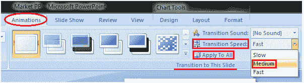

# 如何设置幻灯片过渡速度

> 原文：<https://www.javatpoint.com/how-to-set-slide-transition-speed-powerpoint>

*   选择幻灯片
*   选择“动画”选项卡
*   在“过渡到此幻灯片”组中，单击“过渡速度”选项旁边的下拉箭头
*   它将显示过渡速度的三个选项
*   选择所需的过渡速度
*   点按“全部应用”以对所有幻灯片应用相同的过渡速度

**见图:**

