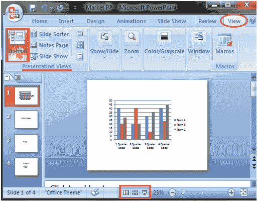
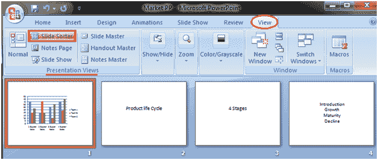
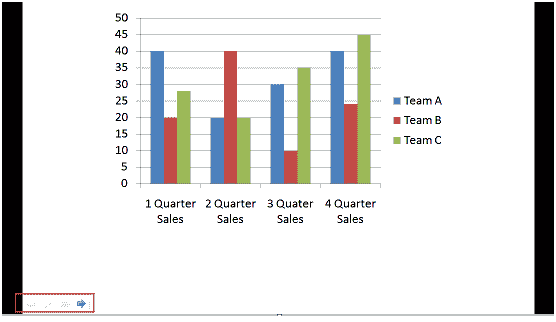
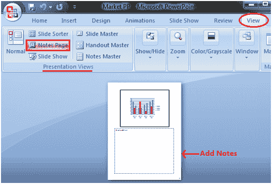

# 查看幻灯片

> 原文：<https://www.javatpoint.com/powerpoint-viewing-slides>

创建演示文稿后，您可以用不同的方式查看它。

选择“视图”选项卡。找到“演示视图”组。它显示四个选项来查看演示文稿；普通视图、幻灯片浏览视图、幻灯片放映视图和备注页视图。

普通视图:当我们打开 PowerPoint 窗口时，默认情况下会出现普通视图。我们在普通视图中创建和编辑幻灯片。该视图还以状态栏上按钮的形式提供了四个选项中的三个视图选项。

**见图:**

幻灯片浏览视图:它提供所有幻灯片的微缩或缩略版本。您可以在屏幕上一次看到所有幻灯片。您也可以拖动或删除幻灯片来重新排列它们。

**见图:**

幻灯片放映视图:它以全屏模式显示您的演示文稿。它还在幻灯片的左下角提供了一个附加菜单。

**见图:**

备注页视图

此视图在幻灯片下方提供了添加注释的空间。

**见图:**

