# VBA 变量

> 原文:[https://www.javatpoint.com/vba-variables](https://www.javatpoint.com/vba-variables)

变量是用于保存存储在存储系统和计算机内存中的值的特定内存。您可以在代码中使用这些值，并且可以在脚本执行期间更改这些值。计算机从系统中获取这些值，并显示在输出中。

每个变量都必须有一个名称。一些是命名 VBA 变量的基本规则，例如:

*   您必须使用字母作为第一个字符，或者不能以数字开头。
    **比如**，不能把一个以数字开头的变量名写成**“1 _ hello”**，正确的做法是**“hello 1”**。
*   名称必须少于 255 个字符。
*   没有空格，句号(。)，感叹号(！)，或允许使用字符(@、#、$、*)。
    **比如**，不能写**【学生证】**因为里面包含了 Student 和 ID 之间的空格，这个变量名的正确表示方式是**【Student ID】**。
*   不能使用**“Visual Basic”**保留关键字作为变量名。
*   期间不允许。

## VBA 变量的语法

在 VBA，在使用变量之前，需要通过指定名称和数据类型来声明变量。

```

Sub Exercise ( )
Dim << variable_name >> As << variable_type >>
End Sub

```

在 VBA，变量要么隐式要么显式声明。

**隐式:**我们来看一个变量隐式声明的例子。

*   Label = javaTpoint
*   体积= 10

**显式:**我们来看一个显式声明变量的例子。

*   将数字调成整数
*   将密码设为字符串

VBA 变量与其他编程语言没有什么不同。要在 VBA 声明一个变量，可以在语法中使用**“Dim”**关键字。

* * *

## 如何执行变量

在执行变量之前，我们需要在 Excel 中记录一个宏。要录制宏，请遵循以下步骤:

**第一步:**选择**记录宏**。

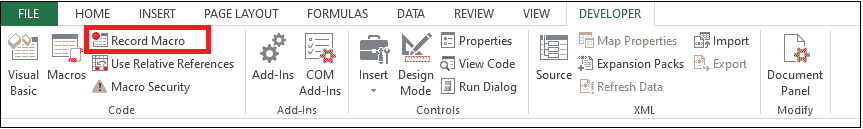

**第二步:**输入宏名称，如**宏 1** 。

**第三步:**点击**确定**按钮。

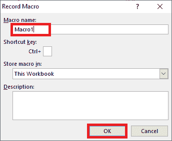

**第二步:**然后，点击**停止录制**。

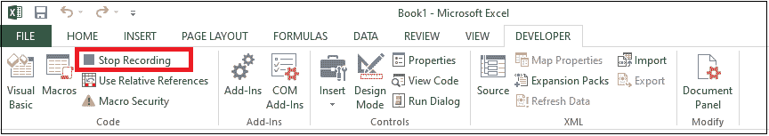

**第三步:**打开宏编辑器，在**宏 1** 中输入变量的代码。

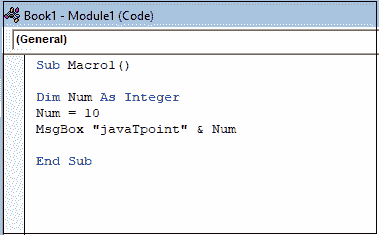

**第四步:**执行**宏 1** 的代码，你会在你的工作表中得到下面的输出。

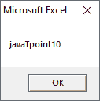

在声明变量之前，我们将创建一个基本的 VBA 程序，它显示一个输入框来询问用户的名字，然后显示一条问候消息。

**第一步:**点击**开发者**标签。

**第二步:**然后，点击**插入**下拉框。

**第三步:**选择一个**命令按钮**，如下图截图所示。

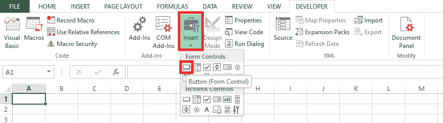

**第四步:**会出现**对话**窗口。

1.输入**宏**名称。

2.点击**新建**按钮。

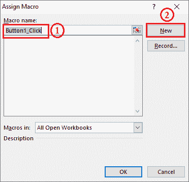

3.您将进入代码窗口并输入以下代码。

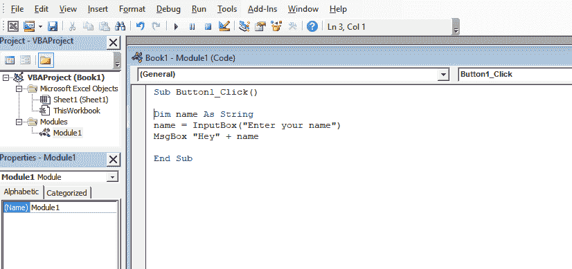

**第五步:**关闭代码窗口。而且，

1.右键单击名为**按钮 1** 的按钮。

2.选择**编辑文本**选项。

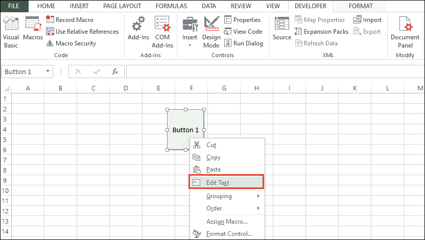

3.进入**嘿那里**。

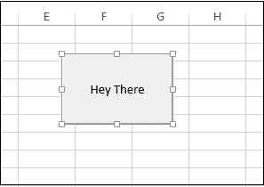

4.点击**嘿这里**按钮。

5.你会得到如下截图所示的输入框。

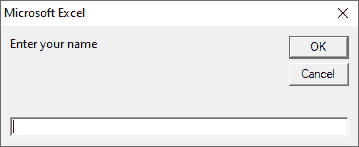

6.输入姓名，即**爱德华**。

7.然后你会得到如下截图所示的消息框。

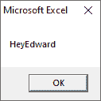

* * *

## 如何声明变量

让我们举一个在 VBA 如何声明变量的例子。我们将维护三种类型的变量，如连接日期、字符串和货币。

**第一步:**之前我们在 excel 表单中插入了一个**命令按钮**。

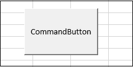

**步骤 2:** 转到**宏**并

1.  选择一个**创建的**宏。
2.  点击**“进入”**按钮。
3.  它打开代码窗口，如下图所示。

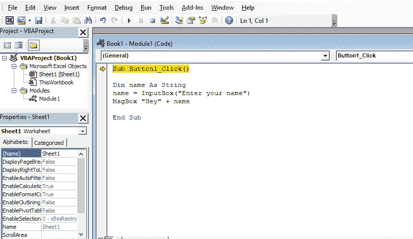

**第三步:**编写代码来声明变量。

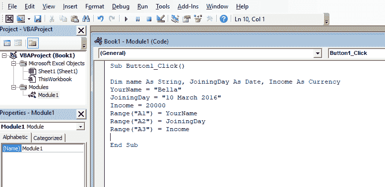

**第四步:**之后，

1.  点击**保存**按钮，保存文件。
2.  然后点击 **Excel** 图标返回 Excel 表。
3.  你会得到如下截图所示的**设计模式**“开”。

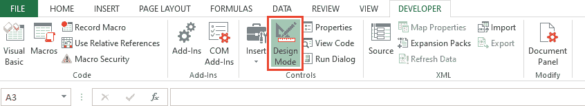

**第五步:**点击命令按钮前关闭**设计模式**。

**第 6 步:**然后点击**命令按钮**。它将变量显示为我们在代码中声明的范围的输出。

*   名字
*   加入日期
*   货币

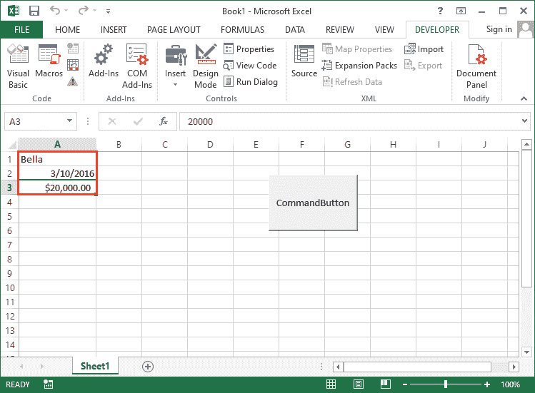

* * *