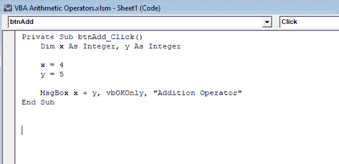
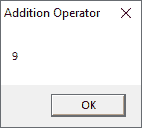

# VBA 算术运算符

> 原文:[https://www.javatpoint.com/vba-arithmetic-operators](https://www.javatpoint.com/vba-arithmetic-operators)

VBA 算术运算符用于执行算术运算。其中涉及计算由**变量**、**文字**、**函数**、**常数**、**属性调用**和其他表达式表示的数值。

可以一起对表达式中的两个值进行算术运算，如**加**、**减**、**乘**或**除**。

VBA 有以下算术运算符:

**1。加法(+):** 您可以使用加法运算符在一个表达式中添加两个数字。

**例如**

```

Dim x As Integer
x = 10 + 5

```

**输出:**

```
15 

```

**2。减法(-):** 可以用减法运算符一起减去表达式中的两个数字。

**例如**

```

Dim x As Integer
x = 20 - 15

```

**输出:**

```
5

```

**3。否定(~):** 否定也使用减法运算符，但只有一个数字或操作数。

**例如**

```

Dim x As Integer = 50
Dim y As Integer
y = -x

```

**输出:**

```
-50

```

**4。乘法(*):** 可以用乘法运算符将表达式中的两个数字相乘。

**例如**

```

Dim x As Double
x = 10 * 55.23

```

**5。除法(/):** 可以用除法运算符将表达式中的两个数相除。

**例如**

```

Dim x As Double
X = 50 / 5

```

**输出:**

```
10

```

整数除法返回商，这意味着整数表示除数在不考虑任何余数的情况下可以除以被除数的次数。

对于此运算符，除数和被除数都必须是整型(字节、字节、短整型、整数、整数、长整型和整数)。首先，所有其他类型都必须转换为整型。

```

Dim y As Integer 
y = 22 / 5

```

**输出:**

```
4

```

**6。指数运算(^):** 指数运算子用于将一个数的幂提升到另一个数的幂。

**例如**

```

Dim y As Double
z = 4 ^ 2

```

**输出:**

```
16

```

**7。模数运算符(Mod):** 模数运算使用 Mod 运算符执行。这个运算符将除数除以被除数的整数倍，然后返回余数。

如果除数和被除数都是整数类型，那么返回值就是整数。如果除数和被除数都是浮点类型，那么返回值也是浮点。

**例如**

```

Dim p As Integer = 100
Dim q As Integer = 6 
Dim r As Integer 
r = p Mod q 

```

**输出:**

```
4

```

**或**

```

Dim x As Double = 100.3
Dim y As Double = 4.13
Dim z As Double
Z = x Mod y 

```

**输出:**

```
1.18

```

## 移位操作

位移位操作是对位模式执行算术移位。这个模式包含在左边的操作数中。右边的操作数指定了移动模式的位置数。

您可以使用>>运算符将模式向右移动，或者使用<

模式操作数的数据类型是**字节、字节、短字节、短字节、整数、整数、长字节或长字节**。

算术移位不是循环的，这意味着从结果一端移出的位不会在另一端重新定义。移位空出的位位置设置如下:

*   算术左大便为 0。
*   正数的算术右移为 0。
*   0 表示无符号数据类型的算术右移(**字节、UShort、Uinteger、ULong** )。
*   负数的算术右移为 1(**字节、整数、短或长**)。

**示例下例中的**将整数值向左或向右移动。

```

Dim lResult, rResult As Integer
Dim pattern As Integer = 15
' The low-order bits of the pattern are 0000 1100\. 
lResult = pattern << 3
' A left shift of 3 bits produces a value of 96.
rResult = pattern >> 2
' A right shift of 2 bits produces a value of 3\. 

```

#### 注意:算术移位从不产生溢出异常。

## 位运算

除了是逻辑运算符之外，**和**、**或**、**不是**、**异或**在用于数值时也执行按位算术。

## VBA 算术运算符示例

**第一步:**首先在 excel 表格中添加一个**按钮**，如前所示。

1.更改名称属性，如 **btnAdd** 。


2.右键单击该按钮。

3.选择**查看代码**选项。

4.您将看到如下截图所示的代码窗口。


**第 2 步:**在专用子菜单点击和结束子菜单之间编写如下代码:

*   将 X 调成整数，Y 调成整数
    X = 4
    Y = 5
*   MsgBox x + y，vbOKonly，“加法运算符”



**第三步:**点击**保存**按钮。

**步骤 4:** 并关闭代码编辑器窗口。

**第五步:**然后关闭**设计模式**按钮。


**第六步:**指示灯为，将由绿色背景变为白色背景，如下图截图所示。


**第 7 步:**点击**添加操作员**按钮。

**第八步:**你会得到如下截图所示的代码输出。



* * *