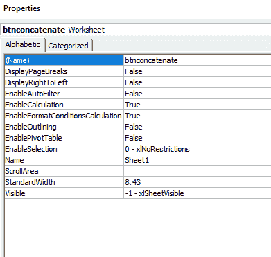

# VBA 字符串运算符

> 原文：<https://www.javatpoint.com/vba-string-operator>

字符串数据用于保存由数字、字母、特殊字符(符号)或所有字符组成的字符序列。

字符串运算符用于操作字符串数据。

如果变量用双引号("")括起来，则称其为字符串。

### 句法

```vba

Variablename = "String"

```

### 例子

```vba

Str1 = "String" (only Alphabets)
Str2 = "145.32" (only Numbers)
Str3 = "!@#$" (only symbols or special characters)
Str4 = "Mar-1997" (character (Mar), symbol (-), number (1997), has all of above)

```

您可以将 1997 年 3 月的值与月份和年份的前三个字母连接起来，如“1997 年 3 月”。

以下是一些字符串运算符，例如:

**1。Concatenate ( & ):** 该运算符用于将两个字符串或值连接在一起。

**比如**【玛丽】&【科姆】。

**输出:** MaryKom

#### 注意:串联运算符可以用于数字，也可以用于字符串。如果变量包含字符串值或数值，则输出取决于上下文。

### 示例

**第一步:**首先在 excel 表格中添加一个**按钮**，如前所示。

1.  更改名称属性，如 **btnconcatenate** 。



**第二步:**右键点击按钮。

**第三步:**选择**查看代码**选项。

**第四步:**你会得到如下截图所示的代码窗口。


**第 5 步:**在**专用子菜单点击**和**结束子菜单**之间编写如下代码:

```vba

MsgBox "Mary" & "Kom", vbOKOnly, "Concatenate Operator"

```


**第六步:**点击**保存**按钮。

**步骤 7:** 并关闭代码编辑器窗口。

**第 8 步:**然后关闭**设计模式**按钮。


**第九步:**指示灯为，会从绿色背景变为白色背景，如下图截图所示。


**第 10 步:**点击**连接**按钮。

**第 11 步:**执行上面的代码，会得到如下截图所示的输出。


* * *