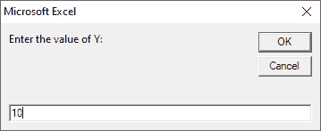

# VBA 精选案例

> 原文：<https://www.javatpoint.com/vba-select-case>

使用 VBA 选择案例语句代替多个嵌套的 If 语句。VBA 精选案例使 VBA 计划易于理解，执行时间更快。

VBA 选择案例语句在许多其他语言中也被称为切换案例，例如 [Java](https://www.javatpoint.com/java-tutorial) 、 [C++](https://www.javatpoint.com/cpp-tutorial) 、 [C#](https://www.javatpoint.com/c-sharp-tutorial) 和 [JavaScript](https://www.javatpoint.com/javascript-tutorial) 。它检查变量的不同值。如果任何一个案例是真的，那么它将只执行那个案例，而避免其他案例。

选择案例语句是 [If Else If 语句](https://www.javatpoint.com/vba-if-then-else-statement)的替代语句。这是从值列表中选择值的另一种方法。

### 句法

[VBA](https://www.javatpoint.com/vba) 选择案例语句遵循以下语法:

```vba

Select Case test_expression
Case condition_1 
Result_1
Case condition_2
Result_2 
.....
.....
Case condition_n
Result_n
Case Else 
Result_else
End Select 

```

**解释**

*   **test_expression:** 是与条件列表进行比较的字符串或数值。
*   **条件 _1 至条件 _n:** 这些是按列出的顺序评估的条件。如果条件为真，它将执行相应的代码，而不执行代码的其他条件。
*   **Result_1 到 result_n:** 当条件为真时执行的代码。
*   **Case Else:** 如果不满足条件为准确，则在代码中执行 Else 语句。

### 例子

以下是一些有助于理解 Select Case 语句执行的示例。

**例 1:** 我们将借助于 Select Case 语句找到一个条件，其中 **x = y** 。


如果条件为真，那么将执行代码的“**Case True”**块。否则，**将执行代码的【案例错误】**块。

在上面的例子中，我们使用 InputBox 函数从用户那里获取值。

现在执行代码并输入 X 和 y 的值

**情况 1:** 如果用户同时输入 X 和 y 的不同值


现在按下**确定**按钮，输入 y 值



你可以看到 X 和 Y 的值是不同的。点击**确定**按钮后，给出如下输出。


**情况 2:** 如果 X 和 Y 的值相等。

为 x 输入一个值。


现在点击**确定**按钮，输入相同的 y 值


再次点击**确定**按钮，给出如下输出。


**例 2:** 我们要检查用户输入的数字是否小于等于 50。


这里我们使用**IS**关键字和 Case 语句来比较值。

现在执行代码，给出 1 到 100 之间的任何值。


点击**确定**按钮，给出如下输出。


**示例 3:** 在本例中，我们借助 Select Case 语句检查单个案例中的多个条件。


当用户输入 1 到 10 之间的任何数字时，该代码将检查数字是偶数还是奇数。

我们使用 **(" ")** 来比较单个 Case 语句中的多个条件。

使用**运行**按钮执行代码，并输入从 1 到 10 的任意数字。


现在点击**确定**按钮，它给出如下输出。


* * *