# 否则如果语句

> 原文：<https://www.javatpoint.com/vba-if-then-else-statement>

If Then、If Then Else 和 If Else If 语句允许程序员控制脚本或其中一个部分的执行流程。

下图是大多数编程语言中常见的结构形式。

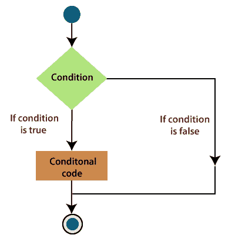

## 1.如果然后陈述

If Then 语句包含允许一个或多个语句的布尔表达式。

如果条件为“真”，则执行“如果”条件下的语句。如果条件为假，则执行 If 循环后的语句。

**语法**

```

If (Boolean_expression) Then
    Statement 1
    ........
    ........
    ........
    Statement n
End If

```

要在条件为真时运行一条语句，我们可以使用 If 语句的单行语法。

**例如:**

```

Sub FixDate () 
    myDate = #10/03/1997# 
    If myDate < Now Then myDate = Now 
End Sub

```

要运行多行代码，可以使用多行语法。该语法包括结束 If 语句。

**例如:**

```

Sub AlertUser (value as Long) 
    If value = 1 Then 
    AlertLabel.ForeColor = "yellow" 
    AlertLabel.Font.Bold = True 
    AlertLabel.Font.Italic = True 
  End If 
End Sub 

```

**流程图**

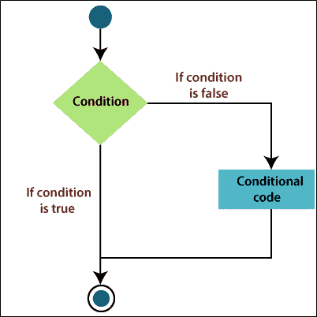

**例**

让我们借助一个函数找到 Excel 两个数中最大的一个。

```

Private Sub If_demo_Click ()
     Dim x As Integer
     Dim y As Integer
     x = 20
     y = 10
     If x > y Then 
        MsgBox "x is greater than y"
     End If 
End Sub

```

之后，执行上述代码，您将获得如下输出:

```
x is greater than y 

```

这里还有一些 If Then 语句的例子。该 [VBA](https://www.javatpoint.com/vba) 代码正在检查指定条件评估为真还是假。

当条件评估为“真”时，您只指定了要完成的步骤。在这种情况下，一个 [MsgBox](https://www.javatpoint.com/vba-msgbox) 将作为代码的结果显示在屏幕上。

如果条件评估为假，VBA 代码将什么也不做，它将立即跳过该行。

**例如:**

```

Sub evenOdd ()
If Range ("X1") Mod 2 = 0 Then 
MsgBox "X1 is even"
End If
End Sub

```

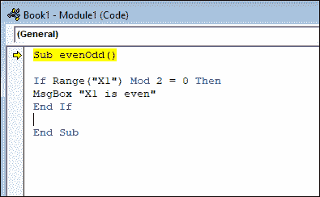

在上面的例子中，如果 excel 单元格中包含的数字被 2 除后余数为零，那么 excel 会显示一个 MsgBox，告诉这个数字是偶数。

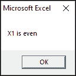

* * *

## 2.如果然后是其他语句

if 语句包含允许一个或多个语句的布尔表达式，如果条件为真，则执行 If 条件下的语句。如果条件为假，则执行 Else 条件下的语句。

**语法**

```

If (Boolean_expression) Then
Statement 1
.........
.........
.........
Statement n
Else
Statement 1
.........
.........
Statement n
End If

```

根据上面的语法，您可以根据条件的结果执行不同的任务。

**例如:**

```

Sub evenOdd ()
If Range ("A1") mod 2 = 0 Then
MsgBox "A1 is even"
Else
MsgBox "A1 is odd"
End If
End Sub

```

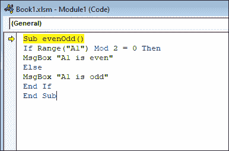

现在，当您运行 VBA 代码时，无论 A1 中的数值是多少，您都会得到输出。您可以在上面代码的下面截图中看到输出。

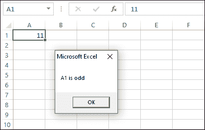

如果指定条件的计算结果为真，而另一组代码的计算结果为假，If ThenElse 语句将执行一组代码。

If Then Else 语句是 excel 中的内置函数，被归类为逻辑函数。也可以作为 excel 中的 [VBA 函数](https://www.javatpoint.com/vba-functions)。您可以在通过 Microsoft visual basic 编辑器输入的宏代码中使用此函数。

**流程图**

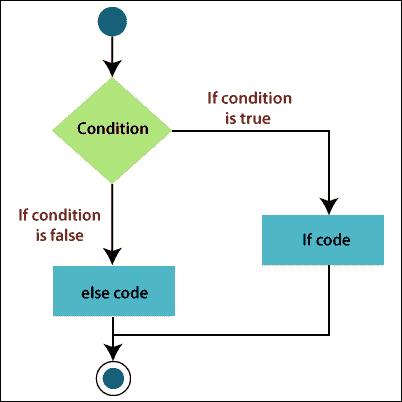

**例**

让我们借助一个函数找到 Excel 两个数中最大的一个。

```

Private Sub If_demo_Click ()
Dim x As Integer
Dim y As Integer
x = 20
y = 40
If x > y Then 
MsgBox "x is greater than y"
Else
MsgBox "y is greater than x"
End If 
End Sub

```

之后，执行上述代码，您将获得如下输出:

```
y is greater than x

```

让我们再举一个例子来清除 If Then Else 语句。

**例如**假设你想在 Excel VBA 中打印学生成绩及格或不及格。

```

Dim score As Integer, result As String
Score = Range ("A1").Value
If score >= 60 Then
Result = "Pass"
Else
Result = "Fail"
End If
Range ("B1").Value = result

```

如果分数大于或等于 60，Excel VBA 返回通过，否则 Excel VBA 返回失败。

* * *

## 3.If ElseIf 语句

If 语句允许一个或多个包含布尔表达式的 If Else 语句。然后是默认的 Else 语句，当所有语句都变成 False 时执行。

**语法**

```

If (Boolean_expression) Then
Statement 1
........
........
........
Statement n
ElseIf (Boolean_expression) Then
Statement 1
.........
.........
Statement n
ElseIf (Boolean_expression) Then
Statement 1
.........
.........
Statement n
Else
Statement 1
.........
.........
Statement n
End If

```

不是每个条件都可以简化为简单的两个语句。您的代码中还有两个以上的选项。在这种情况下，可以使用 ElseIf 语句。

您可以使用一个或两个以上的 ElseIf 部分，如上面的语法所示。

**流程图**

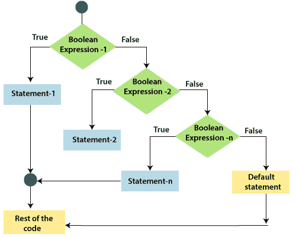

**例**

让我们借助一个函数找到 Excel 两个数中最大的一个。

```

Private Sub If_demo_Click ()
Dim x As Integer
Dim y As Integer
x = 40
y = 40
If x > y Then 
MsgBox "x is greater than y"
ElseIf y > x Then
MsgBox "y is greater than x"
Else
MsgBox "x and y are Equal"
End If 
End Sub

```

之后执行上述代码，您将获得如下输出:

```
x and y are Equal

```

让我们再举一些 If ElseIf 语句的例子。

**例如，**假设你有一个三按钮对话框，里面有是、否和取消选项。

如果用户按下一个按钮，您将获得按钮值，并向用户显示一条消息，告诉用户按下了哪个按钮。

为此，VBA 如果陈述被用作:

```

Sub Macro1()
 btnVal = MsgBox("Press a button and program will tell which button was pressed?", 3, "Demo")

   If btnVal = 1 Then

      MsgBox "User pressed Yes!"

   ElseIf btnVal = 2 Then

      MsgBox "User Pressed No!"

   Else

      MsgBox "User Pressed Cancel!"

   End If

End Sub

```

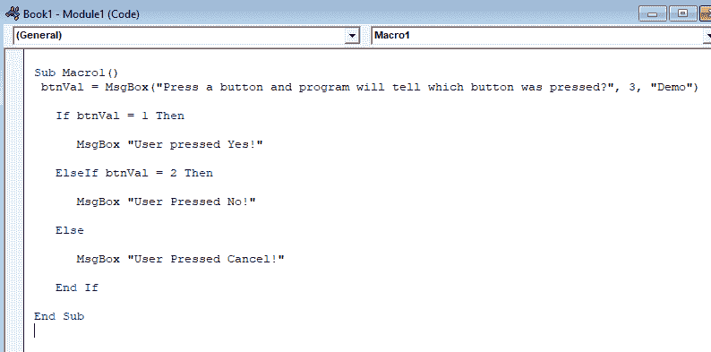

您可以看到，如何在 If 和 ElseIf 语句中计算 btnVal 变量，然后您将通过另一个对话获得相应的消息给用户。

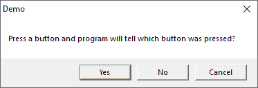

在按下所有三个按钮中的任何一个按钮或您在代码中给出的任何键后，您将获得如下输出:

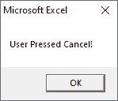

* * *