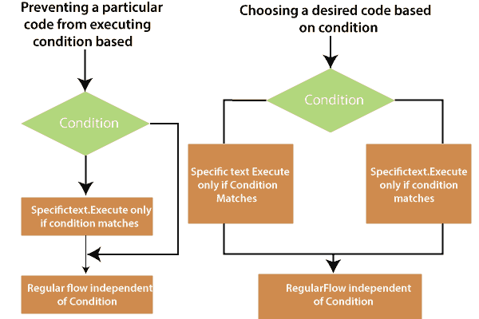
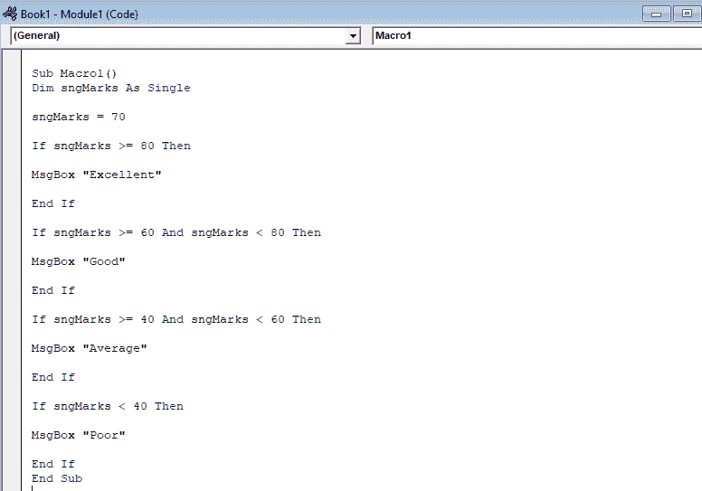
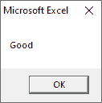

# 嵌套的 If 语句

> 原文:[https://www.javatpoint.com/vba-nested-if-statement](https://www.javatpoint.com/vba-nested-if-statement)

另一个 If 或 ElseIf 语句中的 If 或 ElseIf 语句。内部 If 语句的执行基于最外面的 If 语句。这使得 VBScript 能够处理复杂的情况。

### 句法

```
If (Boolean_expression) Then
Statement 1
........
........
........
Statement n
If (Boolean_expression) Then
Statement 1
.........
.........
Statement n
ElseIf (Boolean_expression) Then
Statement 1
.........
.........
Statement n
Else
Statement 1
.........
.........
Statement n
End If
Else
Statement 1
.........
.........
Statement n
End If

```

**流程图**



在嵌套语句中，VBA 遍历每个 If...然后，即使在评估真条件(并执行其相关语句)之后，条件仍然存在，而在 **ElseIf 结构**中，在评估真条件之后，将跳过以下所有条件。

在这种情况下，ElseIf 结构更快。因此，**嵌套语句**可能不包括非常有效的方法，如果同样可以用 **ElseIf 结构**完成的话。

**例如:**假设您想编写一个代码，如果学生分数大于或等于 80，则返回消息优秀。并根据决策标准返回好、中、差，如下例所示，例如:

```
Sub Macro1()
Dim sngMarks As Single
sngMarks = 70
If sngMarks >= 80 Then
MsgBox "Excellent"
End If
If sngMarks >= 60 And sngMarks < 80 Then
MsgBox "Good"
End If
If sngMarks >= 40 And sngMarks < 60 Then
MsgBox "Average"
End If
If sngMarks < 40 Then
MsgBox "Poor"
End If
End Sub

```



在 VBA 运行上述代码，您将获得如下截图所示的输出。



### 例子

让我们借助一个函数找到 Excel 的正数。

```
Private Sub nested_If_demo_Click ()
Dim x As Integer 
x = 30 
If x > 0 Then 
MsgBox "a number is a positive number"
If x = 1 Then
MsgBox "A number is neither prime nor composite"
ElseIf x = 2 Then 
MsgBox "A number is the only prime even prime number"
ElseIf x = 3 Then 
MsgBox "A number is the least odd prime number"
Else 
MsgBox "The number is not 0, 1, 2, or 3"
End If 
Else If x < 0 Then
MsgBox "A number is a negative number"
Else 
MsgBox "the number is zero"
End If
End Sub

```

执行上述代码后，您将获得如下输出:

```
A number is a positive number 
The number is not 0, 1, 2, or 3

```

* * *