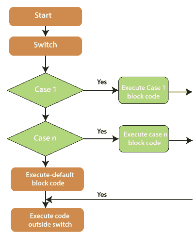
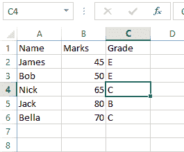

# 交换语句

> 原文：<https://www.javatpoint.com/vba-switch-statement>

为了根据表达式的值执行一组语句，我们使用了 Switch Case。在这里，每个值被称为一个案例，变量基于每个案例被打开。如果测试表达式与用户指定的任何 case 都不匹配，则执行 Else 语句 Case。

Case Else 是选择案例中的可选语句。然而，总是有一个 Case Else 语句是一个很好的编程实践。

### 语法:

```

Select Case expression
   Case expressionlist1
      Statement 1
      Statement 2
      .................
      .................
      Statement n
   Case expressionlist2
      Statement 1
      Statement 2
      .................
      .................
      Statement n
   Case expressionlistn
      Statement 1
      Statement 2
      .................
      .................
      Statement n
   Case Else
      Elsestatement 1
      Elsestatement 2
      ....
      ....
End Select

```

**流程图**



### 例子

让我们借助一个函数来找出整数的类型。

```

Private Sub switch_demo_Click ()
Dim MyVar As Integer
MyVar = 1
Select Case MyVar
Case 1
MsgBox "A number is the least composite number"
Case 2
MsgBox "A number is the only even prime number"
Case 3
MsgBox "A number is the least odd prime number"
Case Else 
MsgBox "unknown number"
End Select
End Sub 

```

之后，执行上述代码，您将获得如下输出:

```
The number is the least composite number 

```

让我们看看 switch 语句的更多示例，例如

**例如，**您想要使用 switch 语句创建一个自定义函数(UDF)。

它可以像任何常规的工作表函数一样使用，它会返回学生的分数。

创建自定义公式的代码如下:

```

Function GetGrade(StudentMarks As Integer)
Dim FinalGrade As String

Select Case StudentMarks

Case Is < 33
FinalGrade = "F"

Case 33 To 50
FinalGrade = "E"

Case 51 To 60
FinalGrade = "D"

Case 61 To 70
FinalGrade = "C"

Case 71 To 90
FinalGrade = "B"

Case Else
FinalGrade = "A"

End Select
GetGrade = FinalGrade

End Function

```

现在，您可以在工作表中使用函数 GetGrade，如下图所示，例如:



* * *