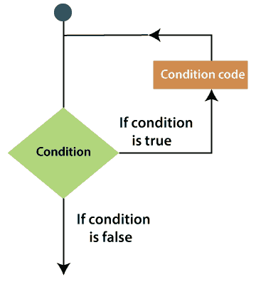

# VBA 环路

> 原文:[https://www.javatpoint.com/vba-loops](https://www.javatpoint.com/vba-loops)

有一种情况是，您需要多次执行一个代码块。一般来说，语句是以预定义的顺序执行的。

编程语言提供了允许更复杂的执行路径的各种控制结构。

循环语句允许您多次执行一条语句或一组语句。要充分利用 Excel 和 VBA，首先要知道如何有效地使用循环。下图是 VBA 循环语句的一般形式。



**例如:**考虑一个数据集，您希望高亮显示偶数行中的所有单元格。您可以使用 VBA 循环遍历该范围并分析每个单元格的行号。如果它变成偶数，那么你给它一个颜色。否则你就保持原样。

VBA 提供了不同类型的循环来处理循环需求。下面是每个循环的简要介绍，例如:

1. [For 循环](vba-for-loop):它多次执行一系列语句，并压缩管理循环变量的代码。

For 循环使用一个变量，该变量循环遍历指定范围内的一系列值。然后对 VBA 的每个值执行循环中的代码。

```

For i = 1 to 20
Total = Total + iArray(i)  
Next i

```

上面的 For 循环将变量 I 设置为值 1，2，3，...，20，对于这些值中的每一个，在循环中运行 VBA 代码。因此，循环将数组的每个成员添加到变量中。

2.[对于每个循环](vba-for-each-loop):如果组中至少存在一个元素，并且对组中的每个元素进行迭代，则执行代码块。

**例如:**让我们列出当前 excel 工作簿中的每个工作表。

```

For Each object_variable In group_object_variable
........
........
[Block of code]
........
Next object_variable

```

3. [Do While 循环](vba-do-while-loop):只要条件为真，就执行，或者只有当情况为假时才重复循环。

```

The do...While loop statement 
Do 
........
........
[Block of code]
........
Loop while (condition)

```

4.[做直到循环](vba-do-until-loop):只要条件为假就会执行，或者只有情况为真才重复循环。

```

The Do...Until loop statement 
Do
........
........
[Block of code]
Loop Until [condition]

```

### 循环控制语句

循环控制语句可以改变正常顺序的执行。当执行离开一个范围时，循环中剩余的所有语句都不会执行。

VBA 支持以下控制声明。

1.  **退出 for 语句:**它终止 For 循环语句，并将执行转移到循环后的非物质语句。
2.  **退出 do 语句:**它终止 do-while 语句，并将执行转移到紧接着循环的语句。

* * *