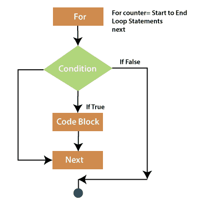
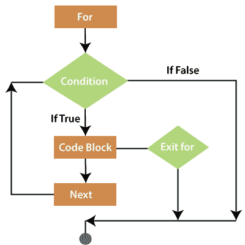

# VBA 换环路

> 原文：<https://www.javatpoint.com/vba-for-loop>

For 循环是一种重复控制结构，它允许开发人员以逻辑方式编写需要执行特定次数的循环。

**流程图**



下面是 for 循环中的一些控制流程，如下所示:

*   首先，执行 for 循环。这允许您初始化任何循环控制变量并增加步进计数器变量。
*   其次，对于循环条件进行评估。如果为真，则执行循环体。如果是假的，身体不会执行。控制流跳转到 For 循环后的下一条语句。
*   然后 for 循环的主体将执行，控制流跳转到下一条语句。这个语句允许你更新任何循环控制变量。它根据步长计数器值进行更新。
*   现在，病情被重新评估。如果为真，则执行循环，整个过程重复进行。如果条件为假，那么 for 循环将终止。

### 句法

For 循环将一个代码块执行特定次数。

```

For counter_variable = start_value To end_value
........
........
[Block of code]
.........
.........
Next conter_varaiable

```

### 例子

```

Sub forNext ()
Dim i As Integer 
Dim iTotal As Integer 
iTotal = 0
For i = 1 to 10
      iTotal = I + iTotal
Next i
MsgBox iTotal
End Sub

```

## 说明

*   计数器变量是 I，需要声明。
*   计数器的**起始值**为 1，计数器的**结束值**为 10，均为数值。
*   关键字**“步骤”**是可选的，它是一个数值，每次循环运行时计数器都会递增。
*   下一条语句是将计数器递增步长值，并返回到该语句的，如果计数器值没有超过 10 的**“End _ value”**，则重复该代码。
*   如果计数器等于 **End_value** ，循环将继续，或者只有当 **End_value** 超过时才会停止。

## 嵌套用于下一个循环

您还可以使用嵌套 for 循环在 excel 中实现更复杂的自动化。在**“为下一个”**循环中会有一个**“为下一个”**循环。

**例如:**假设您想保护系统中所有打开的工作簿中的所有工作表。

```

Sub ProtectWorksheets ()
Dim i As Integer
Dim j As Integer
For i = 1 to Workbooks.Count
For j = 1 to Workbooks(i).Worksheets.Count
Workbooks(i).Worksheets(j).Protect
Next j
Next i
End Sub

```

## 退出语句

通过使用 for 循环语句的 exit，可以在不完成整个循环的情况下退出该语句。“退出”命令将立即停止现有循环的执行。

**流程图**



**例如**检查是否有负值是更有效的方法。但是在这种情况下，没有负值，我们可以退出循环并节省一些 VBA 处理时间。

```

Sub HighlightNegativeCells()
Dim All As Range
For Each All In Selection
If WorksheetFunction.Min(Selection) >= 0 Then Exit For
If All.Value < 0 Then
All.Interior.Color = vbRed
End If
Next All
End Sub

```

* * *