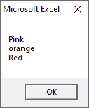

# 每个循环的 VBA

> 原文：<https://www.javatpoint.com/vba-for-each-loop>

For Each 循环用于为数组中的每个元素执行一条语句或一组语句。

每个回路的**与**回路的**相似。对数组中的每个元素执行这个循环。因此，步进计数器不会存在于此循环中。它通常与数组一起使用，或者在文件系统对象的上下文中递归操作。**

### 句法

```vba

For Each element In group
   [Statement 1]
   [Statement 2]
  ................

................
   [Statement n]

   [Exit For]

   [Statement 11]
   [Statement 22]
Next

```

您可以使用 VBA 的“**”For Each**”循环在一组集合中构建一个循环。

以下是在 excel VBA 中使用 For Each 循环的一组集合的一些示例，例如:

*   一组所有打开的工作簿。
*   工作簿中所有工作表的集合。
*   选定单元格范围内的所有单元格的集合。
*   工作簿中所有图表或形状的组合。

使用“**”For Each**”循环，您可以遍历集合中的每个对象，并对其执行一些操作。

**例如**你可以浏览工作簿中的所有工作表并绘制这些工作表。或者，您可以浏览工作表中的所有单元格并更改格式。

使用 For Each 循环，您不需要知道集合中有多少对象。

对于每个循环，自动遍历每个对象并执行指定的操作。

**例如**如果保护一个工作簿中的所有工作表，那么无论是 1 个工作表的工作簿还是 20 个工作表的工作簿，代码都是一样的。

### 例子

假设您有一个想要保护所有工作表的工作簿。例如:

```vba

Sub ProtectSheets()
Dim ws As Worksheet
For Each ws In ActiveWorkbook.Worksheets
Ws.Protect
Next ws
End Sub  

```

在上面的例子中，我们使用了“ **ws** ”变量作为工作表对象。它告诉 VBA“**ws**应该被用来解释为代码中的工作表对象。

现在，我们使用“ **For Each** ”语句来遍历活动工作簿中工作表集合中的每个“ **ws** ”。

请注意，与其他试图保护工作簿中所有工作表的循环不同，这里您不需要担心工作簿中有多少工作表。

你不需要计算这些来运行循环。对于每个循环，确保逐一分析所有对象。

**现在，浏览所有打开的工作簿并全部保存:**

如果您同时使用多个工作簿，可以一次保存所有这些工作簿。比如，

```vba

Sub SaveAllWorkbooks()
Dim wb As Workbook
For Each wb In Workbooks
wb.Save
Next wb
End Sub

```

请注意，在上面的示例中，要将工作簿保存在特定位置，在这种情况下，您不会收到询问您的提示。它会将其保存在默认文件夹中。

### 例子

```vba

Private Sub Constant_demo_Click()  
   'colors is an array
   colors = Array("Pink", "orange", "Red")
   Dim colornames As Variant
   'iterating using For each loop.
   For Each Item In colors
      colornames = colornames & Item & Chr(10)
   Next
   MsgBox colornames
End Sub

```


执行上述代码，您将获得以下输出，例如:



* * *