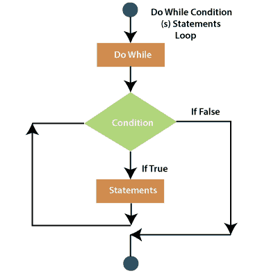
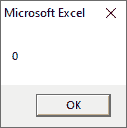
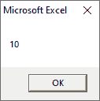

# VBA 边循环边做

> 原文:[https://www.javatpoint.com/vba-do-while-loop](https://www.javatpoint.com/vba-do-while-loop)

当我们想重复一组语句时，只要条件为真，就使用 **Do While Loop** ，当条件变为假时，就停止。

可以在循环开始或结束时检查条件。**边做边**...循环语句”检查循环开始时的条件。

“那**怎么办...循环同时**语句“检查循环结束时的情况。

如果在循环开始时检查了条件，则代码块不会执行。如果在开始时不满足条件，循环甚至不会运行一次，而如果在结束时检查条件，循环至少会运行一次。

### 句法

**边做边看...循环语句**

它在循环开始时检查条件。

```

Do While [Condition]
..............
..............

[Block of code]
..............

Loop

```

**做...While 循环语句**

**Do 有一个替代语法...而**循环。它检查循环结束时的条件。

```

Do
..............
..............
[Block of code]
..............

Loop While [Condition]

```

**流程图**



### 例 1

以上两种语法都是借助于例子来解释的。比如，

下面的例子使用了 **Do While...**循环检查循环开始时的状况。只有当条件变为真时，才会执行循环中的语句。

```

Sub doWhile()
Dim i As Integer
Dim iTotal As Integer
i = 10
iTotal = 0
Do While i > 10
iTotal = i + iTotal
i = i - 1
Loop
MsgBox iTotal

End Sub

```

执行代码后，您将获得以下输出。



### 例 2

在这个例子中，我们使用 **Do...而**循环检查循环结束时的情况。即使条件为假，循环中的语句也应该至少执行一次。

```

Sub doWhile()

Dim i As Integer
Dim iTotal As Integer
i = 5
iTotal = 0
Do
iTotal = i + iTotal
i = i - 1
Loop While i > 5
MsgBox iTotal

End Sub

```

执行代码后，您将获得以下输出。



* * *