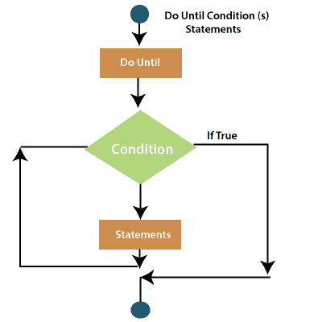
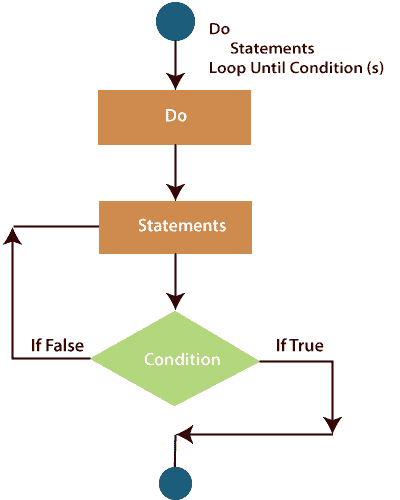
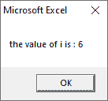
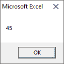

# VBA 做直到循环

> 原文:[https://www.javatpoint.com/vba-do-until-loop](https://www.javatpoint.com/vba-do-until-loop)

当我们想无限期地重复一段代码或一组语句直到条件为真时，使用 **Do 直到循环**。可以在循环开始或结束时检查条件。

**做到**...循环语句检查循环开始时的条件和**做...循环直到**语句检查循环结束时的情况。

如果在循环开始时检查了条件，那么如果条件本身最初得到满足，代码块就不会执行(循环甚至不会运行一次)。如果最后检查了条件，循环至少运行一次。

### 句法

## 做到...循环语句

```

Do Until [Condition]
...............
...............

[Block of code]
...............

Loop

```

**流程图**



### 例子

在这个例子中，我们使用**直到...**循环检查循环开始时的情况。只有当条件为 false 时，才会执行循环中的语句。当条件为真时，它存在于循环之外。

```

Private Sub Constant_demo_Click()
   i = 5
   Do Until i > 10
      i = i + 1
      MsgBox ("The value of i is : " & i)
   Loop
End Sub

```

执行代码后，您将获得以下输出:

```
The value of i is: 6

The value of i is: 7

The value of i is: 8

The value of i is: 9

The value of i is: 10

The value of i is: 11

```

## 做...直到循环语句

做...直到循环用于检查循环结束时的情况。

**语法**

```

Do
..............
..............

[Block of code]
..............

Loop Until [Condition]

```

**流程图**



### 例子

在这个例子中，我们使用 **Do...直到**循环检查循环结束时的情况。即使条件为真，循环中的语句也至少执行一次。

```

Private Sub Constan_demo_Click()
i = 5
Do
i = i + 1
MsgBox "the value of i is: " & i
Loop Until i < 10
End Sub

```

执行代码后，您将在消息框中获得以下输出。



## 退出执行声明

通过使用**退出 Do** 语句，您可以提前退出 **Do While** 或 **Do 直到循环**，而无需完成整个循环。

Exit Do 语句将立即停止循环的执行，并立即执行代码段。在内部嵌套层的情况下，它将停止并执行下一个外部嵌套层。

在一个循环中可以有多个退出 Do 语句。在达到特定值或满足特定条件时想要终止循环的情况下，或者想要在某个点结束循环的情况下，它特别有用。

例如:

```

Sub exitDo1()
Dim i As Integer
Dim iTotal As Integer
iTotal = 0
Do While i < 10
iTotal = i + iTotal
i = i + 1
If i = ActiveSheet.Range("A1") Then
Exit Do
End If
Loop
MsgBox iTotal
End Sub

```

执行上述代码，您将获得以下输出。



* * *