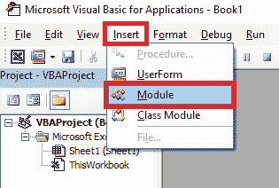
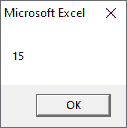

# VBA 函数

> 原文：<https://www.javatpoint.com/vba-functions>

函数是一段执行特定任务并返回结果的代码。函数主要用于执行重复任务，如执行计算、格式化数据以进行输出等。

在 VBA，您可以创建一个函数或用户定义的函数，它可以像常规函数一样在工作表中使用。

这在现有 excel 函数不够用的时候非常有帮助。在这些情况下，您可以创建自定义的用户定义函数来满足您的特定需求。

您可以将函数放入模块中。让我们一步一步来看:

**步骤 1:** 进入**开发者**复选框。

**第二步:**点击 **Visual Basic** 编辑器。


**第三步:**然后点击**插入**按钮。

**第 4 步:**选择**模块**选项。



### 句法

```vba

Private Function FunctionName (ByVal arg1 As Integer, ByVal arg2 As Integer)

    FunctionName = arg1 + arg2 

End Function

```

**例如**假设下面代码中有一个名为 Sum 的函数，比如:

```vba

Private Function Sum (x As Double, y As Double) As Double
Area = x + y
End Function

```

**解释:**在这个例子中，函数有两个参数(双精度类型)和一个返回类型(也是双精度类型)。函数名为 Sum，表示要返回的结果，如(x + y)。

现在，只需使用函数名(Sum)并为每个参数指定一个值，就可以在代码的其他地方调用这个函数。

在工作表上插入一个命令按钮，并添加以下代码。

```vba

Dim z As Double 
z = Sum (4, 8) + 3
MsgBox z 

```

**说明:**可以用另一个变量 z 来存储结果。该函数返回一个值，因此您必须在代码中捕捉这些值。此外，您可以向该变量添加另一个值。使用 MsgBox 显示该值。

点击表单上的命令按钮后，您将获得以下结果。



### 例子

一个函数非常类似于子程序。函数和子程序的唯一区别是函数在被调用时返回值，但是子程序在被调用时不返回值。

假设您想要找到该区域，因此您需要创建一个函数，该函数接受可以用函数名本身返回的值。

**步骤 1:** 在工作表中添加一个**命令**按钮。


1.然后设置**命令**按钮的**名称**属性。


2.设置**命令**按钮的**标题**属性。

3.现在，界面看起来像下面的截图。


**第二步:**打开代码窗口，写出如下代码。

```vba

Private Function Area(Length As Double, Optional Width As Variant)
   If IsMissing(Width) Then
      Area = Length * Length
   Else
      Area = Length * Width
   End If
End Function  

```

**第三步:**编写调用函数的代码。

1.  右键单击**按钮。**
2.  选择**查看代码**选项。
3.  并添加以下代码。

```vba

Private Sub btnAreaFunction_Click()
    MsgBox Area(5, 9)
End Sub

```

**第四步:**运行上面的代码，会得到如下截图所示的输出。


* * *