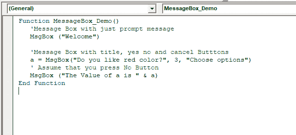
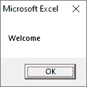
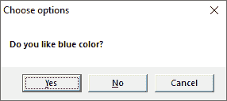
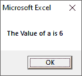

# VBA MsgBox

> 原文:[https://www.javatpoint.com/vba-msgbox](https://www.javatpoint.com/vba-msgbox)

MsgBox 是 excel VBA 中的一个对话框，可以用来通知用户您的程序。

它会显示一个弹出样式的消息框，等待用户单击按钮，然后根据用户单击的按钮执行操作。

它为最终用户提供了一种与工作簿交互的方式。它可以是对用户的简单警告，也可以是需要用户采取行动的复杂警告。

### 句法

```

Msgbox (prompt, [buttons], [title], [helpfile, context])

```

**提示:**(必选参数)是指在对话框中显示为消息的文本。发布消息的最大长度大约为 1024。如果单词跨越了定义的范围，那么将在每行之间使用回车符(Chr(13))或换行符(Chr(10))来分割消息。

**按钮:**(可选参数)它表示一个数字表达式，用于显示按钮类型、使用图标样式、默认按钮的标识以及消息框的形态。如果按钮的左侧为空，则按钮的默认值为零。

**标题:**(可选参数)对话框标题栏显示字符串表达式。如果对话框的左侧为空，则应用程序名称将放在标题栏中。

**帮助文件:**一个字符串参数，标识用于为对话框提供上下文相关帮助的帮助文件。

**上下文:**帮助作者将帮助上下文编号分配给适当的主题。如果提供了上下文，那么也必须提供帮助文件。

我们可以在按钮参数的帮助下以多种方式配置消息框。如下表所示，例如:

| 常数 | 价值 | 描述 |
| vbokonly(俄罗斯联邦) | Zero | 仅显示**确定**按钮 |
| vbOKCancel | one | 显示**确定**和**取消**按钮 |
| vbAbortRetryIgnore | Two | 显示中止、**重试**和**忽略**按钮 |
| vbYesNoCancel | three | 显示**是，否**，以及**取消**按钮 |
| vbYesNo | four | 显示**是**和**否**按钮 |
| vbRetryCancel | five | 显示**重试**和**取消**按钮 |
| vbCritical | Sixteen | 显示**临界信息** e 图标 |
| vbQuestion | Thirty-two | 显示**警告查询**图标 |
| vb 感叹 | Forty-eight | 显示**警告信息**图标 |
| vbinformation-v 资讯 | Sixty-four | 显示**信息信息**图标 |
| vbDefaultButton1 | Zero | 第一个按钮是默认的 |
| vbDefaultButton2 | Two hundred and fifty-six | 第二个按钮是默认按钮 |
| vbDefaultButton3 | Five hundred and twelve | 第三个按钮是默认按钮 |
| vbDefaultButton4 | Seven hundred and sixty-eight | 第四个按钮是默认按钮 |
| vbApplicationModal | Zero | 用户必须响应消息框 |
| vbSystemModal | Four thousand and ninety-six | 在用户响应消息框之前，所有应用程序都将暂停 |
| vbMsgBoxHelpButton | Sixteen thousand three hundred and eighty-four | 在消息框中添加**帮助**按钮 |
| vbMsgBoxSetForeground | Sixty-five thousand five hundred and thirty-six | 将消息框窗口指定为前台窗口 |
| vbMsgBoxRight | Five hundred and twenty-four thousand two hundred and eighty-eight | 文本是八对齐的 |
| vbmsgboxrtlrreading | One million forty-eight thousand five hundred and seventy-six | 指定文本在阿拉伯语和希伯来语系统中应显示为从右向左的阅读 |

上述数值分为四组，第一组数值(0-5)描述了对话框中显示的按钮数量和类型。第二组**值(16、32、48 和 64)说明了图标样式。第三组**值(0，256 和 512)决定哪个按钮是默认的。消息框的形态定义在**第四组** (0，4096)中。我们只能从每个组中添加一个数字来创建 buttons 参数的最终值。****

 **### 返回值

MsgBox 函数从下列值中返回任意一个值，用于标识按钮。用户唯一要做的就是点击消息框。

| 常数 | 价值 | 描述 |
| vbook .好吧 | one | 好 |
| vb 取消 | Two | 取消 |
| vbAbort | three | 流产 |
| vbRetry | four | 重试 |
| vbIgnore | five | 忽视 |
| 按是 | six | 是 |
| vbNo | seven | 不 |

### 例子

假设我们要显示一个带有**是、否、**和**取消**按钮的消息框，如下代码所示:



通过点击 VBA 窗口上的运行按钮执行上述功能。它在消息框中显示一个“欢迎”消息框和一个**“确定”**按钮。



点击**确定**按钮后，显示另一个对话框，显示信息“你喜欢红色吗”“T2”“是”“否”“T3”“T4”“取消”按钮。



单击任何按钮后(例如“是”)，该按钮的值将存储为整数。它向用户显示了一个弹出消息框，如下所示。使用这个值，我们可以了解用户点击了哪个按钮。



* * ***