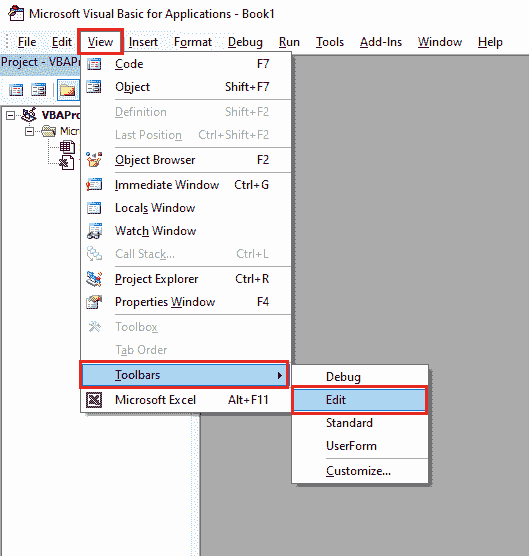
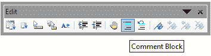

# VBA Comment

> 原文:[https://www.javatpoint.com/vba-comment](https://www.javatpoint.com/vba-comment)

注释是程序中使用的一个简单的、有表现力的文本。VBA 的评论被用来定义我们在做什么以及为什么要做。

当您开发任何变通方法或有复杂的代码时，通常会使用这些注释。

## VBA 评论单行

有几种方法可以对代码行进行注释，例如单引号(')、工具栏中的注释块按钮以及添加 Rem 关键字。

在行首加上单引号是在程序中注释一行最简单的方法，例如:

```

'Sheet2.Range("A11").Value = "Exam"

```

#### 注:在 VBA，绿色文本始终用于显示注释。

在上例中，我们在行首使用了单引号来注释第一行。在行首设置报价后，对整行进行注释。并且这一行不会在程序执行期间执行。

如果我们在行中的某个地方放一个单引号，那么您可以注释部分代码。

```

Sheet2.Range("A11").Value = "Exam"  'This is the line to comment 

```

我们还可以通过使用标准的 VBA 按钮，使用第二种方式对程序中的一行进行注释。

要显示标准的 VBA 按钮，我们需要在 VBA 工作表上添加**视图→工具栏→编辑**。



现在，我们可以在工具栏中看到两个按钮，即注释块和取消注释块。



#### 注意:使用此方法时，我们不能在代码的行尾添加引号。

## 使用快速眼动关键字

要对任何一行进行注释，可以用 Rem 关键字开始该行。不需要使用单引号或撇号。

```

Sub fnToCommentLine()
         Rem MsgBox "this is the line to comment"
End Sub 

```

以下是使用 Rem 关键字的限制，例如:

*   评论的开头和 Rem 关键字之间应该至少有一个空格。
*   我们不能在一行之间使用 Rem 关键字来评论整行。
*   我们必须始终使用 Rem 关键字作为第一个单词。

## VBA 评论整块

我们还需要对多行或一个代码块进行注释，并且我们在工具栏中有相同的标准按钮注释块。

首先，选择我们想要评论的行，然后点击**评论**按钮:

```

Private Sub CommentEntireBlock()

'    Sheet2.Range("A11").Value = "Exam"

'    If Sheet2.Range("A11") = "Exam" Then
'        MsgBox "The value of A11 cell is: Exam"
'    End If

End Sub

```

现在整个代码块都被注释了。同样，通过使用取消注释按钮，我们可以取消注释一段代码。

```

Private Sub CommentEntireBlock()

    Sheet2.Range("A11").Value = "Exam"

    If Sheet2.Range("A11") = "Exam" Then
        MsgBox "The value of A11 cell is: Exam"
    End If

End Sub

```

## 注释的键盘快捷键

要启用评论快捷键，请执行以下步骤，例如:

1.  右键单击工具栏上的。
2.  选择**自定义**选项，选择**编辑**选项。
3.  然后将注释块拖放到工具栏中现有图标的旁边。
4.  现在，新添加的按钮在工具栏中可见。
5.  单击修改并选中图像和文本选项。
6.  再次点击修改选择，在评论区的开头添加 **&** ，这样按钮的名称就是“ **&【评论区】**”。

现在，按 Alt + C 对程序中选定的行或行块进行注释。

通过重复整个过程，我们可以取消对 Block 命令的注释，或者使用快捷键 **Alt + U** 。

* * *