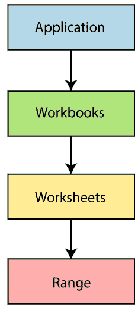
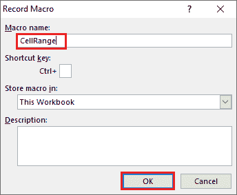
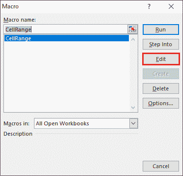
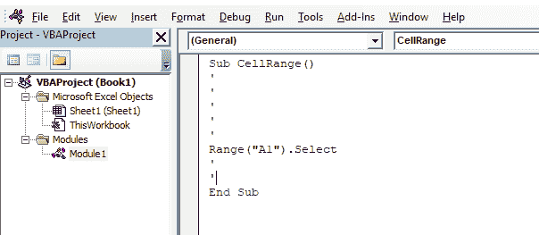
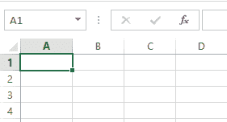

# 超越 VBA 范围

> 原文:[https://www.javatpoint.com/excel-vba-range](https://www.javatpoint.com/excel-vba-range)

Excel VBA 范围对象表示工作表中的一个或多个单元格。这个对象是 Excel VBA 中非常重要的对象。

在 Excel VBA 中，范围也称为任何行或列中的单个单元格或一组单元格的属性。它被认为是一个数据集。

### 句法

```

 Range(Cell1, [Cell2]) As Range

```

要使用范围函数，我们需要了解 Excel VBA 中的三个基本内容，例如:

*   **对象限定符:**用于刷新对象。对象限定符定义当前工作表或工作簿。

属性和方法用于操作这些单元格值。

*   **属性:**该选项包含与对象相关的信息。
*   **方法:**方法是对象执行动作的行为。它复制、选择、排序和清除数据。

VBA 遵循**对象层次结构**来定义对象。我们将遵循以下结构:

```

 Application.Workbooks.Worksheets.Range

```

#### 注意:我们通过使用()连接每个不同级别的对象。)点。



## 范围属性

工作表有一系列用于访问单元格的属性。range 属性采用相同的参数来执行大多数 excel 工作表操作，如“A1”、“A3:C6”等。

**按范围属性引用范围对象**

Range 属性应用于两种不同类型的对象，例如:

*   工作表对象
*   范围对象

范围属性的语法:

```

 Application.Workbooks("Book1.xlsm").Worksheets'("Sheet1").Range("A1")

```

说明

1.  “范围”是一个关键词。
2.  在括号内，我们跟随关键字。
3.  我们需要定义相关的单元格区域。
4.  我们使用了引号(" ")。

**例如:** MsgBox 工作表(“sheet1”)。范围(“A1”)。价值

我们可以通过使用 Range 属性来执行许多任务。这些任务指的是:

*   使用范围属性的单个单元格。
*   使用**工作表的单个单元格。范围属性**。
*   整行整列。
*   使用工作表合并单元格**。范围属性**以及更多。

**使用工作表引用单个单元格。范围属性:**

**第一步:**首先打开 Excel。

**第二步:**在这一步中

*   单击记录宏按钮。
*   它会打开一个窗口，输入程序名。
*   点击确定按钮。



**第三步:**点击菜单中的**宏**按钮。

*   它会弹出一个新窗口。
*   然后点击**编辑**按钮。



**第四步:**现在，它将打开 VBA 代码编辑器并编写您的代码。



**第五步:**保存文件并执行代码。

**第六步:**代码执行完毕后，单元格“A1”自动选择。



要应用另一个 range 对象，下面是代码语法:

| 选择单元格的范围 | 句法 |
| 对于单行 | 范围(“1:1”) |
| 对于单列 | 范围(“答:答”) |
| 对于连续单元格 | 范围(“A1:C5”) |
| 对于不连续的单元格 | 范围(“A1:C5，F1:F5”) |
| 对于两个范围的交集 | 范围(“A1:C5 F1:F5”)
**注意:**对于交集单元格，没有逗号运算符 |
| 合并单元格 | 范围(“A1:C5”)
使用“合并”命令合并单元格 |

## 单元格属性

单元格属性类似于范围，但唯一的区别是它有一个“item”属性，用于引用电子表格上的单元格。单元属性有利于编程循环。

**例如**

单元格.项目(行，列)

*   Cells.item(1，1)或
*   两个行都指单元格 A1。

## 范围偏移属性

Range offset 属性选择行或列，并从其原始位置移开。单元格是根据声明的范围选择的。

**语法**

```

Range("A1").offset(Rowoffset:=1, columnoffset:=1).Select 

```

offset 属性会将单元格 A1 移离一行一列。rowoffset 或 columnoffset 的值可以根据需要更改。我们也可以通过使用负值(-1)来向后移动单元格。

* * *