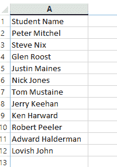

# Excel VBA 查找

> 原文：<https://www.javatpoint.com/excel-vba-find>

“查找”功能通常在 VBA 使用。它是 Range 的成员。“查找”功能用于搜索包含值或格式的单元格区域。

查找功能与在 excel 工作表中使用查找对话框相同。快捷键 Ctrl + F 将找到我们想要在整个工作表以及整个工作簿中搜索的单词或值。

### 句法

在 VBA，我们编写一个函数来查找我们要查找的单词或内容，例如:

```

expression.Find( What, After, LookIn, LookAt, SearchOrder, SearchDirection, MatchCase, MatchByte, SearchFormat )  

```

要查看**查找**对话框，进入**首页**功能区，点击**查找&在**编辑区**选择**。


点击**查找&选择**选项后，显示如下对话框。


以下是 VBA 查找函数语法的解释。

**什么:**我们在寻找什么。我们需要提及我们正在搜索的特定内容。

**之后:**之后我们要搜索哪个单元格。

**向内看:**在哪里寻找我们正在寻找的东西。例如值、公式和注释。参数为 **xlFormulas** 、 **xlValues** 和 **xlComments** 。

**看:**我们是在搜索全部内容还是只搜索部分内容。参数为**XL 整体**，和**XL 零件**。

**SearchOrder:** 我们要找的是哪个顺序，是行还是列。参数为 **xlByRows** 或 **xlByColumns** 。

**SearchDirection:** 我们在寻找哪个方向，是下一个单元格还是上一个单元格。参数为 **xlByColumn** 或 **xlByRows** 。

**匹配案例:**搜索内容是否区分大小写。参数为**真**或**假**。

**MatchByte:** 仅用于双字节语言。参数为**真**或**假**。

**搜索格式:**如果我们是通过格式进行搜索，那么我们需要使用**应用程序。FindFormat** 方法。

## 如何使用查找功能

通过以下示例，按照一些步骤学习如何使用 Excel VBA 查找功能。

**例 1:** 假设我们有包含学生姓名的学生报告数据。我们试图找到名称**尼克·琼斯**如下:



**第一步:**首先打开 Visual Basic，添加一个新模块。

**第二步:**双击新增加的模块，写代码。


**第 3 步:** Find 函数是 Range 属性的一部分。所以，我们需要先提供范围。在这个例子中，范围是从 A2 到 A12。


**第四步:**提供范围后，写一个**点**，添加**查找**功能。

**第五步:**现在，您可以在弹出的表格中看到 Find 属性。


**第 6 步:**选择查找属性选项，打开括号。

**第 7 步:**现在，您可以看到 Find 函数的语法。


**第八步:**我们传递 **What:=** 这样的参数，这将有助于我们识别所指的是哪个参数。


**第九步:**现在选择那个单词，然后写出**点**并传递参数**选择**。


**步骤 10:** 选择选择参数后，使用**运行**按钮执行代码。


**第 11 步:**突出显示单词“**Tom mustane**作为 Excel 工作表中代码的输出，如下图截图所示。


**示例 2:** 在本例中，Find 函数用于搜索文本字符串“**新文本**中的各种字符。该公式用于使用查找功能查找新文本。


查找功能区分大小写。因此，它给出了小写和大写值的不同结果，如“ **T** ”和“ **t** ”，它们位于单元格 B2 和 B3 中。


在单元格 B5 中，**参数【start _ num】**设置为 5。这就是为什么搜索从文本字符串的第五个字符开始。所以 Find 函数优先选择第二个“ **e** ”子串。


* * *