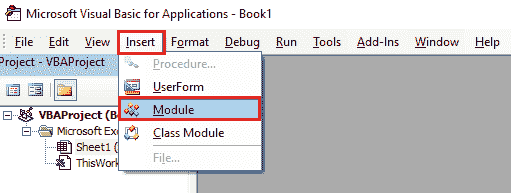
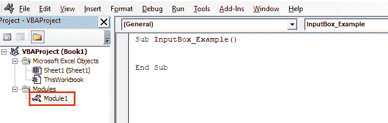
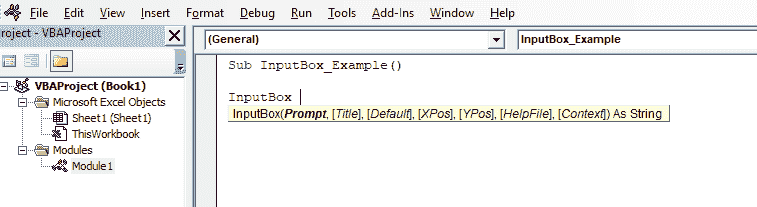
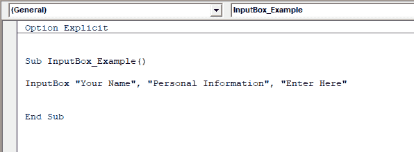
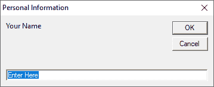
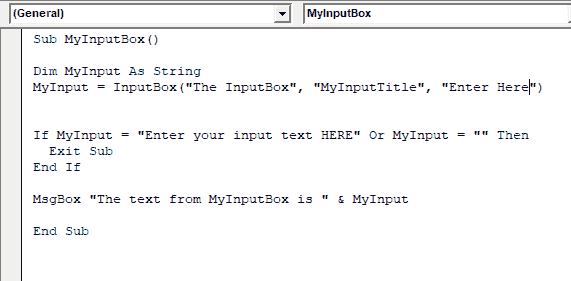
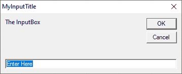

# VBA 输入箱

> 原文：<https://www.javatpoint.com/vba-inputbox>

VBA 输入框用于提示用户输入值。此消息框用于显示消息，并等待用户按下按钮执行操作。

如果用户点击**确定**或**输入**按钮，可以使用输入框功能在文本框中返回文本。如果用户点击**取消**按钮，那么 InputBox 函数将返回一个空字符串(" ")。

InputBox 函数需要正确的错误处理。如果用户在没有输入任何值的情况下单击取消按钮，则会显示一个错误。

### 句法

```

InputBox(prompt[,title][,default][,xpos][,ypos][,helpfile,context])

```

*   **提示**(必选参数):该参数表示字符串，用于在对话框中显示为消息。提示的最小长度约为 1024 个字符。如果文本的长度增加，则在文本的每行之间使用换行符(Chr(10))或回车符(Chr(13))来打断文本。
*   **标题**(可选参数):标题为字符串表达式。它用于在对话框的标题栏中显示字符串。如果标题的左侧为空，应用程序名称将放在标题栏中。
*   **默认**(可选参数):它将文本作为文本框中的默认参数显示给用户。
*   **XPos** (可选参数):X 轴的位置用于将提示距离屏幕左侧的距离显示为水平。如果输入框的值为空，则其水平居中。
*   **YPos** (可选参数):Y 轴的位置用于将提示距离屏幕左侧的距离显示为垂直。，则如果其值为空，则输入框垂直居中。
*   **Helpfile** (可选参数):Helpfile 为字符串表达式。此参数用于标识为对话框提供上下文相关帮助的帮助文件。
*   **上下文**(可选参数):是用于标识帮助上下文编号的数值表达式。帮助作者将此号码分配给合适的帮助主题。如果我们想提供上下文，帮助文件必须存在。

## 如何创建输入框

要在 VBA 创建输入箱，请执行以下步骤，例如:

**第一步:**转到 **Visual Basic 编辑器**并插入一个新模块。



**第二步:**双击最近添加的模块，写好宏名，即 **InputBox_Example** 。



**第三步:**写出单词“ **InputBox** ，我们会看到 InputBox 的语法。



**第四步:**现在给出提示为“**你的名字**”，标题为“**个人信息**，默认为“**在此输入**”。



**步骤 5:** 使用**运行**按钮运行代码。



## 输入框类型参数选项

| 数字 | 价值类型 |
| Zero | 只能输入公式。 |
| one | 唯一可以输入的数字。 |
| Two | 只能输入文本。 |
| four | 只能输入逻辑值(真或假)。 |
| eight | 仅选择单元格引用。 |
| Sixteen | 仅输入错误值。 |
| Sixty-four | 值的数组。 |

### 例子

我们使用了下面示例中显示的 InputBox 函数的流行特性，例如:



*   这段代码在 InputBox 的帮助下请求输入，并将其分配给一个变量。
*   它验证代码；否则，它是存在的。

现在使用**运行**按钮运行上述代码，我们将在消息框中得到结果，例如:



当对话框显示时，用户必须按下其中一个按钮。

当用户按下显示的按钮中的任何一个按钮时，将在 InputBox 函数的帮助下返回一个文本字符串。

*   如果用户点击**确定**按钮，则文本串已经输入到对话框中。
*   如果用户点击**取消**按钮，则返回一个空文本字符串。

在上面的例子中，在执行代码之前，返回的文本字符串被分配给 **MyInput** 变量。

* * *