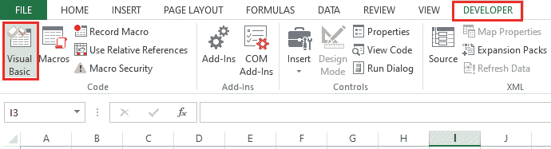
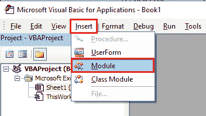
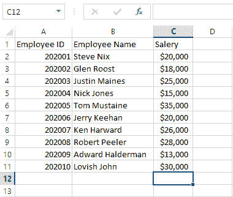
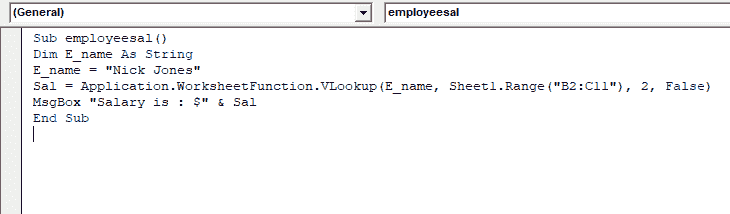
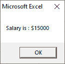
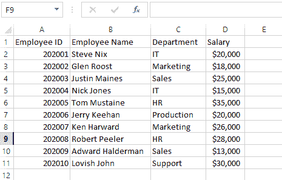
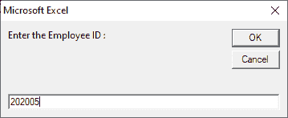
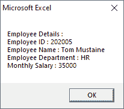

# VBA 流

> 原文：<https://www.javatpoint.com/vba-vlookup>

VLookup 是 excel 中的工作表函数，但是我们也可以在 VBA 中使用。VLookup 的功能类似于 VBA 和工作表中的功能。

在 Excel 中，VLookup 函数用于搜索数组中的一个值，并从另一列返回其对应的值。搜索值应该出现在第一列中。

VLookup 工作表函数可用于 VBA 编码。该函数只能使用工作表调用，不能内置在 [VBA](https://www.javatpoint.com/vba) 中。

### 句法

函数在 Excel VBA 中遵循以下语法:

```vba

Application.VLookup(lookup_value, table_array,col_index_num, [range_lookup]) 

```

或者

```vba

Application.WorksheetFunction.VLookup(lookup_value, table_array, column_index, range_lookup)

```

*   **Lookup_value** 是我们正在搜索的值。
*   **Table_array** 是我们正在搜索的范围。
*   **Col_index_num** 是返回值的列号。
*   **Range_lookup** 告知匹配是精确的还是近似的。它可以是 0/1 或真/假，使用假来找到精确的匹配。使用 true 假设第一列按数字或字母顺序排序。

## 如何在 Excel VBA 中使用虚拟查询

**第一步:**点击**开发者**选项卡，选择 **Visual Basic** 选项。



**第二步:**点击**插入**按钮，添加**模块**。



**第三步:**然后编写 VLookup 程序。

**第 4 步:**现在使用**运行**按钮运行代码。

借助下面给出的一些例子，让我们看看如何在 Excel VBA 中调用 VLookup [函数:](https://www.javatpoint.com/vba-functions)

### 例子

假设我们有员工月薪的数据。下表使用对话框显示了员工的工资。

在下表中，数据在 B 和 C 列中给出。A 单元格中的员工标识，B 单元格中的员工姓名，以及员工的工资在 C 单元格中返回。



现在编写 VLookup 代码。并定义数据存在的范围，即 A、B 和 c 列。

将员工姓名定义为单元格 B2，将工资定义为单元格 C11。现在使用 WorksheetFunction 调用 VLookup 函数，并将其放入 **Sal** 中。



在上面的例子中，我们使用了一个变量“ **E_name** ”来存储要获取工资的员工姓名。给 VLookup 一个员工的名字，它返回那个员工的工资。

现在使用**运行**按钮执行代码。我们将得到如下截图所示的输出。



**例 2:** 在这里，我们在上表中增加了一个新的栏目**部门**。



现在编写 VLookup 代码。并定义数据存在的范围，即 A、B、C 和 d 列。

编写一个代码，根据员工标识使用 WorksheetFunction 调用 VLookup 函数。

```vba

Sub EMP_DETAILS()

Dim E_id As Long

E_id = InputBox("Enter the Employee ID :")

Det = "Employee ID : " & Application.WorksheetFunction.VLookup(E_id, Sheet1.Range("A2:D11"), 1, False)

Det = Det & vbNewLine & "Employee Name : " & Application.WorksheetFunction.VLookup(E_id, Sheet1.Range("A2:D11"), 2, False)

Det = Det & vbNewLine & "Employee Department : " & Application.WorksheetFunction.VLookup(E_id, Sheet1.Range("A2:D11"), 3, False)

Det = Det & vbNewLine & "Monthly Salary : " & Application.WorksheetFunction.VLookup(E_id, Sheet1.Range("A2:D11"), 4, False)

MsgBox "Employee Details : " & vbNewLine & Det
Exit Sub

End Sub

```

在上面的例子中，我们要求用户输入员工 id，然后我们在一个消息框中使用了多个 VLookup 语句和所有细节。

使用**运行**按钮运行上述代码，输入您想要输入的员工 ID，并点击**确定**按钮。



点击确定按钮后，我们将获得如下截图所示的输出。



* * *