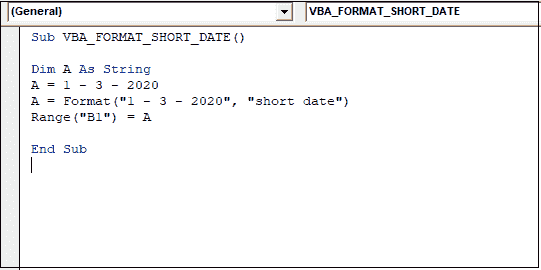
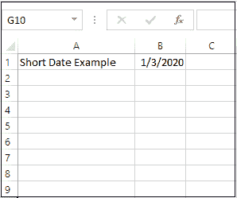
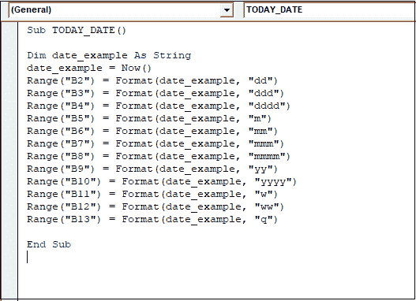
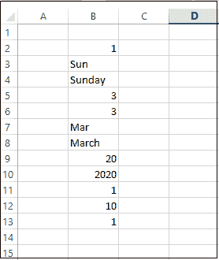

# VBA 日期格式

> 原文：<https://www.javatpoint.com/vba-date-format>

Date Format 函数接受一个日期表达式，并返回一个包含根据指令格式化的表达式的字符串。

在 Excel VBA 中，格式函数是一个内置函数，它分为两个函数:

*   日期函数。
*   时间函数。

在 [Excel VBA](https://www.javatpoint.com/vba) 中格式化日期有两种方式，如:

1.  **单元格的 NumberFormat 属性:**设置存储在单元格中的日期的格式。
2.  **VBA 格式功能:**以 VBA 日期格式为例，变量。

### 句法

Excel VBA 日期格式遵循以下语法:

```vba

Format (expression, [format, [firstdayofweek, [firstweekofyear] ] ])

```

**解释**

*   **表达式(必需):**表示要格式化的值。
*   **格式(可选):**应用于表达式的用户自定义格式。我们可以定义我们的格式或使用任何预定义的命名格式，例如:

| 格式 | 说明 |
| 一般日期 | 它显示日期，日期格式基于系统设置。 |
| 短期的 | 它显示日期，日期格式基于系统的短日期设置。 |
| 中期日期 | 它显示一个日期，其格式基于系统的中间日期设置。 |
| 长日期 | 它显示日期，该格式基于系统的长日期设置。 |
| 短时间 | 它显示的时间取决于系统的短时间设置。 |
| 中等时间 | 它显示的时间取决于系统的中间时间设置。 |
| 长期的 | 它显示取决于系统长时间设置的时间。 |

*   **FirstDayOfWeek(可选):**它是一个声明一周第一天的值。如果没有声明一周的第一天，那么 format 函数假设星期日是一周的第一天。它可以是下面给出的任何值，例如:

| 常数 | 价值 | 说明 |
| vbUseSystem | Zero | 它使用 NLS API设置。 |
| 星期日 | one | 星期日(默认) |
| vb 星期一 | Two | 星期一 |
| vb 星期二 | three | 星期二 |
| vb 星期三 | four | 星期三 |
| vb 星期四 | five | 星期四 |
| vbFriday | six | 星期五 |
| vb 星期六 | seven | 星期六 |

*   **一年中的第一周(可选):**它是一个声明一年中第一周的值。如果没有声明一年的第一周，那么格式函数假设第一周从 1 <sup>st</sup> 开始，它可以是下面给定的任何值，例如:

| 常数 | 价值 | 说明 |
| vbUseSystem | Zero | 它使用 NLS API设置。 |
| vbFirstJan1 | one | 一周包含 1 月 1 日。 |
| vbFirstFourDays | Two | 一年中至少有 4 天的第一周。 |
| vbFirstFullWeek | three | 一年中的第一个整周。 |

### 例子

**第一步:**首先，点击**开发者**选项卡，选择 **Visual Basic** 选项。

**第二步:**点击**插入**按钮，新建**模块**。

**第三步:**双击新增的**模块**，会打开一个代码窗口。

**第四步:**编写 VBA 日期格式功能代码，如:



VBA 日期格式函数被归类为字符串类型的变量。

**Dim** 用于声明变量名及其类型。

在 Format 函数之后， **Range** 函数用于获取特定单元格中的输出，这是短日期使用的最终代码格式。

**第五步:**现在点击**运行**按钮，执行上述代码，会给出如下输出，如:



**示例 2:** 我们还可以创建用户定义的日期格式，例如:

**第一步:**在代码窗口写下以下代码。



在上面的代码中，Format 函数根据今天的日期应用于不同的用户定义的日期格式。

**第二步:**现在点击**运行**按钮，执行上述代码，会给出如下代码，如:



* * *