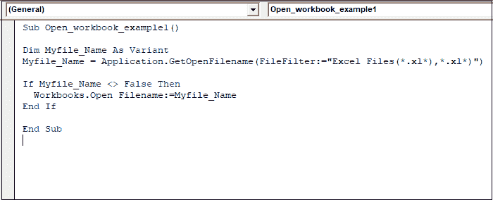

# VBA 工作簿打开

> 原文：<https://www.javatpoint.com/vba-workbooks-open>

在 Excel VBA 中，工作簿是一个对象。它执行不同类型的目的，如**图表工作表** s、**单元格**和**范围**、**形状**和**图表对象**。

我们可以打开一个特定的工作簿，**保存**一个工作簿，**关闭**一个工作簿，**创建**一个工作簿，**更改**一个工作簿的属性，等等。

在 [Excel VBA](https://www.javatpoint.com/vba) 中打开工作簿有两种方法，如:

1.  工作簿。开放式方法。
2.  应用程序。GetOpenFilename 方法。

## 工作簿。开放方法

VBA **作业本。打开**是从另一个工作簿打开一个 Excel 工作簿的方法。

工作簿。Open 方法有 15 个可选参数。这 15 个可选参数允许我们定义工作簿的不同特性。方法打开 excel 工作簿。

### 句法

在 VBA，打开工作簿的基本语法是:

```

"Workbooks.Open Filename:="File_Name"

```

**或**

```

"Workbooks.Open "File_Name"

```

**解释**

*   **“File _ Name”**是我们要打开的工作簿的文件名。
*   当需要工作簿的文件名时，我们需要提供文件的填充路径和文件名以及文件的扩展名，例如()。XLSX)，(。xlsm)，(。XLS)和更多。

### 例子

假设我们要打开一个名为“**示例文件”**的 excel 文件。该文件保存在计算机系统的 **E** 驱动器中。

使用**工作簿打开“**示例文件”**。打开**方法，遵循以下步骤:

**步骤 1:** 在工作簿中创建**宏**。

**第二步:**点击工作簿中的**文件**选项。


**第三步:**点击**选项**。


**第 4 步:**现在点击**自定义** **功能区**选项。


**第五步:**选择**开发者**选项卡，点击**确定**按钮。


**第 6 步:**现在，**开发者**选项卡出现在 excel 工作簿的主选项卡中。

**第 7 步:**点击**开发者**选项卡，选择 **Visual Basic** 选项。


**第 8 步:**点击 **Visual Basic** 选项后，显示代码窗口。

**第 9 步:**现在编写以下代码。


**步骤 10:** 点击**运行**按钮执行代码。

现在**“示例文件”** Excel 文件自动打开，保存在系统的 **E** 驱动中。

提到的路径非常清楚，因为没有子文件夹来获取文件。如果文件路径设置不正确或文件名输入错误，宏将无法工作。所以文件的名称和路径应该是正确的。

### 申请。GetOpenFileName 方法

这种方法消除了**工作簿的缺点。开启**法。以前的方法在更改路径和文件名时面临问题。

但是**应用。GetOpenFileName** 方法给出了在系统中浏览的选项。借助这个功能，我们可以快速定位保存的文件。

要打开文件，我们仍然依赖于 VBA **工作簿。开启**法。**申请中有 5 个论点。GetOpenFileName** 。

### 例子

要打开保存的文件，请执行以下步骤，例如:

**第一步:**点击**开发者**选项卡，选择**可视化** **基本**选项。


**第二步:**在代码窗口写下以下代码，为**宏**提供一个名称。


**第 3 步:**写下一条声明 Filename 为变量的语句，因为在这个方法中，我们没有指定任何路径或文件名。


**第四步:**写这个语句，会打开一个对话框。现在我们可以浏览文件夹，找到文件所在的路径。


**第五步:**在文件名不等于假时使用的代码中写入 [If-Then 语句](https://www.javatpoint.com/vba-if-then-else-statement)，则打开选中的 Excel 文件。



**第 6 步:**现在，点击**运行**按钮执行上述代码。它会显示一个对话框来浏览文件。

*   浏览到保存文件的桌面。
*   现在我们可以在 **E** 中看到文件
*   选择该文件，点击**打开**


在上面的例子中，我们不需要提供文件名和文件路径。我们可以快速找到保存的文件，并选择我们想要打开的文件。

因此，与工作簿相比，这种方法更有效。开放式方法。

* * *