# 类型不匹配 VBA

> 原文：<https://www.javatpoint.com/type-mismatch-vba>

当我们试图在两个不同的变量类型之间赋值时，就会出现一个称为 VBA 类型不匹配错误的错误。

此错误发生在运行时，例如“运行时错误 13:类型不匹配”。

**例如:**如果我们为整数数据类型变量提供一个文本值，那么在代码执行期间会出现类型不匹配错误。

我们在代码中声明变量，并为其分配数据类型。在向这些变量提供值的过程中，我们需要记住它包含什么样的数据。如果提供的值不符合数据类型要求，则抛出“运行时错误 13:类型不匹配”错误。

### VBA 型失配的优点

以下是类型不匹配错误的一些优点，例如:

*   我们知道代码中发生错误的地方。
*   不编译代码，我们可以得到代码中的错误点。

### 例子

以下是显示类型不匹配错误的一些步骤。现在，按照以下步骤操作，例如:

**第一步:**点击**开发者**标签。

**第二步:**点击 **Visual Basic** 选项。

**第三步:**然后点击弹出窗口中的**插入**按钮。

**步骤 4:** 现在插入一个新的**模块**。

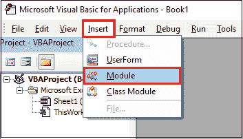

**第五步:**双击新增的**模块**；它会打开一个代码窗口。

**第六步:**在代码窗口写一个 [VBA](https://www.javatpoint.com/vba) 代码。

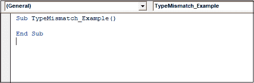

**步骤 7:** 接下来，将变量“**X”**定义为整数数据类型。

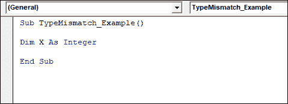

**第 8 步:**整数数据类型只能存储数字和整数。但是我们给 **X** 变量赋值。

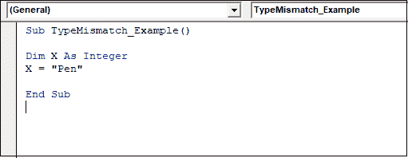

**步骤 9:** 我们使用消息框查看 X 变量中存储的值。

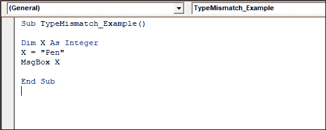

**步骤 10:** 点击**运行**按钮执行上述代码。

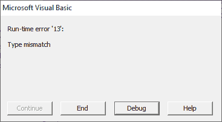

执行后，它会显示一条错误消息“**运行时错误‘13’:类型不匹配”**。整数数据类型只能存储数字或整数，但我们将文本值赋给整数数据类型。这就是它给出错误的原因。

如果我们将正确的值赋给变量，我们将得到正确的输出，如下所示:

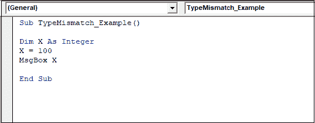

现在执行上面的代码，它将给出正确的输出，而不会显示任何错误。

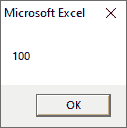

**示例 2:** 这里是另一个具有不同数据类型的示例，例如:

我们将变量“**A”**定义为布尔型。布尔数据类型只能包含真值或假值。

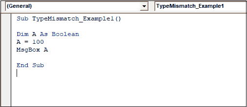

我们赋予值 100，但它不是根据数据类型值。

现在点击**运行**按钮执行上述代码。

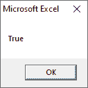

执行上述代码后，它不会显示任何错误消息，因为 excel 将除零之外的所有数字都视为真，零被视为假。

如果我们将文本值与数值相加，则会显示一个错误，例如:

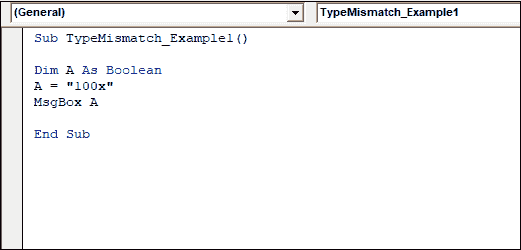

再次执行相同的代码，现在它将显示如下截图所示的错误，例如:

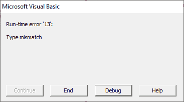

* * *