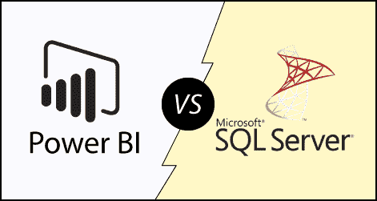

# SSRS vs PowerBI

> 原文：<https://www.javatpoint.com/ssrs-vs-power-bi>

**SSRS** 和 **Power BI** 都是商业智能工具，旨在向最终用户呈现数据。两者都是微软商业智能包的一部分，每个系统都被设计成不同的用法。

**Power BI** 是一款基于通用网络标准的图形化现代报告工具。

**SSRS** 一直负责 Pixel perfect 报告，这些报告通常会分页并通过电子邮件发送给个人。

在继续之前，先看一下 SSRS 和 Power BI。

## 社会支持量表

SSRS 代表 **SQL Server 报告服务**。这是一个由微软开发的报告工具，与 SQL Server 一起免费提供。它生成带有数据表、图表和报告的格式化报告。报告托管在服务器上，可以配置为使用用户提供的参数运行。当我们运行报告时，当前数据出现在数据库、XML 文件或其他数据源中。它提供了控制谁可以查看哪些报告的安全功能。

## 商业智能

Power BI 是一个**数据可视化**和**商业智能**工具，有助于将来自不同数据源的数据转换为交互式仪表盘和 BI 报告。它提供了具有自助业务智能功能的交互式可视化，最终用户可以自己创建报告和仪表板，而不必依赖信息技术人员或数据库管理员。

Power BI 提供多种连接器、软件和服务。这些服务基于适用于不同平台的 **SaaS** 和移动电源商业智能应用。业务用户使用这些服务来消费数据和构建商业智能报告。

**以下是 SSRS 和 Power BI 的一些本质区别:**

| S.No | 社会支持量表 | 商业智能 |
| **1** | 它需要一个 SQL Server 许可证。 | 电力 BI 是免费的。 |
| **2** | SSRS 是一个基于服务器的工具。 | Power BI 是一个基于云的工具。 |
| **3** | SSRS 是传统的，需要人工努力和时间来创建报告和分析。 | Power BI 更加现代化和图形化。 |
| **4** | Power BI 已将 Cortana 集成到基于人工智能的自然语言中，在 Power BI 中对您的数据和报告进行问答。 | SSRS 没有这个特点。 |
| **5** | SSRS 只能使用内部数据。 | Power BI 可以使用来自云的数据。 |

**SSRS 和 Power BI 之间的一些更主要的区别:**

| 因素 | 社会支持量表 | 商业智能 |
| 定义 | SSRS 代表 SQL server 报告服务，它是微软的产品。SSRS 用于分析数据和生成基于服务器的数据报告。 | Power BI 代表PowerBI，也是微软的产品。它用于分析和生成来自云和服务器的报告。 |
| 历史 | SSRS 于 2004 年推出，它提供了一个统一的、基于服务器的、可扩展的平台，通过该平台可以满足所有的业务报告需求。 | Power BI 报表服务器是 2017 年推出的基于云的业务分析服务，用于分析和可视化数据。 |
| 许可证 | SSRS 是一个付费设备。 | Power BI 免费使用。 |
| 适应性 | SSRS 用于生成基于服务器的报告。 | Power BI 用于生成基于云和基于服务器的报告。 |
| 数据依赖性 | SSRS 可以处理信息的结构和半结构。 | Power BI 可以管理结构化和非结构化数据。它可以将数据保存在 Excel 中。 |
| 易接近 | 它可以访问网络和桌面。 | 强大的商业智能可以通过网络、桌面和移动应用程序来利用。 |
| 成分 | SSRS 是一个基于旧技术的企业可视化工具。 | Power BI 是一个支持 HTML5 开源应用和云的 SAAS。 |
| 自然 | SSRS 不太方便用户，因为它更注重编程界面。 | Power BI 因其丰富的图形用户界面和拖放功能而更加用户友好。 |
| 履行 | SSRS 的实施是复杂的。 | Power BI 采用云存储，实现流程简单。 |
| 大小限制 | SSRS 对数据集的大小没有限制。 | Power BI 在免费版本中有 1GB 数据的限制。您可以在其中创建多个数据集。 |
| 出现 | SSRS 有很多存在感，但现在 Power BI 有更多的存在感。 | PowerBI正在出现并取代 SSRS。 |

## 为什么是 SSRS

以下是选择 SSRS 的一些主要原因，例如:

*   它为用户提供了更准确、更好的决策机制。
*   它允许我们在没有任何信息技术专业人员参与的情况下与信息进行交互。
*   它提供了许多安全功能。

## 为什么是PowerBI

以下是使用 Power BI 的一些好处，例如:

*   在 Power BI 中，您可以处理大量数据。
*   它帮助您将企业数据转化为丰富的视觉效果。
*   它可以嵌入到您的自定义应用程序中。

* * *