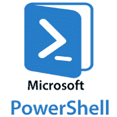
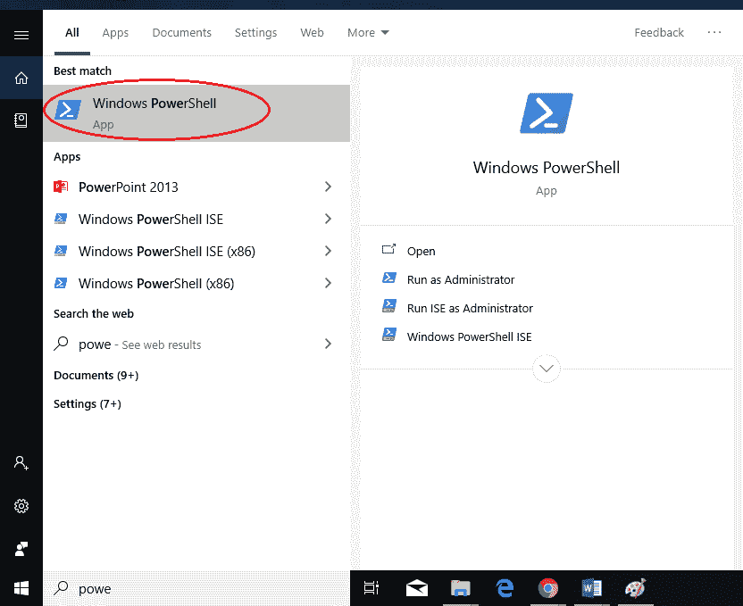
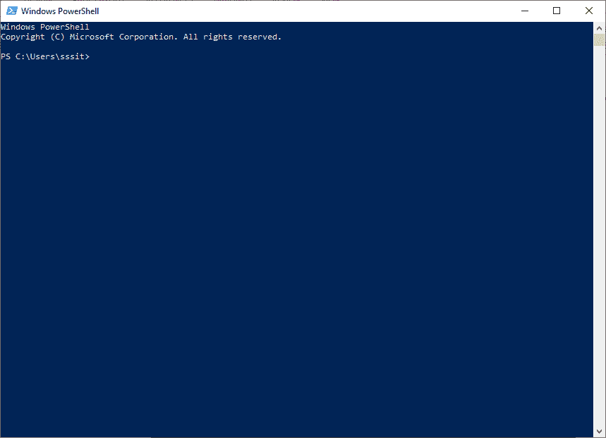

# PowerShell 教程

> 原文：<https://www.javatpoint.com/powershell>

PowerShell 教程提供了 PowerShell 的基本和高级概念。我们的 PowerShell 教程是为初学者和专业人士设计的。

Windows **PowerShell** 是微软创建的命令行 Shell 和相关脚本语言。它建立在.NET 框架。Windows PowerShell 中的命令称为**cmdlet**，它允许您从命令行管理计算机。

我们的 PowerShell 教程包括所有的 PowerShell 主题，如 PowerShell 脚本、变量、数组、循环、命令，包括对象和类。

## 什么是 PowerShell

**Windows PowerShell** 是微软创建的基于任务的自动化命令行 Shell 和相关脚本语言。它是**微软**的新外壳，结合了旧的命令提示符(CMD)功能和带有内置系统管理功能的新脚本指令集。

它是专门为系统管理员设计的。它在 Linux 操作系统中的模拟被称为 Bash 脚本。与接受和返回文本的其他外壳不同，它构建在.NET 框架、 **CLR(公共语言运行时)**和 **DLR(动态语言运行时)**。所以，它可以接受并返回.NET 框架对象。

它帮助信息技术专业人员控制和自动管理运行在视窗服务器环境中的视窗操作系统和其他应用程序。PowerShell 使管理员能够通过对 COM 和 WMI 的完全访问，在远程和本地 Windows 系统上执行任务。

Windows PowerShell 中的命令被称为**小命令**，发音为“小命令”，其中每个小命令代表一个特定的函数或基于任务的脚本。

像许多其他外壳一样，它让我们可以访问计算机系统上的文件系统。此外，Windows PowerShell 的提供商使我们能够访问其他数据存储，如注册表和数字签名证书存储。

## 为什么要用 PowerShell？

*   它既是一种脚本语言，也是一种命令行 Shell。
*   它可以与不同数量的技术进行交互。
*   Windows PowerShell 允许完全访问中的所有类型.NET 框架。
*   PowerShell 是基于对象的。
*   微软为其各种产品设计的 GUI 的很多接口都是 PowerShell 的前端接口。
*   它比运行 VBScript 或其他脚本语言更安全。
*   它允许通过组合多个命令和编写脚本来更高效地执行重复任务。假设，一个系统管理员想要创建数百个 active directory 用户，他只需要在脚本中放置一些 PowerShell cmdlets 就可以实现这一点。
*   借助 PowerShell 的简单 cmdlets，许多复杂且耗时的配置和任务可以在一秒钟内完成。

## 要启动 Windows PowerShell

PowerShell 在所有最新版本的 Windows 中都可用。我们需要按照给定的步骤启动 PowerShell:

1.搜索 Windows PowerShell。选择并单击。

2.将会打开 PowerShell 窗口。

## PowerShell 的优势

以下是 PowerShell 的几个优点:

*   它易于学习和实施。
*   它是一种基于对象的脚本语言。
*   它提供了比 VBScript 和 cmd.exe 更多的功能
*   PowerShell 支持自动化平台，这也是一个重要因素。
*   我们也可以在 PowerShell 中执行一个. NET 代码。
*   在 PowerShell 中，不需要指定变量的“类型”。
*   它也是交互式的。它允许程序员首先在控制台尝试，然后使用更复杂的脚本。
*   PowerShell 脚本中有一个后台作业的概念。
*   它提供了可重用性的特性。为执行特定任务而编写的脚本可以保存下来供以后使用。并且可以与其他脚本合并来执行各种任务。因此，可以执行重复的任务来执行任务。它节省了管理员配置机器的时间和金钱。

## PowerShell 的缺点

以下是 PowerShell 的几个缺点:

*   **框架:**需要.NET 框架。
*   **基于对象:**对于大多数 shells，基于文本的命令用于在编写脚本时完成工作。如果用户从其他类型的外壳切换到 Windows PowerShell，他将不得不习惯不同的思维方式。因此，一些用户需要更多的时间来了解 PowerShell。
*   **安全风险:**使用 PowerShell 的另一个缺点是会产生一些潜在的安全风险。许多信息技术专业人员用它来远程连接其他服务器和计算机。在此过程中，PowerShell 可能会留下一些安全漏洞。这是使用 PowerShell 脚本的主要缺点。
*   **Web 服务器:**PowerShell 的另一个缺点是，在利用远程功能时，需要用户在自己的服务器上运行 Web 服务器。

## 先决条件

在学习 PowerShell 之前，您必须具备计算机和 Windows 操作系统的基本知识。

## 观众

本教程对于那些想要学习如何控制和自动化管理视窗操作系统和其他应用程序的信息技术学生很有帮助。

## 问题

我们保证您不会发现本 PowerShell 教程有任何问题。但是如果有任何错误，请在联系表格中发布问题。

* * *