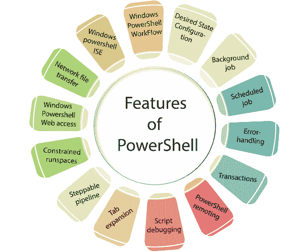

# PowerShell 的特性

> 原文：<https://www.javatpoint.com/features-of-powershell>

在开始更深层次的 PowerShell 概念之前，让我们先来看看 PowerShell 脚本语言的显著特性，这些特性使它不同于其他脚本语言。

**1。Windows PowerShell 工作流:**Windows PowerShell 3.0 版本引入了工作流功能。它是专为帮助我们而设计的，通过在不同位置的不同和多个设备上执行耗时费力的复杂任务。

**2。所需状态配置:** DSC 是 Windows PowerShell 的功能，它提供了一组**语言扩展、资源和 cmdlet**，可用于以声明方式配置软件。

**3。后台作业:** Windows PowerShell 引入了后台作业的概念，在后台的远程和本地机器上异步运行脚本和 cmdlets，不会影响用户界面或与控制台交互。

**4。计划作业:**类似后台作业。这两个作业在后台异步执行，不会影响界面，但主要区别在于后台作业是手动启动的。

**5。错误处理:** Windows PowerShell 通过 **Try{ }、Catch { }和 Finally {}** 块提供错误处理机制，如中所示.NET 语言。

**6。PowerShell remoting:**Windows PowerShell 的这一特性允许在远程系统上执行 cmdlets，这有助于从一台机器上管理远程计算机集。

**7。脚本调试:**在 PowerShell 运行时检查脚本、函数、命令或表达式是 PowerShell 的一个特性。PowerShell 脚本调试器包括一组 cmdlets，允许设置和管理断点以及查看调用堆栈。

**8。选项卡扩展:**选项卡扩展是自动完成的实现，通过按一次**选项卡**键来完成 cmdlets、属性和参数名称。

**9。可步进管道:**此功能允许将脚本块拆分为可步进管道。然后它给出了调用脚本块的 begin()、process()和 end()方法来控制执行顺序的选项。

**10。受约束的运行空间:**它允许创建带有一组约束的 PowerShell 运行空间，这些约束包括访问和执行脚本、cmdlets 和语言元素的能力。

**11 时。Windows PowerShell web 访问:** PowerShell 控制台在 Windows Server 2012 中引入了基于 web 的版本。在这里，我们可以从任何网络浏览器运行 PowerShell cmdlets，这些浏览器在台式机上不可用，但在任何平板电脑或移动设备上也不可用。

**12 时。网络文件传输:**该功能为使用 **BITS** (后台智能传输服务)的机器之间的优先化和异步文件传输提供本地支持。

**13。Windows PowerShell 集成脚本环境(ISE):** 它是 Windows PowerShell 的基于主机 GUI 的应用程序。这个特性提供了制表符补全、多行编辑、语法着色、上下文相关帮助、选择性执行以及对从右向左语言的支持。

**14。事务:**Windows PowerShell 的这个特性使我们能够启动一个事务，指示哪个命令是它的一部分，并回滚或提交一个事务。

* * *