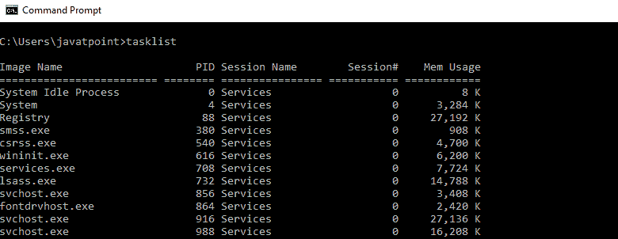
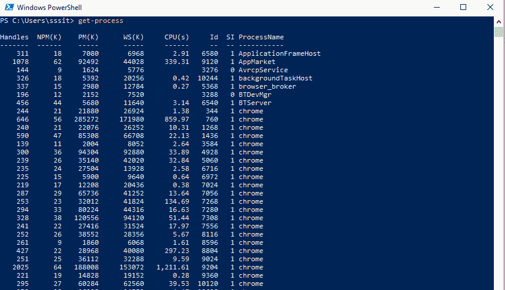

# PowerShell 和 CMD 的区别

> 原文：<https://www.javatpoint.com/powershell-vs-cmd>

## 什么是命令提示符？

命令提示符是命令行外壳，基于 20 世纪 80 年代的微软磁盘操作系统(MS-DOS)。它是一个简单的 win32 应用程序，帮助用户使用基于文本的命令和参数与 Windows 操作系统进行交互。

命令提示符具有运行各种任务的内置命令，其中大多数可以作为管理员执行。

命令提示符正式称为 Windows 命令处理器，但有时也被称为 CMD 提示符或命令外壳，甚至被称为其文件名 cmd.exe。【1987 年 12 月，特蕾莎·斯托维尔为 **Windows NT** 开发了第一个版本的 CMD。它在几乎所有版本的 Windows 操作系统中都可用。

## 什么是 PowerShell？

PowerShell 是命令提示符的更高级版本。它用于执行外部程序，如 ping 或 copy，并自动执行从**cmd.exe**无法访问的不同系统管理任务。

这是一个为系统管理员设计的基于任务的自动化命令行 shell 和相关脚本环境。它建立在.NET 框架。它是一个比 cmd 更强大的命令行解释器，可以解释 PowerShell 和 Batch 命令。

| 管理员 | 命令提示符 |
| 1.它是基于任务的自动化命令行界面和相关的脚本语言.NET 框架。 | 1.它是微软视窗操作系统的默认命令行解释器。 |
| 2.它可以解释批处理和 PowerShell 命令。 | 2.它只能解释批处理命令。 |
| 3.它用于控制和自动化 Windows 服务器上的应用程序和 Windows 操作系统。 | 3.它用于执行控制台上给定的命令，这些命令可用于调试问题。 |
| 4.PowerShell 生成的输出不仅仅是字符流，而是对象的集合。 | 4.命令提示符生成的输出只是一个字符流(文本)。 |
| 5.它是一个外壳和脚本环境，支持创建大型文件来管理 windows 操作系统。 | 5.它只是一个 shell 系统，只允许用户为批处理文件的执行执行简单而基本的脚本。 |

* * *