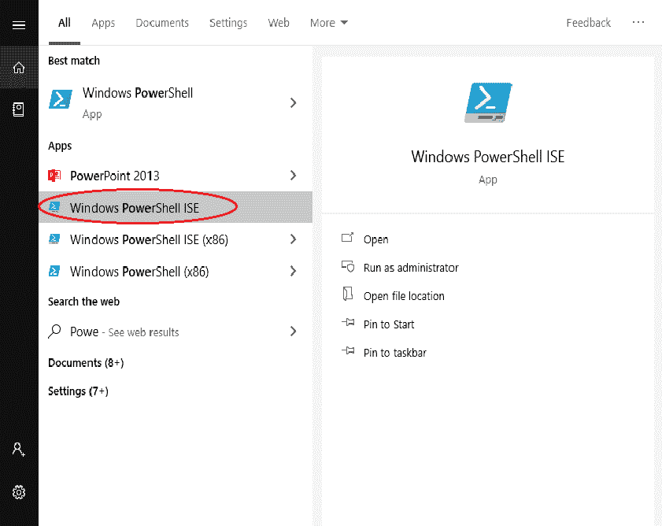
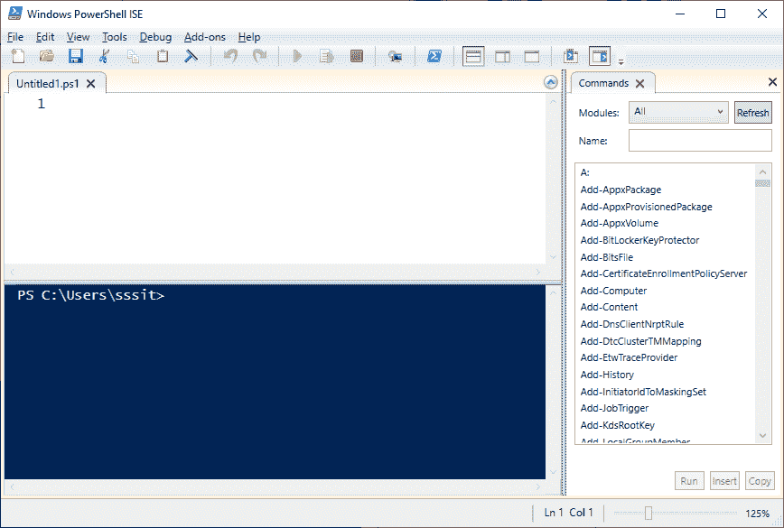

# Windows PowerShell ISE

> 原文：<https://www.javatpoint.com/windows-powershell-ise>

微软 Windows PowerShell ISE 是一个基于图形用户界面的应用程序，也是 Windows PowerShell 的默认编辑器。ISE 代表集成脚本环境。在这个界面中，我们可以运行命令，编写、测试和调试 PowerShell 脚本，而无需在命令行界面中编写所有命令。

集成脚本环境(ISE)提供选项卡完成、多行编辑、语法着色、上下文相关帮助、选择性执行以及对从右向左语言的支持。

Windows PowerShell ISE 是 WMF (Windows 管理框架)的一部分，它允许管理员管理多个版本的 Windows 和 Windows 服务器。它允许我们在控制台窗格中执行命令。但是，它也支持那些用于同时查看脚本源代码的窗格，以及可以插入 ISE 的其他工具。

我们甚至可以同时打开多个脚本窗口。当我们调试使用其他模块或脚本中定义的函数的脚本时，它特别有用。

集成脚本环境(ISE)最初是在 Windows PowerShell 2.0 版本中引入的，并在 PowerShell 3.0 版本中进行了重新设计。

## 主要特征

以下是 Windows PowerShell ISE 的主要功能:

*   **多行编辑:**在命令窗格中，要在当前行下插入空行，请按 SHIFT + ENTER。
*   **选择性执行**:要执行脚本的一部分，选择要运行的文本，点击**运行脚本**或按 **F5** 键。
*   **上下文相关帮助:**键入**调用项**，然后按下 **f1** 打开文章的帮助文件，获取**调用项**命令让**。**

**启动 Windows PowerShell ISE**

PowerShell ISE 预装在所有最新版本的 Windows 中。我们需要按照以下步骤启动 PowerShell 控制台:

单击开始，搜索 Windows PowerShell ISE，然后单击它。

点击后，PowerShell ISE 窗口将打开。

PowerShell 的 ISE 窗口由以下三个窗格组成:

*   **脚本窗格:**该窗格允许用户创建和运行脚本。用户可以在脚本窗格中轻松打开、编辑和运行现有脚本。
*   **输出窗格:**该窗格显示您运行的脚本和命令的输出。您也可以在“输出”窗格中清除和复制内容。
*   **命令窗格:**该窗格允许用户编写命令。您可以在命令窗格中轻松执行单行或多行命令。

* * *