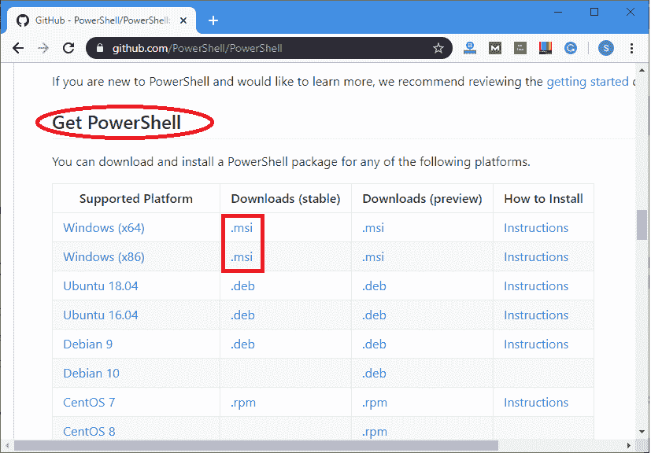
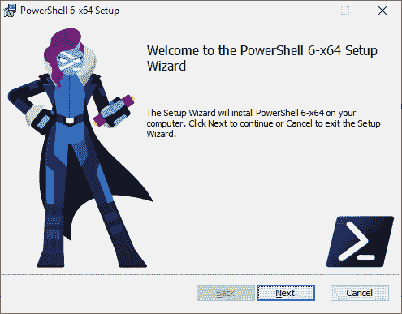
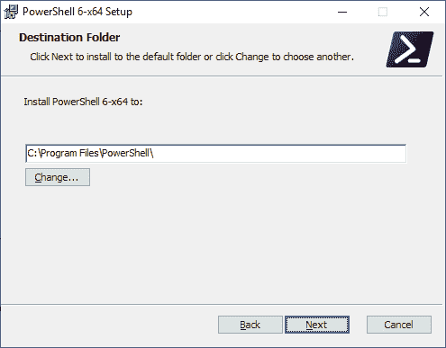
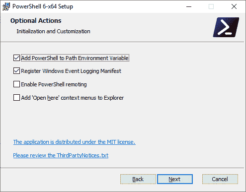
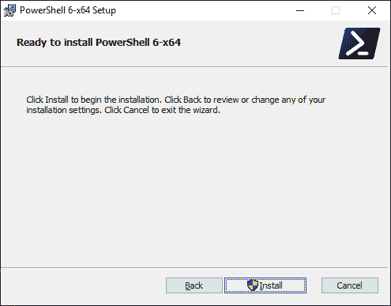
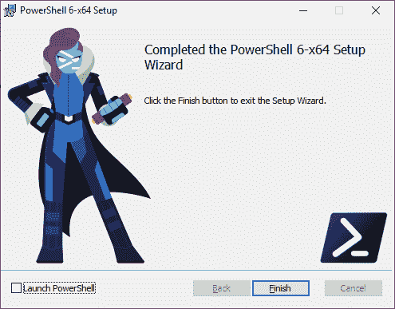
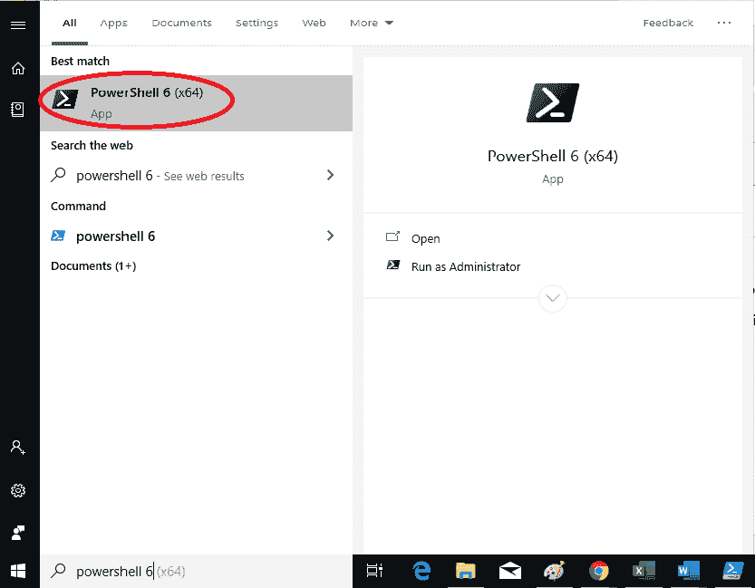
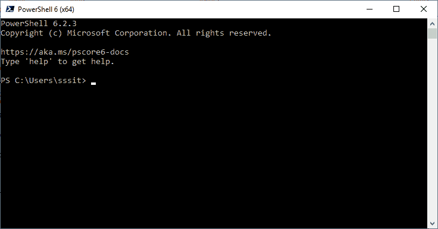

# PowerShell 核心

> 原文:[https://www.javatpoint.com/powershell-core](https://www.javatpoint.com/powershell-core)

PowerShell 5.1 版本是原 PowerShell 的最新版本，但从**PowerShell 6.0 版本**开始，现在被称为 PowerShell 核心。

**PowerShell Core** 是一款开源软件，可以在 Windows、Linux 和 Mac 操作系统上使用。它建立在。NET 核心。

PowerShell core 在 Linux 和 MacOS 上作为 **pwsh** 推出，在 Windows 上作为**pwsh.exe**推出。

PowerShell Core 版本于 2016 年 8 月 18 日首次推出。

## PowerShell 和 PowerShell 核心的区别

下表描述了 PowerShell 和 PowerShell 内核之间的区别:

| 属性 | 管理员 | PowerShell 核心 |
| 版本 | 1.0 至 5.1 | Six |
| 支持的平台 | Windows 操作系统 | Linux、MacOS 和 Windows |
| 属国 | 。NET 框架 | 。净核心 |
| 启动方式 | powershell.exe | 苹果电脑和 Linux 的 pwsh，Windows 的 pwsh.exe |
| 使用 | 它依赖于。NET 框架运行时。 | 这取决于。NET 核心运行时。 |
| $PSVersionTable。PSEdition | 它被设置为桌面 | 它被设置为核心。 |

## 在 Windows 上安装 PowerShell 核心

以下步骤用于在使用 MSI 的 Windows 操作系统中安装 PowerShell 核心:

1)首先从 PowerShell 的 GitHub 页面下载 MSI 文件。点击以下链接下载:

[https://github . com/powershell/powershell](https://github.com/PowerShell/PowerShell)

2)现在，进入**获取 PowerShell** ，点击**。msi** 链接根据你的系统版本从**下载(稳定)**栏目如下图截图所示:

3)现在，点击下载的文件进行安装。单击后，将出现以下安装向导。并且，继续安装，点击**下一步**

4)以下窗口显示了 PowerShell 的默认安装路径。如果您想更改，那么根据您的选择进行更改，否则，点击**下一步**

5)根据需要选择选项后，再次点击**下一步**按钮。

6)最后点击**安装**

7)安装后，PowerShell 核心已成功安装到您的计算机系统中。

## 启动 PowerShell 核心

要启动 PowerShell 核心，请执行以下步骤:

1)单击开始，搜索 PowerShell 6，然后单击它。

2)点击后，将打开 PowerShell 6 窗口。

* * *