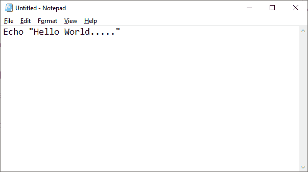
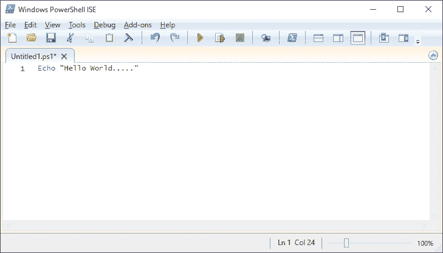

# 创建并运行一个 PowerShell 脚本

> 原文：<https://www.javatpoint.com/create-and-run-a-powershell-script>

## 创建 PowerShell 脚本

在 Windows 10 上，用户可以使用任何文本编辑器或集成脚本环境(ISE)创建 PowerShell 脚本，这在每个系统上都已经可用。

**使用记事本**创建脚本

以下步骤用于创建 PowerShell 脚本:

1)开启启动。

2)搜索记事本等文本编辑器，点击记事本应用。

3)现在，记事本的新窗口将打开。在要执行的文本文件上键入脚本。例如:

```

Echo "Hello world....."

```



4)点击菜单栏中的“**文件**”菜单。

5)从下拉列表中选择选项“**另存为**”。

6)在框中输入文件名，点击**保存**按钮。例如: **fs.ps1**

7)最后，点击**保存**按钮。

## 使用集成脚本环境创建脚本

以下步骤用于使用 ISE 工具创建 PowerShell 脚本:

1)开启启动。

2)搜索 **Windows PowerShell ISE** ，右键点击 **Windows PowerShell ISE** ，从下拉列表中选择**以管理员身份运行**选项。

3)单击菜单栏中的文件。

4)选择“新建”选项创建新的空文件。

5)写一个你想执行的脚本。例如:

```

Echo "Hello world....."

```



6)点击菜单栏中的“**文件**”菜单。

7)从下拉列表中选择选项“**另存为**”。

8)键入脚本的名称。然后，点击**保存**按钮。

## 启用 PowerShell 脚本

当我们在计算机系统中启动 PowerShell 时，默认执行策略不允许我们执行或运行脚本。

PowerShell 中有四种不同类型的执行策略:

*   **受限:**在此策略中，不执行任何脚本。
*   **RemoteSigned:** 在这个策略中，只运行那些脚本，这些脚本是从互联网上下载的，并且这些脚本必须由可信的发布者签名。
*   **无限制:**Windows PowerShell 的所有脚本都在运行。
*   **AllSigned:** 只能运行那些由可信发布者签名的脚本。

因为 Windows PowerShell 的默认执行策略是受限制的，所以我们在更改之前无法运行任何脚本。首先，我们使用以下命令将执行策略设置为无限制，以执行脚本。

```

Set-ExecutionPolicy Unrestricted

```

## 运行 PowerShell 脚本

要从命令行执行 PowerShell 脚本，请按照给定的步骤操作:

1)在开始菜单中键入 Windows PowerShell，然后通过单击结果将其打开。

2)现在，通过键入脚本的完整路径来执行脚本，例如( **C:/desktop/fs.ps1** )，或者如果它在当前目录中，则键入文件名，后跟反斜杠。

* * *