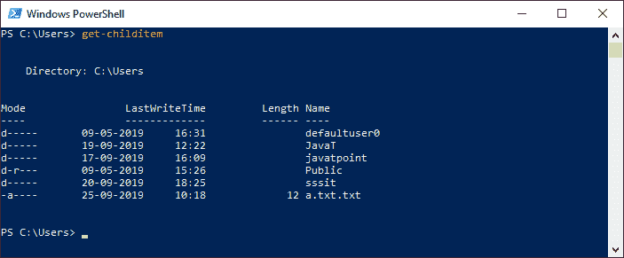
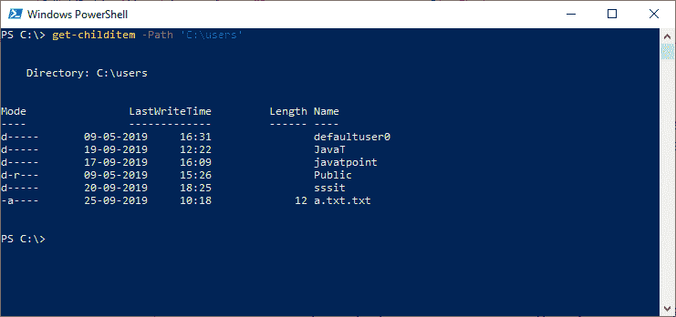
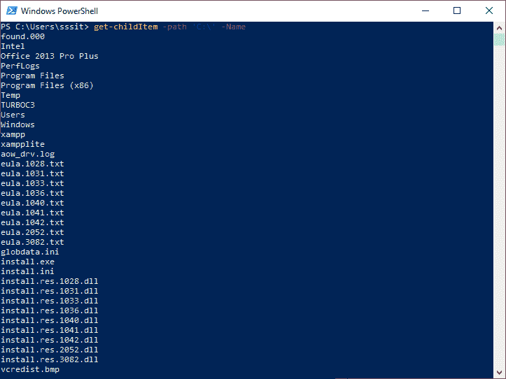
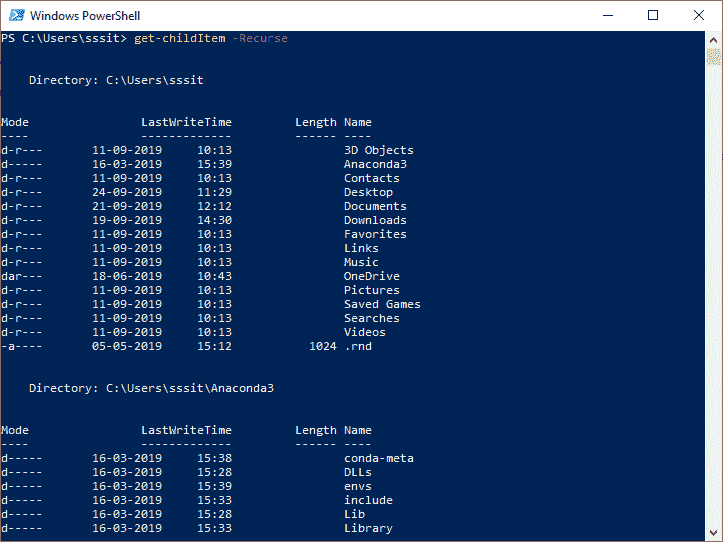
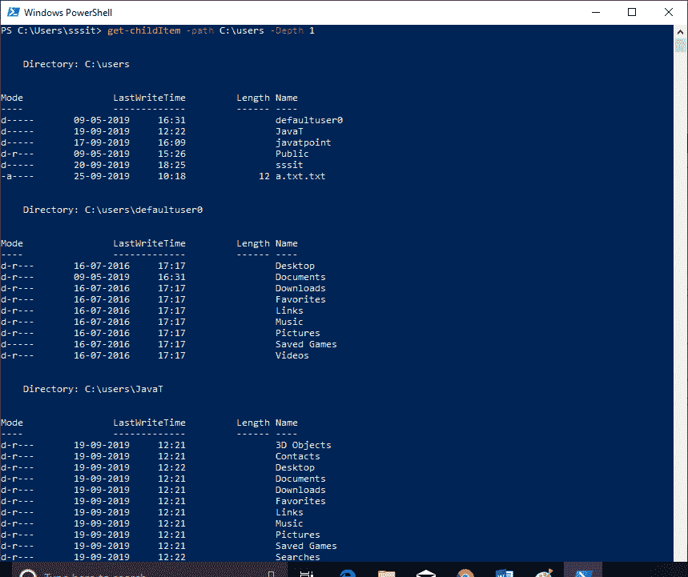

# PowerShell Get-childItem

> 原文：<https://www.javatpoint.com/powershell-get-childitem>

**Get-ChildItem** 小命令获取一个或多个位置的项目和子项目。如果一个项目是一个容器，它获取容器内的项目，称为子项目。位置可以是注册表配置单元、文件系统注册表或证书存储。

此 cmdlet 不显示空目录。 **gci，dir，ls** 是这个 cmdlet 的别名。

使用**-递归**参数获取所有子容器中的项目，并使用**-深度**参数限制递归的级别数。

## 句法

```ps1

Get-ChildItem
[[-Path] <string[]>] 
[[-Filter] <string>]
[-Recurse] 
[-Depth <uint32>] 
[-Include <string[]>] 
[-Exclude <string[]>]
[-Name] 
[-Force] [-Directory] 
[-Attributes <FlagsExpression[FileAttributes]>][-FollowSymlink] 
[-File]
[-Hidden]
[-System]
[-ReadOnly]
[<CommonParameters>]

```

## 因素

**-属性**

此参数获取具有指定属性的文件和文件夹，它支持所有属性，并允许您指定复杂的属性组合。

**该参数支持以下属性:**

*   归档、设备、目录、加密、完整性流、隐藏、非内容索引、正常、离线、非关键数据、只读、重解析点、压缩、系统、稀疏文件和临时。

**使用以下运算符组合属性:**

*   ！(不是)
*   +(与)
*   ，(或)

#### 注意:不要在运算符及其属性之间使用空格，而要在逗号之后使用。

**常用属性使用以下缩写:**

*   d(目录)
*   h(隐藏)
*   只读
*   系统

**-深度**

在 PowerShell 5.0 中添加了-Depth 参数，允许您控制递归的深度。默认情况下，cmdlet **get-ChildItem** 显示父目录的内容。

此参数确定递归中包含的子目录级别的数量，并显示内容。

**-目录**

**-目录**参数用于获取目录列表。我们也可以在目录中使用**-递归**参数

**-排除**

**-Exclude** 参数被指定为字符串数组，一个属性。它还指定 cmdlet 从操作中排除的那些项。**-排除**参数的值限定了**-路径**参数。

输入图案或路径元素，如 **A*** 或 ***。txt** 。允许使用通配符。

**-包括**

**-Include** 参数指定为字符串数组，一个属性。它还指定 cmdlet 在操作中包含的那些项。**-包含**参数的值限定了路径参数。输入图案或**路径**元素，如“ ***”。txt** 。

此参数仅在 cmdlet 包含项目内容时有效，如“ **C:\Windows\*** ”，其中通配符“ ***** ”指定 **C:\Windows** 目录的内容。

**-文件**

**-文件**参数用于获取文件列表。我们也可以在文件中使用**-递归**参数。

**-过滤器**

**-过滤器**参数指定一个过滤器来限定**-路径**参数。此参数比其他参数更有效，因为提供程序在 cmdlet 检索对象时应用它们，而不是让 PowerShell 在检索对象后对其进行筛选。筛选器字符串被传递给.NET API 枚举文件，API 支持**？**和 ***** 通配符。

**-力**

**-Force** 参数允许我们获取用户无法访问的项目，如系统或隐藏文件。此参数不会覆盖文件/安全权限。

**-隐藏**

**-隐藏的**参数或带有**隐藏的**属性的**-属性**参数仅用于获取隐藏的项目。

**-路径**

**-路径**参数用于指定一个或多个位置的路径。默认位置是当前目录'**。**。允许使用通配符。

**-文字路径**

**-LiteralPath** 参数也用于指定一个或多个位置的路径。与**-路径**参数不同，该参数的值完全按照键入的内容使用。如果路径包含任何转义字符，则用引号将其括起来。没有字符被解释为通配符。单引号告诉 Windows PowerShell 不要将任何字符解释为转义序列。

**-名称**

**-名称**参数仅用于检索该位置的项目名称。该参数的输出是一个字符串对象，可以通过管道发送给其他命令。接受通配符。

**-递归**

**-Recurse** 参数用于获取指定位置的项目，以及该位置的所有子项目。

**-系统**

使用**-系统**参数或带有**系统**属性的**-属性**参数，仅获取系统文件和目录。

**-只读**

使用**-只读**参数或带有**只读**属性的**-属性**参数仅获取只读项目。

**-跟随符号链接**

**-FollowSymlink** 参数用于搜索以这些符号链接为目标的目录。它是一个动态参数。它仅在**文件系统**提供程序中受支持。

## 例子

**例 1:获取当前位置的子项目**



这个 **cmdlet (get-childItem)** 在这个例子中获取当前目录或位置的子项目。它显示所有的文件名和子目录名。如果某个项目没有子项目，则此 cmdlet 不会返回任何输出并返回到 PowerShell 提示。

默认情况下，该 cmdlet 列出了文件的**模式、最后写入时间、大小(长度)**，以及项目的**名称**。

**示例 2:获取给定路径的子项目**



本示例使用**-路径**参数显示 cmdlet 中给定路径的子项目。

**示例 3:获取给定目录或位置中子项目的名称**



本示例通过使用 **-Name** 参数，仅显示给定目录中项目或文件的名称。该 cmdlet 使用**-路径**参数来指定目录。

**例 4:获取当前目录及其子目录下的子项**



本示例使用带有**-递归**参数的 cmdlet **get-childItem** 来搜索当前目录及其子目录。

**示例 5:使用深度参数**获取项目



本示例使用**-深度**参数来确定递归中包含的子目录级别的数量。输出中不包括那些空目录。

cmdlet*get-chill item*使用 **-Path** 参数指定**C:\ user**。-Depth 参数指定了两个递归级别。

cmdlet**get-childItem-Path c:\ users-Depth 1**显示由-Path 参数指定的目录内容和一级子目录。

* * *