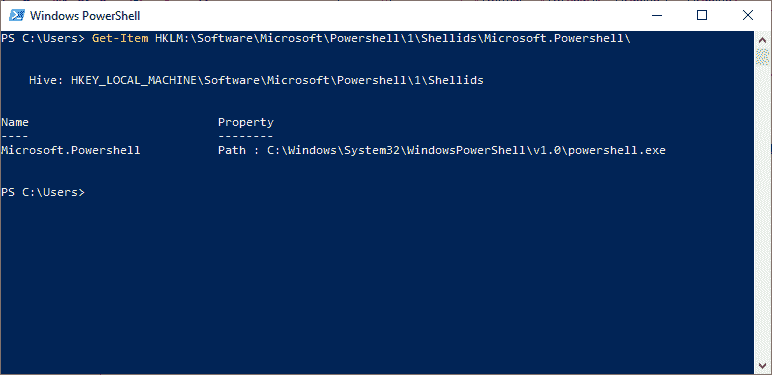

# PowerShell 获取-项目

> 原文：<https://www.javatpoint.com/powershell-get-item>

**获取项目**小命令获取特定位置的项目。除非我们使用“ ***** ”通配符来请求项目的所有内容，否则此 cmdlet 不会获取指定位置的项目内容。

PowerShell 提供程序使用此命令浏览不同类型的数据存储。

## 句法

```ps1

Get-Item
[-Path] <String[]>]
[-Include <String[]>] 
[-Filter <String>]
[-Force]
[-Exclude <String[]>]
[-Stream <String[]>]
[-Credential <PSCredential>] 
[<CommonParameters>]

```

## 因素

**-路径**

**-路径**参数指定项目的路径。接受通配符。-Path 参数是必需的，但名称“ **-Path** ”是可选的。

您可以使用“.”指定当前位置。要指定当前位置的所有项目，请使用星号“*”。

**-文字路径**

**-LiteralPath** 参数指定一个或多个位置的路径。它的值完全按照类型使用。通配符字符不会被解释。如果路径包含任何转义字符，则用引号将其括起来。单引号告诉 Windows PowerShell 不要将任何字符解释为转义序列。

**-力**

**-Force** 参数表示隐藏文件等用户无法访问的项目。此参数的实现因提供者而异。即使使用-Force 参数，cmdlet 也不能重写安全权限。

**-包括**

**-Include** 参数指定为字符串数组，一个项目。它还指定该 cmdlet 在操作中包含的那些项。**-包含**参数的值限定了**路径**参数。输入图案或路径元素，如“ ***”。txt** 。

此参数仅在 cmdlet 包含项目内容时有效，如“ **C:\Windows\*** ”，其中通配符“ ***** ”指定 **C:\Windows** 目录的内容。

**-过滤器**

**-过滤器**参数用于指定一个过滤器来限定**-路径**参数。文件系统提供程序是 PowerShell 唯一安装的提供程序，它支持使用过滤器。此参数比其他参数更有效，因为提供程序在 cmdlet 检索对象时应用它们，而不是让 PowerShell 在检索对象后对其进行筛选。

**-排除**

**-Exclude** 参数指定为字符串数组，一个属性。它还指定了此 cmdlet 从操作中排除的那些项。**-排除**参数的值限定了路径参数。接受通配符。

输入图案或路径元素，如 **A*** 或 ***。txt** 。允许使用通配符。

**-流**

**-Stream** 参数用于从文件中获取特定的备用 NTFS 文件流。支持通配符。使用星号“ ***** ”字符获取所有流。**-流**参数在文件夹上无效。

它是一个动态参数，仅适用于文件系统驱动器。

## 例子

**例 1:获取当前位置**


本示例中的 cmdlet 用于获取当前工作位置。点“**”。**“操作符”代表当前目录下的项目，但不是它的内容。

**例 2:获取当前位置的所有项目**


本示例中的 cmdlet 用于访问当前工作目录中的所有项目。星号“ ***** ”字符代表当前项目的所有内容。

**例 3:获取指定目录或位置的所有项目**


本示例中的 cmdlet 用于获取 cmdlet 中给定目录的所有项目。使用星号“ ***** ”字符来显示容器的内容，而不仅仅是容器。

**例 4:获取指定位置的属性**


此示例中的 cmdlet 显示了目录的**lastacesstime**属性，该属性在 cmdlet 中给出。 **LastAccessTime** 是文件系统目录的一个属性。使用此 cmdlet **(获取项目\ <directory-name>) |获取成员</directory-name>** 查看给定目录的所有属性。

**示例 5:显示注册表项的内容**



在本例中，cmdlet 显示**微软的内容。PowerShell** 注册表项。我们可以使用这个带有 PowerShell 注册表提供程序的 cmdlet 来显示注册表项和子项，但是我们必须使用 **Get-ItemProperty** cmdlet 来获取注册表的值和数据。

* * *