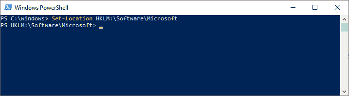
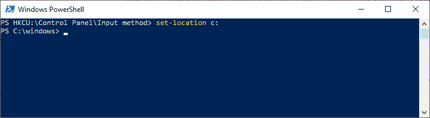

# 获取位置

> 原文：<https://www.javatpoint.com/powershell-get-location>

**获取位置**小命令获取当前工作目录或位置堆栈的信息。

此 cmdlet 获取一个表示当前目录的对象，很像 print present working directory(pwd)命令。当我们在驱动器之间切换时，PowerShell 会保留我们在每个驱动器中的位置。我们还可以使用这个 cmdlet 来查找每个驱动器中的位置。

此 cmdlet 用于在执行时获取当前目录，并在脚本和函数中使用它，例如在 PowerShell 提示符下显示当前工作目录的函数中。我们还可以使用 Get-Location cmdlet 来查看位置堆栈中的位置。

## 句法

```powershell

Get-Location
[-PSDrive <String[]>]
[-PSProvider <String[]>]
[-UseTransaction <SwitchParameter>]
[<CommonParameters>]

```

```powershell

Get-Location
[-Stack] 
[-StackName <String[]>]
 [-UseTransaction <SwitchParameter>]
 [<CommonParameters>]

```

## 因素

-psdrive

**-PSDrive** 参数用于指定该 cmdlet 在操作中获得的给定 PowerShell 驱动器中的当前位置。

例如，如果证书:驱动器中的任何用户使用此参数，则他/她可以在 C:驱动器中找到其当前位置。

**-PSProvider**

**-PSProvider** 参数用于指定该 cmdlet 在操作中获得的 PowerShell 提供程序支持的驱动器中的当前位置。如果指定的 PowerShell 提供程序支持多个驱动器，则**获取位置** cmdlet 返回最近访问的驱动器上的位置。

**例如，**如果 C: drive 中的任何用户使用此参数，则他/她可以在 **PowerShellRegistry** 提供商的驱动器中找到其当前位置。

**-堆叠**

**-堆栈**参数用于显示当前位置堆栈中的位置。如果用户想要显示不同位置堆栈中的位置，他可以使用**堆栈名称**参数。

**栈名称**

**-堆栈名称**参数用于显示不同位置堆栈中的位置。

**Get-Location** cmdlet 无法显示默认堆栈中的位置，除非是当前堆栈。

## 例子

**示例 1:显示当前驾驶位置**


本示例中的 cmdlet 显示当前 PowerShell 驱动器中的一个位置。假设用户在 D: drive 的 Windows 目录中，此 cmdlet 显示该目录的路径。< /p>

**示例 2:显示不同驱动器的当前位置:**

此示例说明了如何使用 get-location 来显示不同 PowerShell 驱动器中的当前位置。

**即**本例中的第一个小命令使用 **set-location** 小命令将当前位置设置到 **C:\ drive** 的 Windows 目录中。


**二。**本例中的第二个 cmdlet 使用 set-location cmdlet 将位置更改为 **HKLM:\ Software \ Microsoft** 注册表项。当我们更改 HKLM:驱动器中的位置时，Windows PowerShell 会保留我们在 C:\驱动器中的位置。



**三。**本示例中的第三个小命令使用 set-location 小命令将位置更改为**HKCU:\控制面板\输入法**注册表项。


**iv。**本示例中的第四个 cmdlet 使用 Get-location cmdlet 来查找 C:\驱动器上的当前位置。该 cmdlet 使用 **-PSDrive** 参数来指定驱动器。


**v.** 本例中的第五个 cmdlet 使用 Set-location cmdlet 返回 C:\驱动器。



**vi .**本示例中的第六个 cmdlet 使用 Get-Location cmdlet 在 PowerShell 注册表提供程序支持的驱动器中查找当前位置。在本例中，Get-location 返回最近访问的注册表驱动器 HKCU 的位置。


**vii。**本例中的第七个 cmdlet 使用-PSDrive 参数查看 HKLM 的当前位置:Drive。


**示例 3:自定义 PowerShell 提示**


本示例展示如何自定义 **Windows PowerShell 提示**。定义提示的函数包括一个 Get-location cmdlet，每当控制台中出现提示时就会执行该 cmdlet。

该 cmdlet 以 **Function 关键字**开头，后面跟着一个函数的名称，即提示。函数体出现在大括号“{ 0 }”中。

此 cmdlet 定义了一个以“ **PowerShell:** ”字符串开头的新提示。要添加当前位置，它使用 get-location cmdlet，当调用**提示函数**时执行。提示函数以字符串“>”结尾。

键入此命令，**获取-内容功能:提示**查看当前提示功能。

* * *