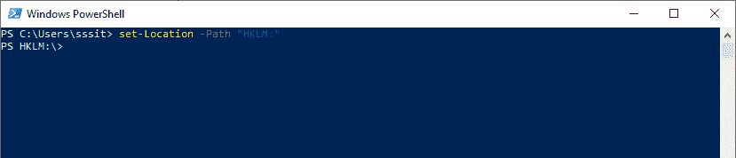
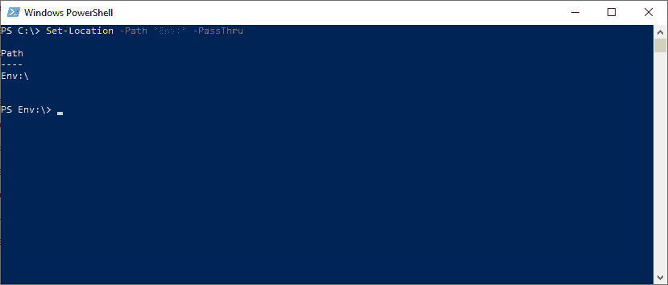
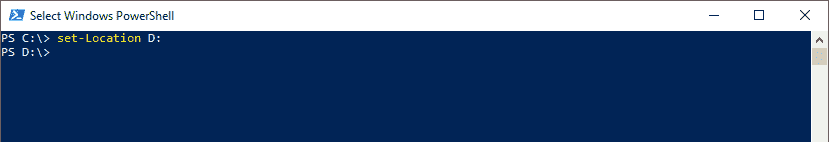

# PowerShell Set-位置| PowerShell 更改目录

> 原文:[https://www.javatpoint.com/powershell-set-location](https://www.javatpoint.com/powershell-set-location)

Set-Location cmdlet 将当前的 PowerShell 工作位置设置为指定的位置。该位置可以是目录、注册表位置、子目录或任何提供程序路径。 **sl、cd、chdir** 是**设置位置小命令**的别名。

## 句法

```

Set-Location
[-Path<string>]
[-PassThru] 
[-UseTransaction] 
[<CommonParameters>]

```

```

Set-Location 
[-LiteralPath<string>]
[-PassThru] 
[-UseTransaction] 
[<CommonParameters>]

```

```

Set-Location 
[-PassThru]
[-StackName<string>]
[-UseTransaction]  
[<CommonParameters>]

```

## 因素

**-路径**

**-路径**参数用于指定新工作位置的路径。如果 cmdlet 中没有提供路径，此 cmdlet 默认将路径设置为当前用户的主目录。当在 cmdlet 中使用通配符时，它会选择与通配符模式匹配的第一个路径。

通配符保留了我们设置的最近二十个位置的历史。如果路径是 cmdlet 中的“-”字符，则新的工作位置将成为历史中的前一个工作位置(如果存在的话)。同样，如果路径是 cmdlet 中的“+”字符，那么新的工作位置将成为历史中的下一个工作位置(如果存在的话)。此 cmdlet 类似于使用“推送-位置”和“弹出-位置”cmdlet，只是历史记录是一个列表，而不是堆栈，并且无法显示此历史记录列表。

**-文字路径**

-LiteralPath 参数用于指定一个或多个位置的路径。它的值完全按照类型使用。如果路径包含转义字符，请用单引号引起来。单引号告诉 Windows PowerShell，它不应该将任何字符解释为转义序列。

【t0-通行证】T1

-PassThru 参数用于返回一个**路径信息**对象，该对象代表位置。默认情况下，此 cmdlet 会生成任何输出。

**栈名称**

-StackName 参数用于指定此 cmdlet 使当前位置成为堆栈。键入$null 或空字符串，以指示未命名的默认位置堆栈。除非我们可以使用**-堆栈名称**参数来指定不同的堆栈，否则***-Location**cmdlet 不能对当前堆栈起作用。

## 例子

**例 1:设置当前位置**



此 cmdlet 中的示例将当前位置设置为 HKLM 的根目录:驱动器。

**例 2:设置当前位置并显示该位置**



本示例中的 cmdlet 将当前位置设置为 **Env: drive** 的根目录。它使用-PassThru 参数指示 PowerShell 返回一个**路径信息**对象，该对象代表**环境:位置**。

**示例 3:将当前位置设置到另一个驱动器**



在本例中，cmdlet 将当前位置设置为 D:驱动器。

* * *