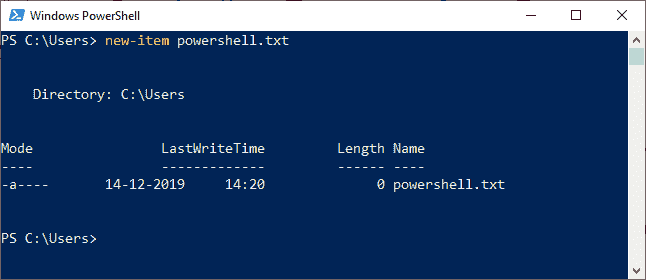
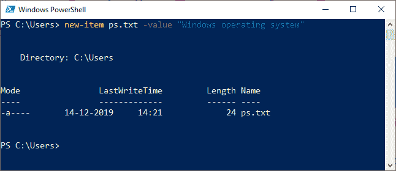
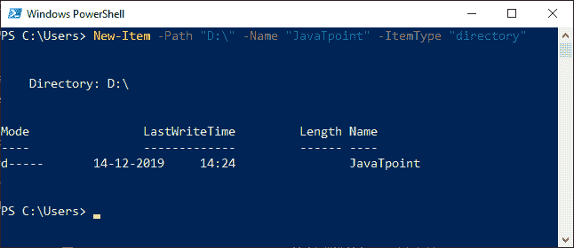
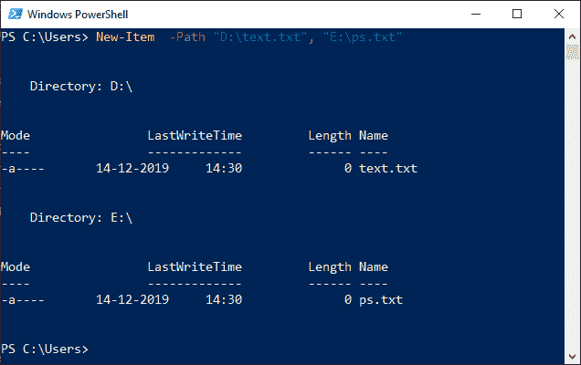

# 新项目|创建文件夹

> 原文：<https://www.javatpoint.com/powershell-new-item>

PowerShell 中的 **New-Item** Cmdlet 在文件系统中创建文件和文件夹，并在注册表中创建注册表项和条目。随着文件的创建，它也将初始内容添加到文件中。

### 句法

```ps1

New-Item 
[-Path] <string[]> 
[-ItemType <string>] 
[-Value <Object>] 
[-Force] 
[-Credential <pscredential>] 
[-WhatIf] 
[-Confirm] 
[-UseTransaction]  
[<CommonParameters>]

```

```ps1

New-Item 
[[-Path] <string[]>] 
-Name <string> 
[-ItemType <string>] 
[-Value <Object>] 
[-Force] 
[-Credential <pscredential>] 
[-WhatIf] 
[-Confirm] 
[-UseTransaction]  
[<CommonParameters>]

```

## 因素

以下是此 cmdlet 中使用的参数:

**-路径**

**-路径**参数用于指定新文件或文件夹位置的路径。接受通配符。

**item type**

**-项目类型**参数指定新项目的指定提供者的类型。

如果用户的位置在文件系统驱动器中，这五个值(文件、符号链接、目录、连接、硬链接)是允许的。

如果您的位置在认证驱动器中，您可以指定这些值:证书提供者、证书、存储、存储位置。

**-名称**

此参数指定新的文件或文件夹名称。

**-值**

此参数用于表示新项目的值。

**-力**

此参数强制此 cmdlet 创建覆盖现有只读项目的项目。

**-whati**

此参数描述如果 cmdlet 执行会发生什么。cmdlet 不执行。

**-确认**

此参数在执行 cmdlet 之前提示您确认。

## 例子

**示例 1:在当前工作目录下创建文件**



在本例中，该命令在当前工作目录中创建一个文本文件。

**示例 2:创建一个文件并将内容添加到该文件中**



本示例中的命令创建一个文本文件，并将字符串传递给该文件，该文件后面是 cmdlet 中的 **-Value** 参数。

**示例 3:创建目录**



本示例中的命令在给定的驱动器中创建目录。在该命令中， **-ItemType** 参数代表目录中的新项目。

**示例 4:创建多个文件**



在本例中，命令在两个不同的目录中创建新文件。如果要创建多个项目，**-路径**参数接受多个字符串。

* * *