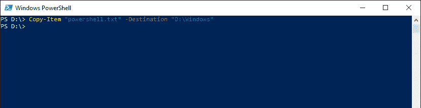
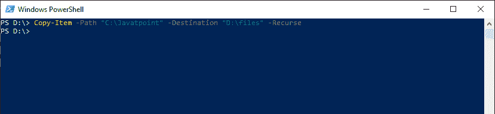
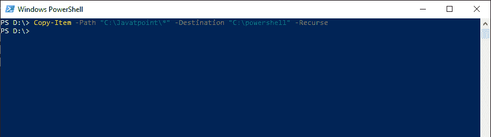
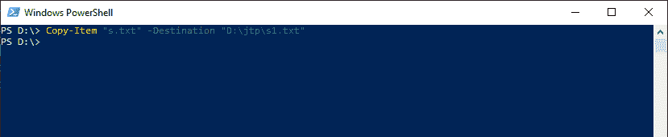

# PowerShell 副本-项目| PowerShell 副本文件

> 原文：<https://www.javatpoint.com/powershell-copy-item>

复制项目 cmdlet 将项目从命名空间中的一个位置复制到另一个位置。例如，此 cmdlet 可以将文件复制到文件夹，但不能将文件复制到证书驱动器。它不会删除或剪切正在复制的项目。cmdlet 复制的那些特定项依赖于公开该项的 PowerShell 提供程序。

例如，此 cmdlet 可以复制文件系统驱动器中的文件和目录，以及注册表驱动器中的注册表项和条目。它可以复制和重命名同一 cmdlet 中的项目。在**-目的地**参数值中输入新名称，对项目进行重命名。

## 句法

```

Copy-Item
[-Confirm]
[-Path <String[]>] 
[-Destination <String>] 
[-Filter <String>]
[-Force]
[-Container]
[-Include <String[]>]
[-Exclude <String[]>]
[-Recurse] 
[-PassThru]
[-Credential <PSCredential>] 
[-WhatIf] 
[-FromSession<PSSession>] 
[-ToSession<PSSession>]
[<CommonParameters>]

```

```

Copy-Item
[-Confirm]
[-LiteralPath<String[]>]
[-Destination <String>]
[-Filter <String>]
[-Force]
[-Container]
[-Include <String[]>] 
[-Exclude <String[]>]
[-Recurse]
[-PassThru]
[-Credential <PSCredential>] 
[-WhatIf]
[-FromSession<PSSession>]
[-ToSession<PSSession>]
[<CommonParameters>]

```

## 因素

**-确认**

-Confirm 参数在运行 cmdlet 之前提示确认。

**-路径**

**-路径**参数中的字符串数组用于指定要复制的项目的路径。接受通配符。

**-文字路径**

**-LiteralPath** 参数用于指定位置的路径。它的值完全按照类型使用。如果路径包含转义字符，请用单引号引起来。单引号告诉 Windows PowerShell，它不应该将任何字符解释为转义序列。cmdlet 中没有字符，它被解释为通配符。

**-目的地**

-Destination 参数用于指定新位置的路径。默认为当前位置。不接受通配符。要重命名被复制的项目，请在-Destination 参数的值中给定一个新名称。

**-过滤器**

-Filter 参数指定一个筛选器来限定-Path 参数。文件系统提供程序是唯一支持使用过滤器的 PowerShell 提供程序。此参数更有效，因为提供程序在 cmdlet 获取对象时应用筛选器，而不是让 Powershell 在对象被访问后对其进行筛选。

**-力**

此参数指示此 cmdlet 复制那些无法更改的项目，例如通过只读文件或别名复制。

**-容器**

-Container 参数指示此 cmdlet 在复制操作期间保留容器对象。默认情况下，此参数设置为真。

**-包括**

此 cmdlet 在操作中包含的项被指定为字符串数组。-Include 参数的值限定了 **-Path** 参数。输入图案或路径元素，如 ***。txt** 。接受通配符。-Exclude 参数仅在 cmdlet 包含项目内容时有效，如 **C:\*** ，通配符**' ***用于指定 C:目录的内容。

**-排除**

此 cmdlet 在操作中排除的项被指定为字符串数组。-Exclude 参数的值限定了-Path 参数。输入图案或路径元素，如 ***。txt** 。接受通配符。-Exclude 参数仅在 cmdlet 包含项目内容时有效，如 **C:\*** ，通配符**' ***用于指定 C:目录的内容。

**-递归**

-Recurse 参数指示此 cmdlet 执行递归复制。

【t0-通行证】T1

-PassThru 参数返回一个对象，该对象表示我们正在处理的一个项目。默认；它不会产生任何输出。

**-证件**

安装了 PowerShell 的任何提供程序**都不支持-Credential 参数。默认情况下，此参数使用当前用户。**

 ****-whati**

-WhatIf 参数显示如果执行 **cmdlet** 会发生什么。cmdlet 不执行。

**from session**

-FromSession 参数用于指定正在从中复制远程文件的**psession**对象。当我们使用它时，path 和 LiteralPath 参数都引用远程机器上的本地路径。

**- 折腾**

-ToSession 参数用于指定远程文件要复制到的**psession**对象。当我们使用它时，**-目的地**参数指的是远程机器上的本地路径。

## 例子

**示例 1:将文件复制到指定位置**



本例中的 cmdlet 将 **powershell.txt** 文件复制到 **D:\windows** 目录。原始文件不会被删除。

**示例 2:将目录的内容复制到新目录**



本例中的 cmdlet 复制了 **C:\Javatpoint** 源目录的内容，并创建了一个新的目标目录。新的目标目录**\文件**是在 **D:\ drive** 中创建的。

**示例 3:将目录的内容复制到现有目录**



本例中的 cmdlet 将**C:\ Javapoint**目录的内容复制到现有目录 **C:\PowerShell** 目录中。不复制 Javatpoint 目录。

如果 **Javatpoint** 目录包含子目录中的文件，它们也会被复制，并且它们的文件树保持不变。默认情况下

**-容器**参数设置为**真**，保留目录结构。

**示例 4:将文件复制到给定的目录并重命名该文件**



本例中的 cmdlet 将文件 **s.txt** 从**D:\目录**复制到 **D:\jtp** 目录，并将文件名从 **s.txt** 更改为 **s1.txt** 。

* * ***