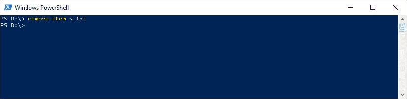
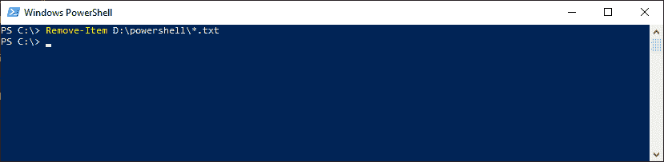
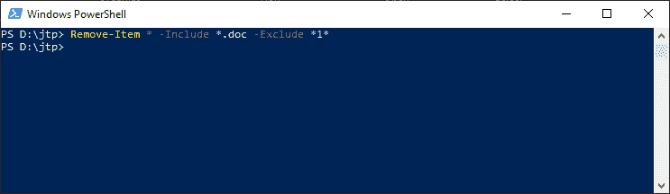

# PowerShell 删除-项目| PowerShell 删除文件

> 原文：<https://www.javatpoint.com/powershell-remove-item>

PowerShell 移除项目 cmdlet 删除一个或多个指定的项目。因为许多提供程序支持此 cmdlet，因此它可以删除许多不同类型的项目，包括文件、文件夹、变量、注册表项、别名和函数。

## 句法

```powershell

Remove-Item
[-Path<string[]>]
[-Confirm]
[-Filter <string>]
[-Recurse] 
[-Force]
[-Include <string[]>]
[-Exclude <string[]>]
[-Credential <pscredential>] 
[-WhatIf] 
[-UseTransaction] 
[-Stream <string[]>]  
[<CommonParameters>]

```

```powershell

Remove-Item
[-LiteralPath <string[]>]
[-Filter <string>] 
[-Recurse]
[-Force]
[-Include <string[]>] 
[-Exclude <string[]>] 
[-Credential <pscredential>] 
[-WhatIf] 
[-Confirm] 
[-UseTransaction] 
[-Stream <string[]>]
[<CommonParameters>]

```

## 因素

**-路径**

-Path 参数用于指定要删除的项目的路径。接受通配符。

**-文字路径**

**-LiteralPath** 参数用于指定一个或多个位置的路径。它的值完全按照类型使用。如果路径包含转义字符，请用单引号引起来。单引号告诉 Windows PowerShell，它不应该将任何字符解释为转义序列。cmdlet 中没有字符，它被解释为通配符。

**-确认**

-Confirm 参数在运行 cmdlet 之前提示确认。

**-过滤器**

-Filter 参数指定一个筛选器来限定-Path 参数。文件系统提供程序是唯一支持使用过滤器的 PowerShell 提供程序。此参数更有效，因为提供程序在 cmdlet 获取对象时应用筛选器，而不是让 PowerShell 在对象被访问后对其进行筛选。

**-递归**

-Recurse 参数指示此 cmdlet 删除给定位置中的项目以及这些位置的所有子项目。当此参数与 **-Include** 参数一起使用时，它可能不会删除所有子文件夹或所有子项目。

**-力**

-Force 参数强制 cmdlet 删除那些无法更改的项目，例如隐藏的只读文件、别名或变量。它不能删除常量变量或别名。即使使用-Force 参数，cmdlet 也不能重写安全权限。

**-包括**

此 cmdlet 在操作中包含的项被指定为字符串数组。-Include 参数的值限定了-Path 参数。输入图案或路径元素，如 ***。txt** 。接受通配符。-Exclude 参数仅在 cmdlet 包含项目内容时有效，如 **C:\*** ，通配符“ ***** ”用于指定 C:目录的内容。

**-排除**

此 cmdlet 在操作中排除的项被指定为字符串数组。-Exclude 参数的值限定了-Path 参数。输入图案或路径元素，如 ***。txt** 。接受通配符。-Exclude 参数仅在 cmdlet 包含项目内容时有效，如 **C:\*** ，通配符“ ***** ”用于指定 C:目录的内容。

**-whati**

-WhatIf 参数显示如果 cmdlet 运行会发生什么。cmdlet 不执行。

**-流**

-Stream 参数是文件系统提供程序添加到 Remove-Item cmdlet 的动态参数。它仅在文件系统驱动器中工作，并在 Windows PowerShell 3.0 中引入。

## 例子

**示例 1:删除当前驱动器中的指定文件**



在本例中，cmdlet 删除当前驱动器中给定的 **s.txt 文件**。

**示例 2:删除扩展名为. txt 的文件**



本例中的 cmdlet 删除所有有**的文件。从 **D:\PowerShell** 文件夹中选择 txt** 扩展。

**示例 3:删除当前文件夹中的文档文件**



本例中的 cmdlet 删除所有带有**的文件。文档**文件扩展名和当前文件夹中不包含 **1** 的名称。它使用通配符“ ***** ”来指定当前。并使用**-包含**和**-排除**参数指定要删除的文件。

* * *