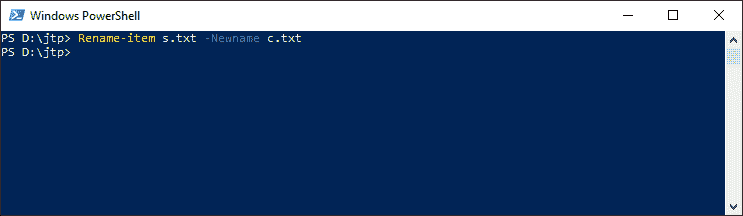
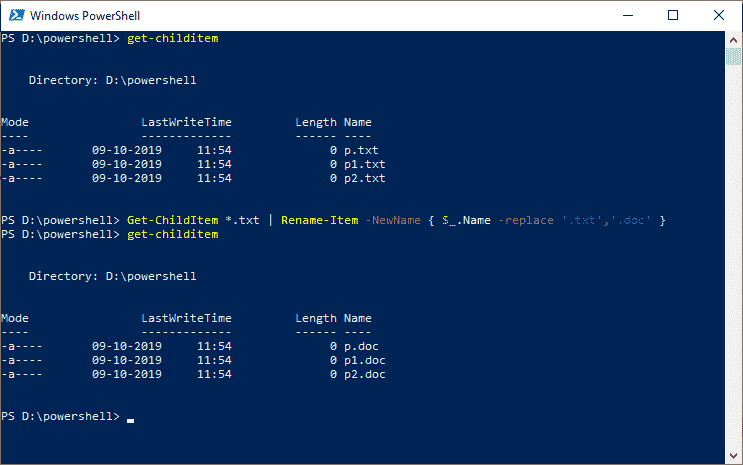

# PowerShell 重命名-项目| PowerShell 重命名文件

> 原文:[https://www.javatpoint.com/powershell-rename-item](https://www.javatpoint.com/powershell-rename-item)

PowerShell **重命名-项目** cmdlet 重命名 PowerShell 提供程序命名空间中的项目。它更改指定项目的名称。它不影响正在重命名的项目的内容。 **ri、rm、rmdir、del、erase 和 rd** 是**重命名项**小命令的别名。

## 句法

```

Rename-Item
[-Path <string>]
[-NewName <string>]
[-Force] 
[-PassThru] 
[-Credential <pscredential>] 
[-WhatIf]
[-Confirm] 
[-UseTransaction]  
[<CommonParameters>]

```

```

Rename-Item
[-NewName] <string>
-LiteralPath <string>
[-Force] 
[-PassThru] 
[-Credential <pscredential>] 
[-WhatIf]
[-Confirm] 
[-UseTransaction]  
[<CommonParameters>]

```

## 因素

**-路径**

-Path 参数用于指定要重命名的项的路径。

**-文字路径**

-LiteralPath 参数用于指定一个或多个位置的路径。它的值完全按照类型使用。如果路径包含转义字符，请用单引号引起来。单引号告诉 Windows PowerShell，它不应该将任何字符解释为转义序列。cmdlet 中没有字符，它被解释为通配符。

**-NewName**

-NewName 参数用于指定项目的新名称。如果用户输入的路径与**-路径**参数中指定的路径不同，该参数会产生错误。我们不能在-NewName 参数的值中使用通配符。

**-力**

-Force 参数强制 cmdlet 重命名那些不能更改的项，如隐藏的只读文件、别名或变量。它不能**移除**常量变量或别名。即使使用-Force 参数，cmdlet 也不能重写安全权限。

【t0-通行证】T1

-PassThru 参数返回一个对象，该对象代表管道中的一个项目。默认情况下，它不会生成任何输出。

**-whati**

-WhatIf 参数显示如果 cmdlet 运行会发生什么。cmdlet 不执行。

**-确认**

-Confirm 参数在运行 cmdlet 之前提示确认。

## 例子

**示例 1:重命名文件**



在本例中，cmdlet 将当前目录中的文件 **s.txt** 重命名为 **c.txt** 。

**示例 2:重命名多个文件**



在这个例子中，cmdlet 重命名所有的**。txt** 文件到**。doc** 文件。

在这个例子中使用 **Get-ChildItem** cmdlet 来获取当前文件夹中所有有**的文件。txt** 文件扩展名，然后将它们传送到**重命名-项** cmdlet。 **-NewName** 的值是一个脚本块，在将该值提交给-NewName 参数之前运行。

* * *