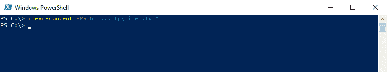
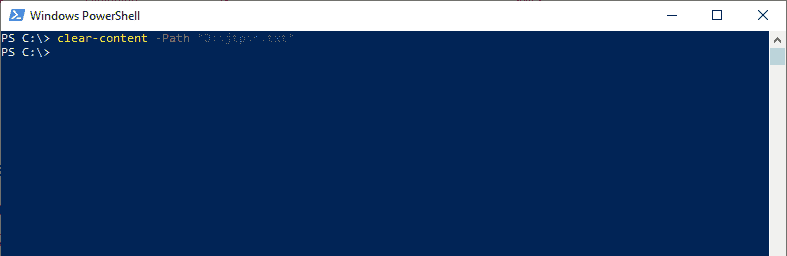

# PowerShell 清除-内容

> 原文:[https://www.javatpoint.com/powershell-clear-content](https://www.javatpoint.com/powershell-clear-content)

**清除-内容** cmdlet 删除项目的内容，但不会删除项目，例如从文件中删除文本。因此，项目存在，但该项目为空。此 cmdlet 适用于包含内容的项，而不是包含值的项。 **clc** 是这个 cmdlet 的别名。

## 句法

```

Clear-Content 
[-Path <string[]>]
[-Force]
[-Credential <pscredential>] 
[-WhatIf]
[-Filter <string>] 
[-Include <string[]>] 
[-Exclude <string[]>] 
[-Confirm] 
[-UseTransaction] 
[-Stream <string>]  
[<CommonParameters>]

```

```

Clear-Content 
[-LiteralPath <string[]>]
[-Force]
[-Credential <pscredential>] 
[-WhatIf]  
[-Filter <string>] 
[-Include <string[]>] 
[-Exclude <string[]>] 
[-Confirm] 
[-UseTransaction] 
[-Stream <string>] 
[<CommonParameters>]

```

## 因素

**-路径**

-Path 参数用于指定从中删除内容的项目的路径。接受通配符。路径必须是项目的路径，而不是容器的路径。它是必需的，但是参数路径的名称是可选的。

**-文字路径**

-LiteralPath 参数用于指定从中删除内容的项目的路径。与-Path 参数不同，它的值完全按照类型使用。不接受通配符。

如果路径包含转义字符，请用单引号引起来。单引号告诉 Windows PowerShell，它不应该将任何字符解释为转义序列。

**-力**

-Force 参数用于强制执行命令，而不要求用户确认。

**-whati**

-WhatIf 参数显示如果 cmdlet 运行会发生什么。cmdlet 不执行。

**-过滤器**

-Filter 参数用于以提供程序的语言或格式指定筛选器。它的值限定了**-路径**参数。此参数更有效，因为提供程序在 cmdlet 获取对象时应用筛选器，而不是让 PowerShell 在对象被访问后对其进行筛选。

**-包括**

此 cmdlet 清除的指定为字符串数组的内容。-Include 参数的值限定了-Path 参数。输入图案或路径元素，如 ***。txt** 。接受通配符。

**-排除**

此 cmdlet 从路径中省略的内容被指定为字符串数组。它的值限定了-Path 参数。输入图案或路径元素，如 ***。txt** 。接受通配符。

**-确认**

-Confirm 参数在运行 cmdlet 之前提示确认。

**-流**

-Stream 参数用于为内容指定备用数据流。如果流不存在，clear-content cmdlet 会创建它。接受通配符。

这是文件系统提供者添加到**清除内容**的动态参数。它仅适用于文件系统驱动器。

## 例子

**示例 1:从指定文件中删除内容**



在本例中，cmdlet 从指定位置的**文件 1.txt** 中删除内容。该文件未被删除，但为空。

**例 2:从所有文件中删除内容**



在本例中，cmdlet 删除所有**的内容。指定目录中的 txt** 文件。

* * *