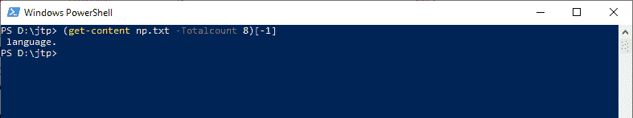

# 获取内容

> 原文：<https://www.javatpoint.com/powershell-get-content>

PowerShell **Get-Content** 小命令获取指定位置的项目内容。 **gc、cat、**和**类型**是该 cmdlet 的别名。

## 句法

```ps1

Get-Content 
[-Filter <string>] 
[-Include <string[]>] 
[-Exclude <string[]>] 
[-Force]
[-Path] <string[]> 
[-ReadCount <long>] 
[-TotalCount <long>] 
[-Tail <int>] 
[-Credential <pscredential>]
[-UseTransaction] 
[-Delimiter <string>] 
[-Wait] 
[-Raw] 
[-Encoding {Unknown | String | Unicode | Byte | BigEndianUnicode | UTF8 | UTF7 | UTF32 | Ascii | Default | Oem | BigEndianUTF32}]
[-Stream <string>]  
[<CommonParameters>]

```

```ps1

Get-Content 
[-Filter <string>] 
[-Include <string[]>] 
[-Exclude <string[]>] 
[-Force]
[-LiteralPath <string[]>]
[-ReadCount <long>] 
[-TotalCount <long>] 
[-Tail <int>] 
[-Credential <pscredential>] 
[-UseTransaction] 
[-Delimiter <string>] 
[-Wait] 
[-Raw] 
[-Encoding {Unknown | String | Unicode | Byte | BigEndianUnicode | UTF8 | UTF7 | UTF32 | Ascii | Default | Oem |BigEndianUTF32}] 
[-Stream <string>]  
[<CommonParameters>]

```

## 因素

**-过滤器**

-Filter 参数用于指定一个过滤器来限定 **-Path** 参数。文件系统提供程序是唯一支持使用过滤器的 PowerShell 提供程序。此参数更有效，因为提供程序在 cmdlet 获取对象时应用筛选器，而不是让 Powershell 在对象被访问后对其进行筛选。

**-包括**

此 cmdlet 在操作中包含的项被指定为字符串数组。-Include 参数的值限定了-Path 参数。输入图案或路径元素，如 ***。txt** 。允许使用通配符。只有当 cmdlet 包含一个项目的内容时才有效，如 **C:\*** ，通配符“ ***** ”用于指定 C:目录的内容。

**-排除**

此 cmdlet 在操作中排除的项被指定为字符串数组。-Exclude 参数的值限定了-Path 参数。输入图案或路径元素，如 ***。txt** 。接受通配符。-Exclude 参数仅在 cmdlet 包含项目内容时有效，如 **C:\*** ，通配符“ ***** ”用于指定 C:目录的内容。

**-力**

-Force 参数将覆盖只读属性或创建目录来完成文件路径。它不会尝试更改文件权限或覆盖安全权限。

**-路径**

-Path 参数用于指定此 cmdlet 获取内容的项的路径。接受通配符。路径必须是指向项目的路径，而不是指向容器的路径。

**-读取计数**

-ReadCount 参数用于指定一次通过管道发送多少行内容。它不会改变要显示的内容，但会影响显示内容所需的时间。

**-总数**

-TotalCount 参数用于指定从文件开始的行数。我们也可以使用别名“第一”或“此参数的开头”。

**-尾部**

**-Tail** 参数用于指定从文件末尾开始的行数。它是在 Windows PowerShell 3.0 中引入的。我们也可以使用这个参数的别名 Last。

**-分隔符**

**-分隔符**参数在此 cmdlet 中用于在文件读取时将其分成对象。通过指定一个文件分隔符作为分隔符，我们可以使用这个参数将大文件分割成小文件。

它将被保留，并成为每个文件部分的最后一项。它是一个动态参数，由文件系统提供者添加到**获取内容**小命令中。

**-等待**

-Wait 参数用于在输出所有现有行后保持文件打开。

这是一个动态参数，由**文件系统**提供程序添加到**获取内容**小命令中。该参数不能与**-原始**参数组合。

**-原始**

-Raw 参数用于忽略换行符，并以单个字符串形式返回文件的全部内容。在文件中，默认情况下，换行符用作分隔符，将输入分隔成一个字符串数组。它是在 Windows **PowerShell 3.0** 中引入的。

它是一个动态参数，由文件系统提供程序添加到获取内容 cmdlet 中

**-编码**

-Encoding 参数用于指定目标文件的编码类型。其默认值为 **UTF8NoBOM** 。

以下是此参数的可接受值:

*   **ASCII:** 该值使用 ASCII (7 位)字符集的编码。
*   **Unicode:** 它使用小端字节顺序以 UTF-16 格式编码。
*   **UTF7:** 以 UTF-7 格式编码。
*   **UTF8:** 以 UTF-8 格式编码。
*   **BigEndianUnicode:** 它使用大端字节顺序以 UTF-16 格式编码。
*   **OEM:** 它使用 MS-DOS 和控制台程序的默认编码。
*   **UTF8NoBOM:** 采用 UTF-8 格式编码，无字节顺序标记(BOM)
*   **UTF32:** 以 UTF-32 格式编码。
*   **UTF8BOM:** 以 UTF-8 格式编码，带字节顺序标记(BOM)

这是一个动态参数，由**文件系统**提供程序添加到**获取内容**小命令中。它仅在文件系统的驱动器中可用。

**-流**

-Stream 参数用于从文件中获取指定的**备选 NTFS** 文件流的内容。不支持通配符。它是在 Windows PowerShell 3.0 中引入的。

它是一个动态参数，由**文件系统**提供程序添加到**获取内容** cmdlet 中，并且只在文件系统驱动器中工作。

## 例子

**示例 1:获取文本文件的内容**


此示例中的 cmdlet 用于显示当前目录中 PowerShell 控制台上的 np.txt 文件的内容。

**示例 2:从文本文件中获取前 n 行的内容**


本示例中的 cmdlet 显示文本文件中的具体行数。 **-Totalcount** 参数显示前 10 行内容。

**示例 3:从文本文件**中获取特定的内容行



本示例中的 cmdlet 用于显示该内容的特定行。

**示例 4:从文本文件中获取最后一行内容**


本示例中的 cmdlet 显示文件内容的最后一行。 **-Tail** 参数获取文件的最后一行。

* * *