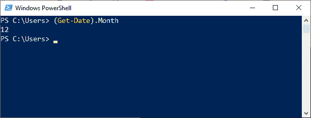

# 获取日期

> 原文：<https://www.javatpoint.com/powershell-get-date>

PowerShell 中的**获取日期**小命令在 PowerShell 控制台上显示当前日期和时间。该 cmdlet 获取一个**日期时间**对象。

我们还可以使用 Get-Date 来生成日期和时间字符串并将其发送给其他 cmdlets 或程序。

### 句法

```

Get-Date 
[[-Date] <datetime>] 
[-Year <int>] 
[-Month <int>] 
[-Day <int>] 
[-Hour <int>] 
[-Minute <int>] 
[-Second <int>] 
[-Millisecond <int>]
[-DisplayHint {Date | Time | DateTime}] 
[-Format <string>]  
[<CommonParameters>]

```

```

Get-Date 
[[-Date] <datetime>] 
[-Year <int>] 
[-Month <int>] 
[-Day <int>] 
[-Hour <int>] 
[-Minute <int>] 
[-Second <int>] 
[-Millisecond <int>] 
[-DisplayHint {Date | Time | DateTime}] 
[-UFormat <string>]  
[<CommonParameters>]

```

### 因素

以下是**获取日期**小命令中使用的参数:

**-日期**

此参数允许您在 cmdlet 中指定特定的日期和时间。默认情况下， **get-date** cmdlet 返回系统日期和时间。在此参数中，如果没有在命令中指定时间，则时间是可选的，然后命令返回 00:00:00。

**-年**

此参数用于指定年份。输入 1 到 9999 之间的年份值，后跟此参数。

**-月**

此参数用于指定一年中显示的月份。输入从 1 到 12 的月份值，后面跟这个参数。

**-日**

此参数用于指定显示的月份中的日期。输入从 1 到 31 的一天的值，后面跟这个参数。

如果 cmdlet 中指定的日期值大于一个月中的天数，则 PowerShell 会将天数添加到该月中。

**-小时**

此参数用于指定小时。输入从 0 到 23 的小时值，后跟此参数。

**-分钟**

此参数用于指定分钟。输入从 0 到 59 的分钟值，后面跟这个参数。

**-第二**

此参数用于指定第二个。输入 0 到 59 之间的秒值，后面跟这个参数。

**-毫秒**

**-毫秒**参数是在 PowerShell 版本中引入的，用于指定日期中的毫秒。输入从 0 到 999 的毫秒值。

显示提示

此参数确定控制台上显示的日期和时间值。

**-格式**

此参数以微软的格式显示日期和时间。NET 框架。

从 PowerShell 版本开始，对于此参数，我们可以使用以下格式作为其值:

*   文件日期
*   文件日期通用
*   取文件时间
*   文件日期时间通用

【t0-u 格式】T1

此参数用于以 UNIX 格式显示日期和时间。此参数输出一个字符串对象。此参数的说明符前面有一个百分号(%)。

### 例子

**示例 1:显示当前日期和时间**


在本例中， **Get-Date** cmdlet 显示系统的当前日期和时间。

**例 2:显示当前日期**


在本例中，cmdlet **获取日期**使用带有值参数的**-显示提示**参数仅获取日期。

**示例 3:用. NET 格式说明符**显示日期和时间


在本例中， **Get-Date** cmdlet 使用 **-Format** 参数以. NET 格式说明符显示当前日期和时间。

在本例中，我们使用以下格式说明符:

*   **dddd:** 一周中的某一天
*   **毫米:**一年中的月份
*   **日:**月中的某一天
*   **yyyy:**4 位数字格式的年份
*   **时:分:**时间为 24 小时制

**例 4:只显示一年中的一个月**



在本例中，**获取日期**小命令与属性**月份**一起使用。

* * *