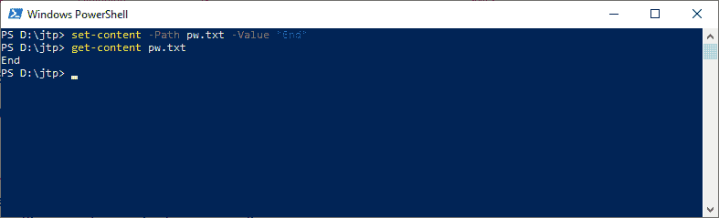
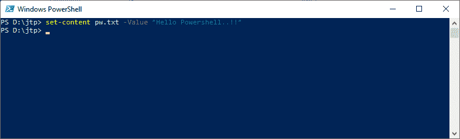
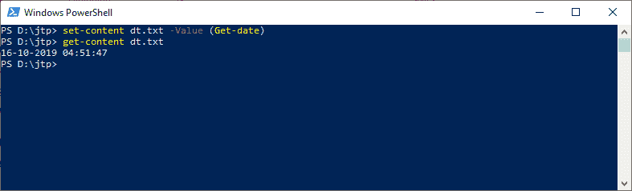

# PowerShell 设置-内容| PowerShell 写入文件

> 原文:[https://www.javatpoint.com/powershell-set-content](https://www.javatpoint.com/powershell-set-content)

PowerShell **Set-Content** 小命令写入新内容或替换文件中的现有内容。它不同于将内容附加到文件中的添加内容 cmdlet。要将内容发送到 Set-Content cmdlet，我们可以使用命令行上的 **-Value** 参数，或者我们可以通过管道发送内容。 **sc** 是这个小命令的别名。

## 句法

```

Set-Content 
[-Path] <string[]>
[-Force] 
[-Credential <pscredential>] 
[-WhatIf] 
[-Confirm]
[-Value] <Object[]> 
[-PassThru] 
[-Filter <string>] 
[-Include <string[]>] 
[-Exclude <string[]>] 
[-UseTransaction] 
[-NoNewline] 
[-Encoding {Unknown | String | Unicode | Byte | BigEndianUnicode | UTF8 | UTF7 | UTF32 | Ascii | Default | Oem | BigEndianUTF32}] 
[-Stream <string>]  
[<CommonParameters>]

```

```

Set-Content 
[-Value] <Object[]>
-LiteralPath <string[]> 
[-PassThru] 
[-Filter <string>] 
[-Include <string[]>]
[-Exclude <string[]>] 
[-Force] 
[-Credential <pscredential>] 
[-WhatIf] 
[-Confirm] 
[-UseTransaction] 
[-NoNewline] 
[-Encoding {Unknown | String | Unicode | Byte | BigEndianUnicode | UTF8 | UTF7 | UTF32 | Ascii | Default | Oem |BigEndianUTF32}]
[-Stream <string>]  
[<CommonParameters>]

```

## 因素

**-路径**

-Path 参数用于指定接收内容的项目的路径。接受通配符。

**-文字路径**

**-LiteralPath** 参数用于指定一个或多个位置的路径。如果路径包含转义字符，请用单引号引起来。单引号告诉 Windows PowerShell，它不应该将任何字符解释为转义序列。cmdlet 中没有字符，它被解释为通配符。

**-力**

-Force 参数用于强制 cmdlet 设置只读**文件的内容。它不会覆盖安全权限。**

 ****-whati**

WhatIf 参数用于显示如果 cmdlet 执行会发生什么。cmdlet 不执行。

**-确认**

-confirm 参数用于在运行 cmdlet 之前提示确认。

**-值**

-Value 参数用于指定项目的新内容。

【t0-通行证】T1

-PassThru 参数用于返回表示内容的对象。默认情况下，它不会生成任何输出。

**-过滤器**

-Filter 参数用于指定一个过滤器来限定 **-Path** 参数。文件系统提供程序是唯一支持使用过滤器的 PowerShell 提供程序。此参数更有效，因为提供程序在 cmdlet 获取对象时应用筛选器，而不是让 Powershell 在对象被访问后对其进行筛选。

**-包括**

此 cmdlet 在操作中包含的项被指定为字符串数组。-Include 参数的值限定了-Path 参数。输入图案或路径元素，如 ***。txt** 。接受通配符。-Exclude 参数仅在 cmdlet 包含项目内容时有效，如 **C:\*** ，通配符“ ***** ”用于指定 C:目录的内容。

**-排除**

此 cmdlet 在操作中排除的项被指定为字符串数组。-Exclude 参数的值限定了-Path 参数。输入图案或路径元素，如 ***。txt** 。接受通配符。-Exclude 参数仅在 cmdlet 包含项目内容时有效，如 **C:\*** ，通配符“ ***** ”用于指定 C:目录的内容。

**-NoNewLine**

输入字符串之间没有插入换行符或空格，最后一个输出字符串后也没有添加换行符。

**-编码**

-Encoding 参数用于指定目标文件的编码类型。它的默认值是 UTF8NoBOM。它是一个动态参数，由文件系统提供程序添加到设置内容 cmdlet 中。它只在文件系统的驱动器中工作。

以下是此参数的可接受值:

*   **ASCII:** 它使用 ASCII (7 位)字符集的编码。
*   **Unicode:** 它使用小端字节顺序以 UTF-16 格式编码。
*   **UTF7:** 以 UTF-7 格式编码。
*   **UTF8:** 以 UTF-8 格式编码。
*   **BigEndianUnicode:** 它使用大端字节顺序以 UTF-16 格式编码。
*   **OEM:** 它使用 MS-DOS 和控制台程序的默认编码。
*   **UTF8NoBOM:** 采用 UTF-8 格式编码，无字节顺序标记(BOM)
*   **UTF32:** 以 UTF-32 格式编码。
*   **UTF8BOM:** 以 UTF-8 格式编码，带字节顺序标记(BOM)

**-流**

-Stream 参数用于为内容指定备用数据流。如果流不存在，则此 cmdlet 会创建它。不接受通配符。

这个参数是在 Windows PowerShell 3.0 中引入的。

这是一个动态参数，由**文件系统**提供程序添加到**设置-内容**小命令中。它只在文件系统的驱动器中工作。

## 例子

**示例 1:新建文件并写入内容**



本示例中的第一个 cmdlet 创建一个新文件，并将 Windows **操作系统**写入该文件。它使用**-路径**和**-值**参数在当前目录中创建新文件 **pw.txt** 。

在本例中，第二个 cmdlet 使用 **Get-content** cmdlet 在 PowerShell 控制台中显示 **pw.txt** 文件的内容。

**示例 2:替换目录中现有文件的内容。**



在本例中，cmdlet 替换当前目录中文件的内容。该 cmdlet 使用 **-Value** 参数，该参数提供文本字符串 **Hello PowerShell..！！**替换文件中现有内容。

**示例 3:创建一个新文件，并将系统日期和时间写入文件**



本示例中的第一个 cmdlet 创建一个新文件，并将系统的当前日期和时间写入当前目录中的文件。

Set-content cmdlet 使用**-路径**和**-值**参数在当前目录中创建新文件 **dt.txt** 。**-值**参数使用**获取日期**小命令获取当前日期和时间。

在本例中，第二个 cmdlet 使用 **Get-Content** cmdlet 在 PowerShell 控制台中显示 **dt.txt** 文件的内容。

* * ***