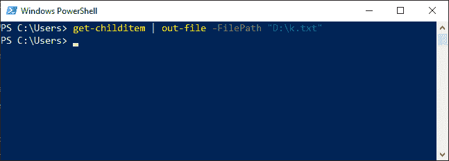
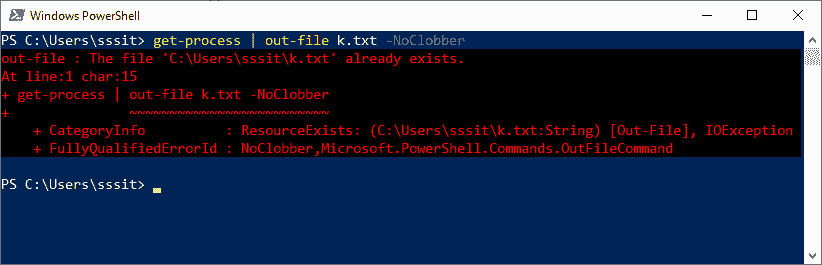

# PowerShell 输出文件

> 原文：<https://www.javatpoint.com/powershell-out-file>

PowerShell 中的**文件外** cmdlet 将输出发送到特定文件。当您需要使用它的参数时，使用这个 cmdlet 而不是重定向操作符(>)。

### 句法

```powershell

Out-File 
[-FilePath] <string> 
[[-Encoding] {unknown | string | unicode | bigendianunicode | utf8 | utf7 | utf32 | ascii | default | oem}] 
[-Append] 
[-Force] 
[-NoClobber] 
[-Width <int>] 
[-NoNewline] 
[-InputObject <psobject>] 
[-WhatIf] 
[-Confirm]  
[<CommonParameters>]

```

```powershell

Out-File 
[[-Encoding] {unknown | string | unicode | bigendianunicode | utf8 | utf7 | utf32 | ascii | default |oem}] 
-LiteralPath <string> 
[-Append] 
[-Force] 
[-NoClobber] 
[-Width <int>] 
[-NoNewline] 
[-InputObject <psobject>]
[-WhatIf] 
[-Confirm]  
[<CommonParameters>]

```

### 因素

以下是此 cmdlet 中使用的参数:

**-文件路径和-文字路径**

这两个参数都用于指定命令中文件的路径。

**-编码**

此参数指定文件中使用的字符类型。此参数的默认值是 UTF8NoBOM。以下是该参数的可接受值:

*   美国信息交换标准代码
*   统一码
*   UTF7
*   BigEndianUnicode
*   UTF8
*   UTF8BOM 表
*   UTF8 无体
*   设备原产商
*   UTF32

**-追加**

此参数用于在现有文件的末尾添加输出。

**-力**

此参数覆盖现有的只读文件和只读属性。它不会覆盖安全限制。

**-NoClobber**

此参数防止同名的现有文件被覆盖，并向您显示文件已经存在的消息。

**-宽度**

此参数指定每个输出行中的字符数。

**-NoNewLine**

此参数指定写入文件的内容不以新的行字符结束。

**-输入对象**

此参数指定写入文件的对象。

**-whati**

此参数描述如果 cmdlet 执行会发生什么。

**-确认**

此参数在执行 cmdlet 之前提示您确认。

### 例子

**例 1:**



本例中的命令通过使用**-文件路径**参数，将 **get-childitem** cmdlet 的输出发送到命令中指定路径的文本文件。

**例 2:**



此示例中的命令不会将 get-process cmdlet 的输出发送到 k.txt 文件，并且会显示一个错误，因为该文件已经存在。由于命令中的 **-NoClobber** 参数，文件 k.txt 不能被覆盖。

* * *