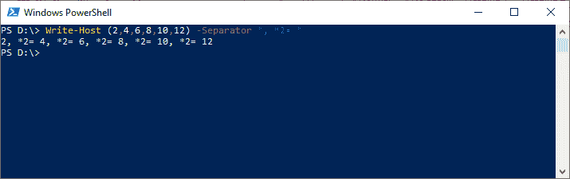
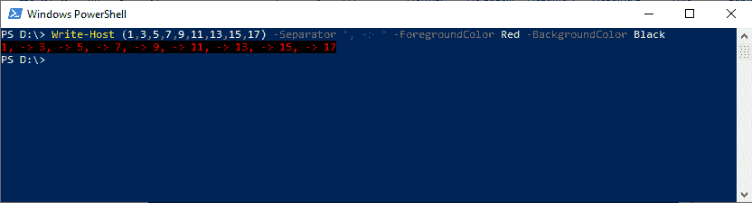

# PowerShell 写主机

> 原文：<https://www.javatpoint.com/powershell-write-host>

PowerShell 写主机 cmdlet 用于将自定义输出写入主机。我们可以使用**-前景**参数指定文本颜色，使用-背景参数指定背景颜色。

## 句法

```powershell

Write-Host 
[[-Object] <Object>] 
[-NoNewline] 
[-Separator <Object>] 
[-ForegroundColor {Black | DarkBlue | DarkGreen | DarkCyan | DarkRed | DarkMagenta | DarkYellow | Gray | DarkGray | Blue | Green | Cyan | Red | Magenta | Yellow | White}] 
[-BackgroundColor {Black | DarkBlue | DarkGreen | DarkCyan | DarkRed | DarkMagenta | DarkYellow | Gray | DarkGray | Blue | Green | Cyan | Red | Magenta | Yellow | White}] 
[<CommonParameters>]

```

## 因素

**-物体**

-Object 参数用于显示宿主中的对象。

**-NoNewline**

-NoNewline 参数指定输出字符串之间不插入空格或换行符，也不在最后一个输出字符串后添加换行符。

**-分离器**

-Separator 参数用于指定插入主机显示的对象之间的分隔符字符串。

【t0-前景颜色】T1

-ForegroundColor 参数用于指定文本的颜色。在此参数中，不存在默认值。

以下是此参数的可接受值:

*   黑色
*   暗蓝色
*   深洋红色
*   深黄色
*   灰色的
*   暗灰色
*   蓝色
*   格林（姓氏）；绿色的
*   品红
*   黄色
*   白色的
*   黑暗格林
*   暗青色
*   暗红色
*   蓝绿色
*   红色

**-背景颜色**

-BackgroundColor 参数用于指定背景的颜色。此参数中不存在默认值。以下是此参数的可接受值:

*   品红
*   黄色
*   白色的
*   深黄色
*   灰色的
*   暗灰色
*   蓝色
*   格林（姓氏）；绿色的
*   蓝绿色
*   红色
*   黑色
*   暗蓝色
*   黑暗格林
*   暗青色
*   暗红色
*   深洋红色

## 例子

**示例 1:通过包含分隔符**将输出写入控制台



本示例中的 cmdlet 用于显示从 2 到 12 的数字。**-分隔符**参数用于将字符串相乘。

**例 2:用不同的文字和背景色书写**



本示例中的 cmdlet 显示从 1 到 17 的奇数。它使用**-前景颜色**参数输出“红色”文本，使用**-背景颜色**参数显示“黑色”背景。

* * *