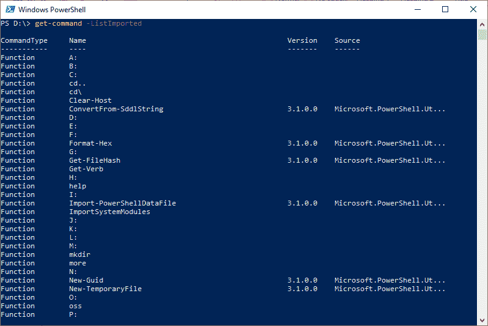

# 获取命令

> 原文：<https://www.javatpoint.com/powershell-get-command>

PowerShell Get-Command cmdlet 用于获取安装在计算机系统上的所有命令。此 cmdlet 包括函数、其他 cmdlet、别名、筛选器、脚本和应用程序。通过使用**-列表导入**参数，我们只能获取那些已经导入到当前会话中的命令。

随着 Windows PowerShell 5.0 的启动，该 cmdlet 默认显示一个**版本**列。

## 句法

```

Get-Command 
[[-ArgumentList] <Object[]>] 
[-Verb <string[]>] 
[-Noun <string[]>] 
[-Module <string[]>]
[-FullyQualifiedModule <ModuleSpecification[]>] 
[-TotalCount <int>] 
[-Syntax] 
[-ShowCommandInfo] 
[-All]
[-ListImported] 
[-ParameterName <string[]>] 
[-ParameterType <PSTypeName[]>]  
[<CommonParameters>]

```

```

Get-Command 
[[-Name] <string[]>] 
[[-ArgumentList] <Object[]>] 
[-Module <string[]>] 
[-FullyQualifiedModule <ModuleSpecification[]>] 
[-CommandType {Alias | Function | Filter | Cmdlet | ExternalScript | Application | Script| Workflow | Configuration | All}] 
[-TotalCount <int>] 
[-Syntax] 
[-ShowCommandInfo] 
[-All] 
[-ListImported]
[-ParameterName <string[]>] 
[-ParameterType <PSTypeName[]>]  
[<CommonParameters>]

```

## 因素

**引数列表**

-ArgumentList 参数用于指定参数数组。该参数的别名是**参数**。不支持通配符。

**-动词**

-Verb 参数用于指定命令动词数组。接受通配符。

**-名词**

-名词参数用于指定命令名词的数组。接受通配符。

**-模块**

-Module 参数用于指定模块数组。它获取来自指定模块的命令。

-Module 参数接受字符串值，但它的值也可以是 PSModuleInfo 对象。

**-完全合格模块**

-fully qualifiedmmodule 参数用于指定具有以**modulespecialization**对象形式指定的名称的模块。

**-总数**

-TotalCount 参数用于指定要获取的命令数量。我们也可以用它来限制命令的输出。

**-语法**

-Syntax 参数用于指示此 cmdlet 获取有关该命令的以下指定数据:

*   函数和过滤器:获取函数的定义。
*   别名:获取标准的名称。
*   Cmdlets:获取语法。
*   脚本和应用程序或文件:获取文件名和路径。

**—show command info**

-ShowCommandInfo 参数用于指示此 cmdlet 仅显示命令的信息。它是在 Windows PowerShell 5.0 中引入的。

**-全部**

它在此 cmdlet 中用于获取所有这些命令，包括具有相同名称的相同类型的命令。它是在 Windows PowerShell 3.0 中引入的。

**-列表导入**

在此 cmdlet 中使用了-listinguided 参数，以便仅获取当前会话中的命令。它是在 Windows PowerShell 3.0 中引入的。

**-名称**

-Name 参数用于指定名称数组。它在此 cmdlet 中仅用于获取那些具有指定名称的命令。接受通配符。

**-CommandType**

-CommandType 参数用于指定此 cmdlet 返回的命令类型。我们也可以用**类型**作为它的别名。

**-参数名称**

参数名是一个用于指定参数名的参数。此 cmdlet 获取会话中具有指定参数的那些命令。接受通配符。它是在 Windows PowerShell 3.0 中引入的。

**参数类型**

-ParameterType 是一个用于指定参数类型数组的参数。此 cmdlet 获取会话中具有指定类型参数的那些命令。输入参数类型的完整或部分名称。允许使用通配符。它是在 Windows PowerShell 3.0 中引入的。

## 例子

**示例 1:获取所有 cmdlets、别名和函数**


此 cmdlet 显示安装在计算机上的 PowerShell 控制台上的所有 cmdlet、别名和函数。

**示例 2:获取当前会话中的命令**



本例中的 cmdlet 使用 **-ListImported** 参数获取当前会话中的命令。

**示例 3:在模块中获取命令**


本例中的 cmdlet 使用 **-Module** 参数来获取微软中的命令。实用程序和微软。安全模块。

**示例 4:获取任何 cmdlet 的语法**


在本例中，cmdlet 使用 **-ArgumentList** 和**-语法**参数来获取 **Get-childItem** cmdlet 的语法。

**例 5:获取所有类型的命令**


在本例中，cmdlet 显示本地计算机上所有类型的所有命令。

**示例 6:获取包含 cmdlet 的模块名称**


本例中的小命令显示了 **Get-Item** 小命令所源自的模块的名称。

* * *