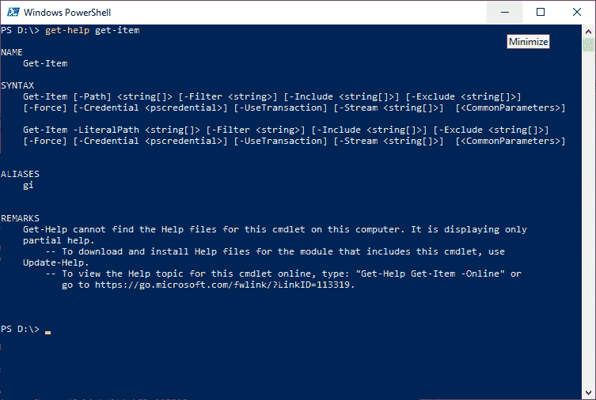
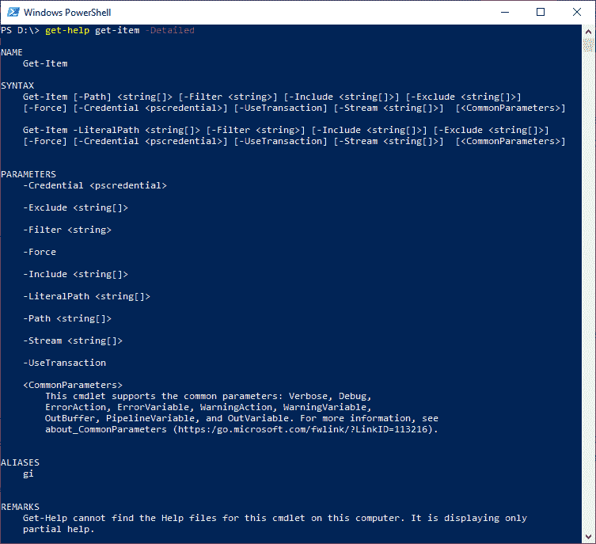
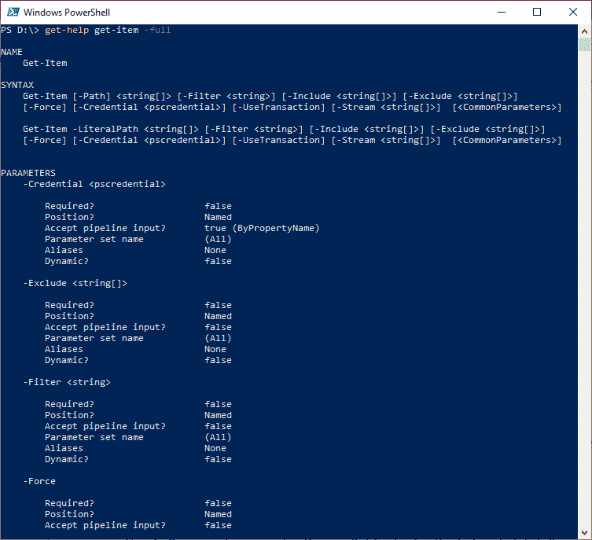
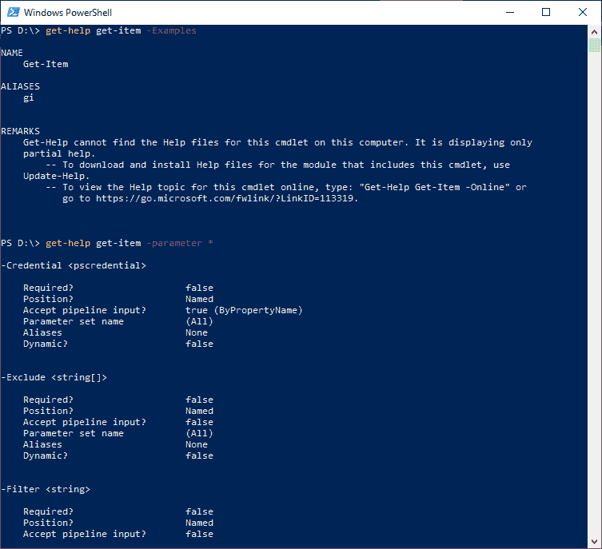
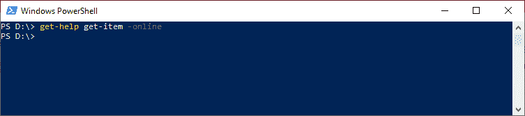
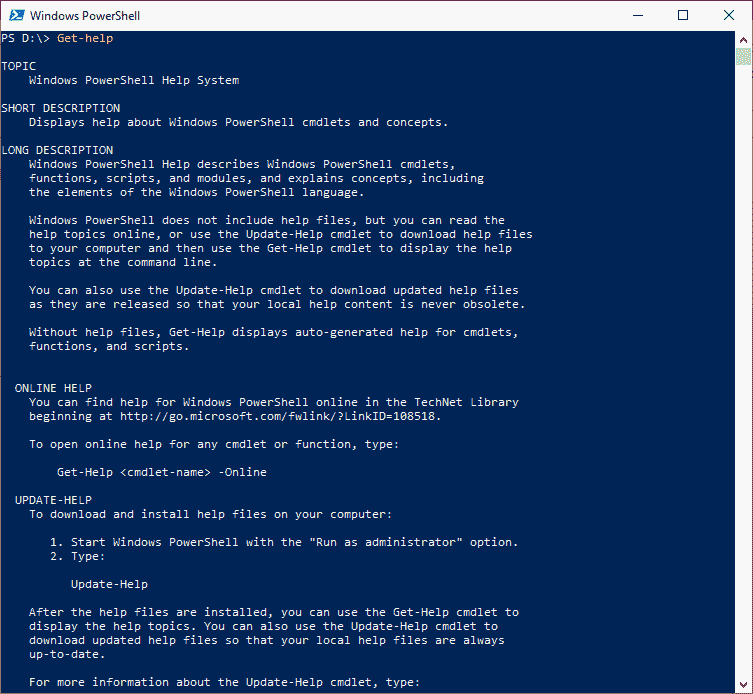
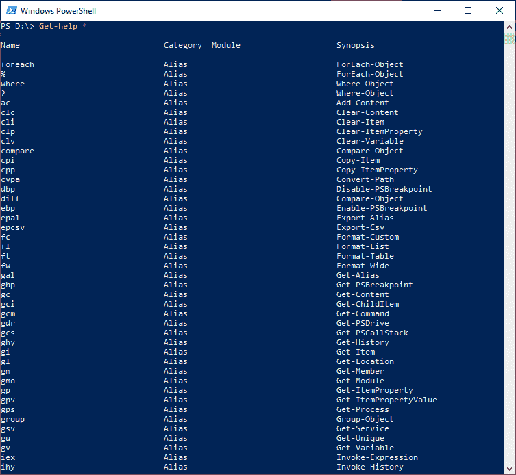

# 获得帮助

> 原文：<https://www.javatpoint.com/powershell-get-help>

PowerShell 获取帮助 cmdlet 用于显示关于 PowerShell 命令和概念的信息。它显示信息，包括函数、提供程序、工作流、脚本和 cmdlets 的别名。要获取 PowerShell 小命令的帮助，请键入**获取帮助**，后跟小命令的名称，例如:**获取帮助集-项目**。我们还可以获得一个 PowerShell 提供程序的帮助，键入 Get-Help cmdlet，后跟提供程序名称。

## 句法

```

Get-Help 
[[-Name] <string>] 
[-Path <string>] 
[-Category {Alias | Cmdlet | Provider | General | FAQ | Glossary | HelpFile | ScriptCommand | Function | Filter | ExternalScript | All |DefaultHelp | Workflow | DscResource | Class | Configuration}] 
[-Component <string[]>] 
[-Functionality <string[]>] 
[-Role <string[]>] 
[-Full]  
[<CommonParameters>]

```

```

Get-Help 
[[-Name] <string>] 
-Detailed 
[-Path <string>] 
[-Category {Alias | Cmdlet | Provider | General | FAQ | Glossary | HelpFile | ScriptCommand | Function | Filter | ExternalScript |All | DefaultHelp | Workflow | DscResource | Class | Configuration}] 
[-Component <string[]>] 
[-Functionality <string[]>] 
[-Role <string[]>]  
[<CommonParameters>]

```

```

Get-Help 
[[-Name] <string>] 
-Examples 
[-Path <string>] 
[-Category {Alias | Cmdlet | Provider | General | FAQ | Glossary | HelpFile | ScriptCommand | Function | Filter | ExternalScript |All | DefaultHelp | Workflow | DscResource | Class | Configuration}] 
[-Component <string[]>] 
[-Functionality <string[]>] 
[-Role <string[]>]  
[<CommonParameters>]

```

```

Get-Help 
[[-Name] <string>] 
-Parameter <string> 
[-Path <string>] 
[-Category {Alias | Cmdlet | Provider | General | FAQ | Glossary | HelpFile | ScriptCommand | Function | Filter |ExternalScript | All | DefaultHelp | Workflow | DscResource | Class | Configuration}] 
[-Component <string[]>] 
[-Functionality <string[]>] 
[-Role <string[]>]  
[<CommonParameters>]

```

```

Get-Help 
[[-Name] <string>] 
-Online 
[-Path <string>] 
[-Category {Alias | Cmdlet | Provider | General | FAQ | Glossary | HelpFile | ScriptCommand | Function | Filter | ExternalScript |All | DefaultHelp | Workflow | DscResource | Class | Configuration}] 
[-Component <string[]>] 
[-Functionality <string[]>] 
[-Role <string[]>]  
[<CommonParameters>]

```

## 因素

**-名称**

-Name 参数用于获取有关指定命令或概念的帮助。

**-路径**

-Path 参数用于获取说明 cmdlet 如何在指定的提供程序路径中工作的帮助。要使用此参数，我们可以为包含提供程序的模块安装帮助文件。

**-类别**

-Category 参数仅用于显示存在于指定类别中的项目及其别名的帮助。以下是此参数的可接受值:

*   全部
*   默认帮助
*   工作流程
*   DscResource
*   班级
*   别名
*   词汇表
*   帮助文件
*   脚本命令
*   功能
*   过滤器
*   指令程式
*   供应者
*   一般
*   常见问题解答
*   ExternalScript
*   配置

**-组件**

-Component 参数用于显示具有给定组件值的命令。接受通配符。

**-功能**

-functional 参数用于显示具有给定功能的项目的帮助。接受通配符。

**-角色**

-Role 参数用于显示为指定用户角色定制的帮助。接受通配符。

**-满**

-Full 参数用于显示 cmdlet 的整个帮助文章。只有在计算机上安装了帮助文件时，它才有效。

**-详细**

-Detailed 参数用于将参数的示例和描述添加到基本帮助显示中。

**-示例**

-Examples 参数仅用于显示名称、简介和示例。

**-参数**

参数是一个只显示给定参数的详细描述的参数。

**-在线**

-Online 参数用于在默认浏览器中显示帮助文章的在线版本。它仅对函数、cmdlet、工作流和脚本帮助文章有效。我们不能在远程会话中将此参数与 Get-Help cmdlet 一起使用。

## 例子

**示例 1:显示关于 cmdlet 的基本帮助信息**



此示例中的 cmdlet 用于在 PowerShell 控制台上显示有关 get-Item cmdlet 的基本帮助信息。

**示例 2:显示小命令的更多信息**

本示例中的 cmdlet 用于显示有关 get-Item cmdlet 的更详细的帮助信息。



**-Detailed** 参数在此 cmdlet 中用于显示帮助文章的详细视图，包括参数描述和示例。



**-Full** 参数用于显示帮助文章的完整视图，包括参数、描述、输入和输出对象类型以及附加注释的示例。

**示例 3:显示小命令的选定部分**



本例中的小命令用于显示 **get-Item** 小命令的选定部分。

**示例 4:显示 cmdlet 帮助的在线版本**



本例中的 cmdlet 用于在默认网络浏览器中显示 **get-Item** cmdlet 的联机帮助文章。

**示例 5:显示关于 PowerShell 帮助系统的帮助**



此示例中的 cmdlet 用于显示关于 PowerShell 帮助系统的信息。

**示例 6:显示可用的帮助文章**



本示例中的 cmdlet 用于显示计算机上可用的帮助文章列表。

* * *