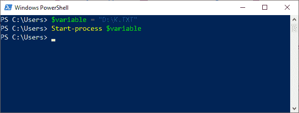
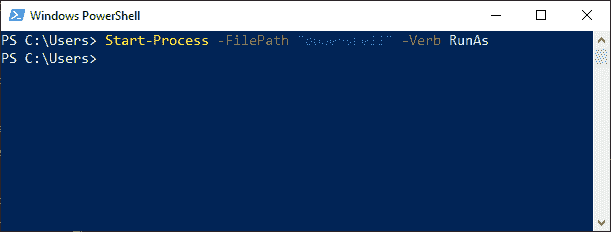
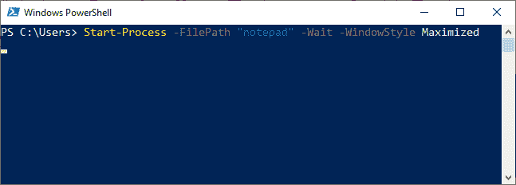

# PowerShell 启动-进程

> 原文：<https://www.javatpoint.com/powershell-start-process>

PowerShell 中的 **Start-Process** cmdlet 在本地计算机上启动一个或多个进程。 **saps 和 start** 是这个 cmdlet 的两个别名。

### 句法

```powershell

Start-Process 
[-FilePath] <string> 
[[-ArgumentList] <string[]>] 
[-Credential <pscredential>] 
[-WorkingDirectory <string>] 
[-LoadUserProfile] 
[-NoNewWindow] 
[-PassThru] 
[-RedirectStandardError <string>] 
[-RedirectStandardInput <string>] 
[-RedirectStandardOutput <string>] 
[-WindowStyle {Normal | Hidden | Minimized | Maximized}] 
[-Wait]
[-UseNewEnvironment]  
[<CommonParameters>]

```

```powershell

Start-Process 
[-FilePath] <string> 
[[-ArgumentList] <string[]>]
[-WorkingDirectory <string>] 
[-PassThru] 
[-Verb <string>] 
[-WindowStyle {Normal | Hidden | Minimized | Maximized}] 
[-Wait]  
[<CommonParameters>]

```

### 因素

我们可以使用 Start-Process cmdlet 的以下参数来指定选项，例如在新窗口中启动进程、加载用户配置文件或使用备用凭据。

【t0-文件路径】T1

-FilePath 参数用于指定在进程中运行的程序的文件名。输入与计算机上的程序相关联的文档文件或可执行文件的名称。

**引数列表**

-ArgumentList 参数指定 cmdlet 开始处理时要使用的参数及其值。

**-证件**

-Credential 参数用于授予用户帐户执行该过程的权限。

**-工作指导**

此参数用于指定在进程中执行的文件的位置。

**-加载用户配置文件**

此参数在此 cmdlet 中用于加载 windows 的用户配置文件，该文件存储在当前用户的 HKEY 用户注册表项中。

**-NoNewWindow**

此参数在当前窗口的控制台中启动新进程。默认情况下，PowerShell 会打开一个新窗口来执行新进程。

【t0-通行证】T1

此参数返回由 cmdlet 启动的每个进程的对象。

**重定向默认错误**

此参数将进程创建的错误发送到指定的文件。使用此 cmdlet 时，您需要输入文件的路径和名称。默认情况下，进程的错误显示在控制台上。

**-重定向标准输入**

当该参数在命令中使用时，进程可以从指定的文件中读取输入。要使用此参数，您需要输入文件的路径和名称。默认情况下，进程从键盘读取输入。

**重定向标准输出**

此参数将由进程创建的输出发送到指定文件。使用此 cmdlet 时，需要输入文件的路径和名称。默认情况下，进程的输出显示在控制台上。

**-WindowStyle**

此参数用于指定用于新进程的 windows 状态。以下是此参数的可接受值:

*   隐藏的
*   正常(默认值)
*   最大化，以及
*   使...减少（或缩小）到最小量

#### 注意:我们不能在同一个命令中同时使用 NoNewWindow 和 WindowStyle 两个参数。

**-等待**

此参数在此 cmdlet 中用于等待进程完成，然后再接受任何其他输入。

### 例子

**示例 1:使用变量**打开记事本文件



在本例中，第一个命令使用一个存储文本文件的变量。第二个命令使用变量 **Start-Process** cmdlet 打开一个文本文件。

**示例 2:以管理员身份启动 PowerShell**



在本例中，该命令通过使用“**以管理员身份运行**”选项来启动 PowerShell。

**示例 3:在最大化窗口中开始一个过程**



在本例中，该命令启动**notepad.exe**过程。该命令最大化记事本窗口，并保留该窗口，直到该过程完成。

* * *