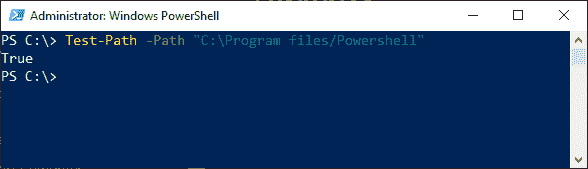
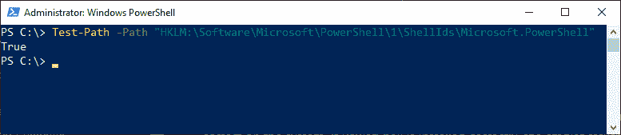
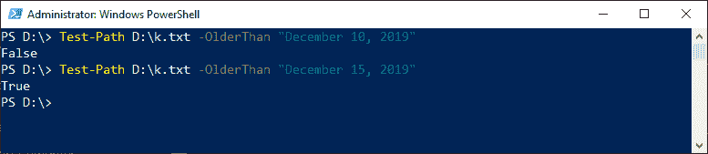

# PowerShell 测试-路径

> 原文：<https://www.javatpoint.com/powershell-test-path>

如果文件或目录路径的所有元素都存在，则 PowerShell 中的**测试路径** cmdlet 返回$true，否则返回$false。它还可以判断文件是在特定日期之后还是之前更新的。它确定路径的语法是否有效。

### 句法

```

Test-Path 
[-Credential <PSCredential>] 
[-Exclude <String[]>] 
[-Filter <String>] 
[-Include <String[]>] 
[-IsValid]
-LiteralPath <String[]> 
[-NewerThan <DateTime>] 
[-OlderThan <DateTime>] 
[-PathType {Any | Container | Leaf}]
[-UseTransaction]
[<CommonParameters>]

```

```

Test-Path 
[-Path] <String[]> 
[-Credential <PSCredential>] 
[-Exclude <String[]>] 
[-Filter <String>] 
[-Include <String[]>] 
[-IsValid] 
[-NewerThan <DateTime>] 
[-OlderThan <DateTime>] 
[-PathType {Any | Container | Leaf}]
[-UseTransaction] 
[<CommonParameters>
]

```

```

Test-Path
[-NewerThan <DateTime>] 
[-OlderThan <DateTime>] 
[<CommonParameters>]

```

### 因素

以下是测试路径 cmdlet 中使用的参数:

**-排除**

此参数用于指定此 cmdlet 忽略的那些项。此参数接受通配符。

**-路径**

此参数用于指定要测试的路径。如果使用包含空格的路径，请用引号引起来。此参数接受通配符。

**-过滤器**

此参数用于以提供程序的格式或语言指定筛选器。

**-包括**

此参数用于指定此 cmdlet 测试的路径。在此参数中，接受通配符。

**-IsValid**

**-IsValid** 用于测试路径的语法，而不是检查路径的元素。当在 cmdlet 中使用此参数时，如果路径的语法有效，则 cmdlet 返回$True，否则返回$False。

**-文字路径**

此参数用于指定要测试的路径。与**-路径参数不同，**该参数的值完全按照键入的内容使用。

**-纽尔坦**

该参数用于将时间指定为**日期时间的对象。**

**-OlderThan**

该参数也用于将时间指定为**日期时间的对象。**

**—pathtype**

此参数用于确定路径中指定的最终元素的类型。在 cmdlet 中使用此参数时，如果元素属于指定类型，则返回$True，否则返回$False。

对于此参数，以下是可接受的值:

*   叶:它是一个不包含其他元素的元素或值。
*   容器:它是一个包含其他元素的元素或值，如注册表项或目录。
*   任何:它是一个元素，或者是一片叶子，或者是一个容器。

### 示例:

**示例 1:检查文件系统中的路径。**



此示例中的命令检查文件系统路径中的所有元素是否存在。如果路径中缺少任何元素，则命令返回$False，否则返回$True。在本例中，路径中的所有元素都是正确的，因此它返回 True。

**例 2:检查注册表项**中的路径



本例中的命令检查**的路径是否为微软。PowerShell 注册表项**是否正确。如果正确，则命令返回$True，否则返回$False。

**示例 3:测试文件是否早于指定日期**



本例中的两个命令都使用 **-olderThan** 参数来检查 **k.txt** 文件是否早于指定日期。

第一个命令返回$False，因为它上次创建或修改是在 2019 年 12 月 10 日之后。第二个命令返回$True，因为它上次创建或修改是在 2019 年 12 月 15 日之前。

**-olderThan** 参数仅用于文件系统。

* * *