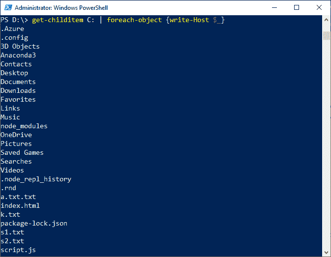

# 每个对象的 PowerShell

> 原文:[https://www.javatpoint.com/powershell-foreach-object](https://www.javatpoint.com/powershell-foreach-object)

PowerShell 中的 **ForEach-Object** 对输入对象集合中的每个项目执行一组语句。这些对象通过管道传递或使用**-输入对象**参数指定。

随着 PowerShell 版本的启动，以下是构造 **ForEach-Object** 命令的两种不同方式:

1.  损益表
2.  脚本块

### 句法

```

ForEach-Object 
[-MemberName] <String> 
[-ArgumentList <Object[]>] 
[-Confirm] 
[-InputObject <PSObject>] 
[-WhatIf]
[<CommonParameters>]

```

```

ForEach-Object 
[-Process] <ScriptBlock[]> 
[-Begin <ScriptBlock>] 
[-Confirm] 
[-End <ScriptBlock>] 
[-InputObject <PSObject>] 
[-RemainingScripts <ScriptBlock[]>] 
[-WhatIf] 
[<CommonParameters>]

```

### 因素

以下是在 **ForEach-Object** 小命令中使用的不同参数:

**-会员名称**

此参数用于指定调用的方法和要获取的属性。

**引数列表**

此参数用于指定调用方法的参数数组。

**-确认**

此参数在执行 cmdlet 之前提示您确认。

**-输入对象**

此参数用于指定输入对象。cmdlet 对每个输入对象执行脚本块或操作语句。当我们在 **ForEach-Object 中使用该参数时，**该参数的值被视为单个对象。

**-whati**

此参数用于显示如果 cmdlet 执行会发生什么。cmdlet 将不会执行。

**-流程**

此参数用于指定在每个输入对象上执行的操作。输入描述操作的脚本块。

**-开始**

此参数用于指定脚本块，该脚本块在 cmdlet 处理任何输入对象之前执行。

**-结束**

此参数用于指定脚本块，该脚本块在 cmdlet 处理所有输入对象后执行。

**-剩余脚本**

该参数用于指定所有那些不被 **-Process** 参数取值的脚本块。

**示例:从 D:驱动器访问文件和文件夹**



在本例中，我们使用**管道(|)** 符号，该符号用于将 **get-childitem** 的输出传递给 **ForEach-Object** 命令。写主机用于显示这些值。

在命令中， **$_** 是一个特殊变量，用于处理通过管道传递的任何值。

* * *